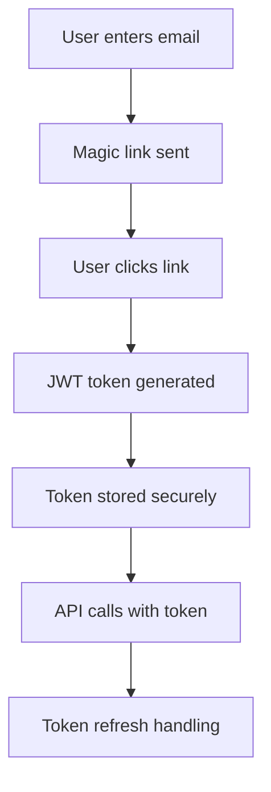

# Property Management Mobile/Web App - Comprehensive Development Plan

**Version**: 1.0  
**Date**: June 8, 2025  
**Current System Version**: 2.2.2  

## Executive Summary

This document outlines the development plan for a cross-platform (iOS, Android, Web) property management application that provides property owners/managers with real-time access to reservations, jobs, and service management capabilities. The app will integrate with the existing automation system's APIs and provide immediate feedback mechanisms while maintaining enterprise-grade security.

### Key Objectives
- **Unified Access**: Single app for iOS, Android, and Web platforms
- **Real-time Data**: Live reservation, job, and status updates
- **Service Management**: Request changes, late checkouts, custom cleaning times
- **Search & Filter**: Advanced search with saved history
- **Account Management**: Profile and address management with change requests
- **Magic Link Authentication**: Passwordless, secure access

---

## Current System Analysis

### Existing Infrastructure Strengths
- ✅ **Robust Backend**: Complete automation system with dev/prod separation
- ✅ **API Ready**: Existing AirScripts API with job management endpoints
- ✅ **Data Integration**: Airtable + HousecallPro with MCP servers for Claude analysis
- ✅ **Authentication**: OAuth systems already in place
- ✅ **Real-time Updates**: Webhook system for status synchronization
- ✅ **Multi-source Data**: iTrip, Evolve, ICS feeds processing 500+ properties

### Current Data Models
- **Customers**: HCP format with addresses, contact info
- **Jobs**: Status tracking (unscheduled → scheduled → in_progress → completed)
- **Reservations**: Property, guest info, service dates, custom instructions
- **Employees**: Assignment and scheduling data
- **Line Items**: Service details with custom instructions support

### Technology Stack Currently Used
- **Backend**: Python 3.8+, Node.js 18+, TypeScript
- **APIs**: Express.js with environment-specific routing
- **Databases**: Airtable (primary), HousecallPro (jobs/scheduling)
- **Authentication**: OAuth2, API key systems
- **Security**: HTTPS/TLS, environment isolation, webhook authentication

---

## Feature Prioritization Matrix

### MUST HAVE (MVP - Critical for Launch)
**Business Justification**: Core functionality needed for basic property management operations

| Feature | Priority | Complexity | Est. Time | Business Impact |
|---------|----------|------------|-----------|-----------------|
| Magic Link Authentication | P0 | Medium | 1.5 weeks | Essential for security |
| View Reservations List | P0 | Low | 1 week | Core data access |
| View Job Status (OMW/Started/Completed) | P0 | Low | 1 week | Essential operations |
| Basic Search & Filter with Property Selection | P0 | Medium | 2 weeks | Enhanced usability |
| Real-time Data Sync | P0 | Medium | 1 week | Data accuracy |
| Guest Contact Information | P0 | Low | 0.5 weeks | Communication needs |
| Employee/Cleaner Details | P0 | Low | 0.5 weeks | Assignment visibility |
| Job Cost & Service Details | P0 | Medium | 1.5 weeks | Financial transparency |
| Account Profile View | P0 | Low | 0.5 weeks | User management |
| Responsive Design (Mobile/Web) | P0 | Medium | 2 weeks | Cross-platform access |

**MVP Total: ~10.5 weeks**

### SHOULD HAVE (Sprint 1-2 Extensions)
**Business Justification**: High-value features that improve operational efficiency

| Feature | Priority | Complexity | Est. Time | Business Impact |
|---------|----------|------------|-----------|-----------------|
| Request Late Checkout | P1 | Medium | 1 week | Customer service |
| Request Custom Cleaning Time | P1 | Medium | 1.5 weeks | Service flexibility |
| Detailed Reservation View | P1 | Low | 0.5 weeks | Information access |
| Calendar/Timeline View | P1 | Medium | 2 weeks | Visual scheduling |
| Photo Upload Functionality | P1 | Medium | 1.5 weeks | Issue documentation |
| Job History per Property | P1 | Medium | 1 week | Historical insights |
| Search History | P1 | Low | 0.5 weeks | User convenience |
| Push Notifications | P1 | High | 2 weeks | Real-time updates |

**Should Have Total: ~9.5 weeks**

### COULD HAVE (Sprint 3-4 Features)
**Business Justification**: Nice-to-have features that enhance user experience

| Feature | Priority | Complexity | Est. Time | Business Impact |
|---------|----------|------------|-----------|-----------------|
| Address Management & Change Requests | P2 | Medium | 1.5 weeks | Administrative efficiency |
| Export Data (PDF/CSV) | P2 | Medium | 1 week | Reporting capability |
| Dark Mode Theme | P2 | Low | 0.5 weeks | User preference |
| Offline Data Cache | P2 | High | 2 weeks | Reliability |
| Quick Guest Communication Templates | P2 | Medium | 1.5 weeks | Communication efficiency |
| Revenue Dashboard | P2 | High | 2.5 weeks | Financial insights |
| Bulk Operations | P2 | Medium | 1.5 weeks | Efficiency gains |

**Could Have Total: ~10 weeks**

### WOULD HAVE (Sprint 5+ Future Features)
**Business Justification**: Long-term enhancements for competitive advantage

| Feature | Priority | Complexity | Est. Time | Business Impact |
|---------|----------|------------|-----------|-----------------|
| Multi-language Support | P3 | High | 3 weeks | Market expansion |
| Integration with External Calendars | P3 | High | 2.5 weeks | Workflow integration |
| Advanced Reporting & BI | P3 | Very High | 4 weeks | Strategic insights |
| AI-Powered Recommendations | P3 | Very High | 3 weeks | Competitive advantage |
| Voice Commands | P3 | Very High | 3 weeks | Innovation feature |
| Automated Conflict Resolution | P3 | Very High | 4 weeks | Advanced automation |

**Would Have Total: ~19.5 weeks**

---

## Cutting-Edge Design System & Architecture

### Design Philosophy: **Compound Component Architecture + Atomic Design**

#### Core Design Principles
1. **Compound Components**: Self-contained components with built-in state management
2. **Atomic Design**: Atoms → Molecules → Organisms → Templates → Pages
3. **Headless UI**: Logic separation from presentation for maximum flexibility
4. **Design Tokens**: Centralized design decisions (colors, spacing, typography)
5. **Progressive Disclosure**: Reveal complexity gradually as needed

### Advanced Design System Stack

#### **UI Framework: Tamagui (Production-Ready 2024)**
**Production Status**: ✅ **Stable & Well-Documented** (2024)
**Why Tamagui over alternatives**:
- ✅ **Universal**: Same components work on Web, iOS, Android with near-native performance
- ✅ **Compile-time Optimization**: CSS-in-JS that compiles to atomic CSS (30-40% faster load times)
- ✅ **Tree-shakeable**: Only ship what you use
- ✅ **TypeScript-first**: Full type safety with autocomplete
- ✅ **Animation System**: Spring-based animations with 60fps performance
- ✅ **Theme System**: Dynamic theming with CSS custom properties
- ✅ **Production Ready**: Used by companies from startups to large corporations
- ✅ **Zero Config**: Works out-of-the-box with Metro, Vite, and Webpack
- ✅ **Official Templates**: `npm create tamagui@latest` provides production boilerplate

```typescript
// Example Tamagui Component
import { Button, Stack, Text } from '@tamagui/core'

export const StatusCard = ({ status, onPress }: StatusCardProps) => (
  <Stack
    backgroundColor="$background"
    borderRadius="$4"
    padding="$4"
    shadowColor="$shadowColor"
    shadowOffset={{ width: 0, height: 2 }}
    shadowOpacity={0.1}
    shadowRadius={8}
    pressStyle={{ scale: 0.98 }}
    onPress={onPress}
  >
    <Text fontSize="$6" fontWeight="600" color="$color">
      {status}
    </Text>
  </Stack>
)
```

#### **State Management: Zustand + Immer + React Query**
**Architecture Pattern**: Hybrid state approach
- ✅ **Zustand**: Client state (UI, preferences, temporary data)
- ✅ **React Query**: Server state (API data, caching, synchronization)  
- ✅ **Immer**: Immutable updates with mutable syntax

```typescript
// Example Store with Immer
import { create } from 'zustand'
import { immer } from 'zustand/middleware/immer'

interface AppStore {
  user: User | null
  filters: FilterState
  searchHistory: SearchEntry[]
  setUser: (user: User) => void
  updateFilters: (filters: Partial<FilterState>) => void
  addSearchEntry: (entry: SearchEntry) => void
}

export const useAppStore = create<AppStore>()(
  immer((set) => ({
    user: null,
    filters: defaultFilters,
    searchHistory: [],
    setUser: (user) => set((state) => { state.user = user }),
    updateFilters: (filters) => set((state) => { 
      Object.assign(state.filters, filters) 
    }),
    addSearchEntry: (entry) => set((state) => {
      state.searchHistory.unshift(entry)
      if (state.searchHistory.length > 10) state.searchHistory.pop()
    })
  }))
)
```

#### **Animation System: Reanimated 3 + Lottie**
- ✅ **Reanimated 3**: 60fps animations on UI thread
- ✅ **Lottie**: Complex animations from After Effects
- ✅ **Gesture Handler**: Native gesture recognition
- ✅ **Skia**: Custom drawings and effects

### Component Architecture Specification

#### **Atomic Design Implementation**

##### **Atoms (Base Components)**
```typescript
// Design tokens for consistency
export const tokens = {
  colors: {
    primary: '#0066CC',
    secondary: '#FF6B35',
    success: '#22C55E',
    warning: '#F59E0B',
    error: '#EF4444',
    surface: '#FFFFFF',
    background: '#F8FAFC',
  },
  spacing: {
    xs: 4, sm: 8, md: 16, lg: 24, xl: 32, xxl: 48
  },
  borderRadius: {
    sm: 4, md: 8, lg: 12, xl: 16, full: 9999
  },
  typography: {
    h1: { fontSize: 32, fontWeight: '700', lineHeight: 40 },
    h2: { fontSize: 24, fontWeight: '600', lineHeight: 32 },
    body: { fontSize: 16, fontWeight: '400', lineHeight: 24 },
    caption: { fontSize: 14, fontWeight: '400', lineHeight: 20 }
  }
}

// Atom: Base Button
export const Button = styled(Pressable, {
  variants: {
    variant: {
      primary: { backgroundColor: '$primary', color: '$white' },
      secondary: { backgroundColor: '$secondary', color: '$white' },
      outline: { borderColor: '$primary', borderWidth: 1, color: '$primary' }
    },
    size: {
      sm: { paddingHorizontal: '$md', paddingVertical: '$sm', fontSize: '$sm' },
      md: { paddingHorizontal: '$lg', paddingVertical: '$md', fontSize: '$md' },
      lg: { paddingHorizontal: '$xl', paddingVertical: '$lg', fontSize: '$lg' }
    }
  }
})
```

##### **Molecules (Component Combinations)**
```typescript
// Molecule: SearchInput
export const SearchInput = ({
  value,
  onChangeText,
  onSubmit,
  placeholder = "Search properties..."
}: SearchInputProps) => (
  <Stack direction="row" alignItems="center" space="$sm">
    <Input
      flex={1}
      value={value}
      onChangeText={onChangeText}
      onSubmitEditing={onSubmit}
      placeholder={placeholder}
      borderRadius="$full"
      paddingHorizontal="$lg"
    />
    <Button
      variant="primary"
      size="sm"
      borderRadius="$full"
      onPress={onSubmit}
    >
      <Search size={16} />
    </Button>
  </Stack>
)

// Molecule: StatusBadge
export const StatusBadge = ({ status }: { status: JobStatus }) => {
  const config = statusConfig[status]
  return (
    <Stack
      backgroundColor={config.color}
      paddingHorizontal="$sm"
      paddingVertical="$xs"
      borderRadius="$full"
    >
      <Text fontSize="$xs" fontWeight="600" color="$white">
        {config.label}
      </Text>
    </Stack>
  )
}
```

##### **Organisms (Complex Components)**
```typescript
// Organism: ReservationCard
export const ReservationCard = ({ 
  reservation, 
  onPress, 
  onRequestAction 
}: ReservationCardProps) => (
  <Card onPress={onPress}>
    <Card.Header>
      <Stack direction="row" justifyContent="space-between" alignItems="center">
        <Text variant="h3">{reservation.propertyName}</Text>
        <StatusBadge status={reservation.job?.status} />
      </Stack>
    </Card.Header>
    
    <Card.Content>
      <Stack space="$sm">
        <PropertyInfo 
          address={reservation.address}
          dates={{ checkIn: reservation.checkIn, checkOut: reservation.checkOut }}
        />
        <GuestInfo 
          name={reservation.guestName}
          contact={reservation.contact}
        />
        {reservation.job && (
          <JobProgress 
            status={reservation.job.status}
            employee={reservation.job.assignedEmployee}
            scheduledTime={reservation.job.scheduledStart}
          />
        )}
      </Stack>
    </Card.Content>
    
    <Card.Actions>
      <Button 
        variant="outline" 
        size="sm"
        onPress={() => onRequestAction('late-checkout')}
      >
        Request Late Checkout
      </Button>
      <Button 
        variant="outline" 
        size="sm"
        onPress={() => onRequestAction('custom-cleaning')}
      >
        Custom Cleaning Time
      </Button>
    </Card.Actions>
  </Card>
)
```

### Advanced Architectural Patterns

#### **Compound Component Pattern**
```typescript
// Advanced: Compound Filter Component
export const FilterPanel = ({ children }: FilterPanelProps) => {
  const [isOpen, setIsOpen] = useState(false)
  
  return (
    <FilterContext.Provider value={{ isOpen, setIsOpen }}>
      {children}
    </FilterContext.Provider>
  )
}

FilterPanel.Trigger = ({ children }: TriggerProps) => {
  const { setIsOpen } = useContext(FilterContext)
  return (
    <Button onPress={() => setIsOpen(true)}>
      {children}
    </Button>
  )
}

FilterPanel.Content = ({ children }: ContentProps) => {
  const { isOpen, setIsOpen } = useContext(FilterContext)
  return (
    <Sheet open={isOpen} onClose={() => setIsOpen(false)}>
      {children}
    </Sheet>
  )
}

// Usage:
<FilterPanel>
  <FilterPanel.Trigger>
    <Text>Filter Results</Text>
  </FilterPanel.Trigger>
  <FilterPanel.Content>
    <DateRangeFilter />
    <StatusFilter />
    <PropertyFilter />
  </FilterPanel.Content>
</FilterPanel>
```

#### **Headless Component Pattern**
```typescript
// Headless useSearch hook
export const useSearch = <T>({
  data,
  searchFn,
  debounceMs = 300
}: UseSearchProps<T>) => {
  const [query, setQuery] = useState('')
  const [results, setResults] = useState<T[]>([])
  const [isSearching, setIsSearching] = useState(false)
  
  const debouncedSearch = useMemo(
    () => debounce(async (searchQuery: string) => {
      setIsSearching(true)
      const searchResults = await searchFn(searchQuery, data)
      setResults(searchResults)
      setIsSearching(false)
    }, debounceMs),
    [searchFn, data, debounceMs]
  )
  
  useEffect(() => {
    if (query.trim()) {
      debouncedSearch(query)
    } else {
      setResults([])
      setIsSearching(false)
    }
  }, [query, debouncedSearch])
  
  return {
    query,
    setQuery,
    results,
    isSearching,
    clearSearch: () => setQuery('')
  }
}

// Usage in component:
const PropertySearch = () => {
  const { query, setQuery, results, isSearching } = useSearch({
    data: properties,
    searchFn: searchProperties
  })
  
  return (
    <SearchInput
      value={query}
      onChangeText={setQuery}
      loading={isSearching}
      results={results}
    />
  )
}
```

### Design System Implementation Guide

#### **Component Library Structure**
```
src/
├── design-system/
│   ├── tokens/
│   │   ├── colors.ts
│   │   ├── spacing.ts
│   │   ├── typography.ts
│   │   └── index.ts
│   ├── components/
│   │   ├── atoms/
│   │   │   ├── Button/
│   │   │   │   ├── Button.tsx
│   │   │   │   ├── Button.test.tsx
│   │   │   │   ├── Button.stories.tsx
│   │   │   │   └── index.ts
│   │   │   ├── Input/
│   │   │   ├── Text/
│   │   │   └── index.ts
│   │   ├── molecules/
│   │   │   ├── SearchInput/
│   │   │   ├── StatusBadge/
│   │   │   ├── PropertyInfo/
│   │   │   └── index.ts
│   │   ├── organisms/
│   │   │   ├── ReservationCard/
│   │   │   ├── FilterPanel/
│   │   │   ├── RequestForm/
│   │   │   └── index.ts
│   │   └── index.ts
│   ├── hooks/
│   │   ├── useSearch.ts
│   │   ├── useAnimation.ts
│   │   └── index.ts
│   └── utils/
│       ├── animations.ts
│       ├── accessibility.ts
│       └── index.ts
```

#### **Specific Components to Build**

##### **1. Atoms (8 weeks total)**

**Button Component (1 week)**
```typescript
// src/design-system/components/atoms/Button/Button.tsx
import { Pressable, Text } from '@tamagui/core'
import { styled } from '@tamagui/core'

export const Button = styled(Pressable, {
  name: 'Button',
  variants: {
    variant: {
      primary: {
        backgroundColor: '$primary',
        color: '$white',
        borderColor: '$primary',
      },
      secondary: {
        backgroundColor: '$secondary', 
        color: '$white',
        borderColor: '$secondary',
      },
      outline: {
        backgroundColor: 'transparent',
        color: '$primary',
        borderColor: '$primary',
        borderWidth: 1,
      },
      ghost: {
        backgroundColor: 'transparent',
        color: '$primary',
      }
    },
    size: {
      sm: {
        paddingHorizontal: '$md',
        paddingVertical: '$sm',
        fontSize: '$sm',
        borderRadius: '$sm',
      },
      md: {
        paddingHorizontal: '$lg',
        paddingVertical: '$md', 
        fontSize: '$md',
        borderRadius: '$md',
      },
      lg: {
        paddingHorizontal: '$xl',
        paddingVertical: '$lg',
        fontSize: '$lg',
        borderRadius: '$lg',
      }
    },
    disabled: {
      true: {
        opacity: 0.5,
        pointerEvents: 'none',
      }
    }
  },
  defaultVariants: {
    variant: 'primary',
    size: 'md'
  },
  pressStyle: {
    scale: 0.98,
  },
  hoverStyle: {
    opacity: 0.9,
  },
  focusStyle: {
    borderColor: '$focus',
    borderWidth: 2,
  }
})
```

**Input Component (1 week)**
```typescript
// Advanced input with built-in validation, icons, and states
export const Input = styled(TextInput, {
  variants: {
    state: {
      default: { borderColor: '$border' },
      focus: { borderColor: '$primary' },
      error: { borderColor: '$error' },
      success: { borderColor: '$success' }
    },
    size: {
      sm: { fontSize: '$sm', paddingVertical: '$sm' },
      md: { fontSize: '$md', paddingVertical: '$md' },
      lg: { fontSize: '$lg', paddingVertical: '$lg' }
    }
  }
})
```

**Typography Components (0.5 weeks)**
```typescript
// Heading, Text, Caption components with semantic meaning
export const Heading = styled(Text, {
  variants: {
    level: {
      1: { fontSize: '$h1', fontWeight: '$bold' },
      2: { fontSize: '$h2', fontWeight: '$semibold' },
      3: { fontSize: '$h3', fontWeight: '$medium' }
    }
  }
})
```

**Icon Component (0.5 weeks)**
```typescript
// Universal icon component with Lucide React icons
import { LucideIcon } from 'lucide-react-native'

export const Icon = ({ name, size = 24, color = '$text', ...props }) => {
  const IconComponent = icons[name]
  return <IconComponent size={size} color={color} {...props} />
}
```

**Card Component (1 week)**
```typescript
// Compound card component with Header, Content, Actions
export const Card = styled(Stack, {
  backgroundColor: '$surface',
  borderRadius: '$lg',
  shadowColor: '$shadow',
  shadowOffset: { width: 0, height: 2 },
  shadowOpacity: 0.1,
  shadowRadius: 8,
  overflow: 'hidden'
})

Card.Header = styled(Stack, {
  padding: '$lg',
  borderBottomWidth: 1,
  borderBottomColor: '$border'
})

Card.Content = styled(Stack, {
  padding: '$lg'
})

Card.Actions = styled(Stack, {
  padding: '$lg',
  direction: 'row',
  gap: '$sm',
  borderTopWidth: 1,
  borderTopColor: '$border'
})
```

##### **2. Molecules (4 weeks total)**

**StatusBadge Component (0.5 weeks)**
```typescript
// Smart status badge with predefined status mappings
export const StatusBadge = ({ status, size = 'md' }: StatusBadgeProps) => {
  const config = statusConfigs[status] // predefined colors/labels
  return (
    <Stack
      backgroundColor={config.color}
      borderRadius="$full"
      paddingHorizontal={size === 'sm' ? '$sm' : '$md'}
      paddingVertical={size === 'sm' ? '$xs' : '$sm'}
    >
      <Text 
        fontSize={size === 'sm' ? '$xs' : '$sm'}
        fontWeight="$semibold"
        color="$white"
      >
        {config.label}
      </Text>
    </Stack>
  )
}
```

**SearchInput Component (1 week)**
```typescript
// Advanced search with debouncing, history, and suggestions
export const SearchInput = ({
  value,
  onChangeText,
  placeholder,
  showHistory = true,
  recentSearches = [],
  loading = false
}: SearchInputProps) => {
  const [showSuggestions, setShowSuggestions] = useState(false)
  
  return (
    <Stack>
      <Stack direction="row" alignItems="center" space="$sm">
        <Input
          flex={1}
          value={value}
          onChangeText={onChangeText}
          placeholder={placeholder}
          onFocus={() => setShowSuggestions(true)}
          onBlur={() => setTimeout(() => setShowSuggestions(false), 200)}
        />
        {loading ? (
          <Spinner size="small" />
        ) : (
          <Icon name="search" size={20} color="$textSecondary" />
        )}
      </Stack>
      
      {showSuggestions && showHistory && recentSearches.length > 0 && (
        <Card marginTop="$sm">
          <Card.Content>
            <Text fontSize="$sm" fontWeight="$medium" marginBottom="$sm">
              Recent Searches
            </Text>
            {recentSearches.map((search, index) => (
              <Pressable
                key={index}
                onPress={() => onChangeText(search)}
                paddingVertical="$sm"
              >
                <Text fontSize="$sm" color="$textSecondary">
                  {search}
                </Text>
              </Pressable>
            ))}
          </Card.Content>
        </Card>
      )}
    </Stack>
  )
}
```

**PropertyInfo Component (0.5 weeks)**
```typescript
// Reusable property information display
export const PropertyInfo = ({ property, dates, compact = false }) => (
  <Stack space={compact ? '$xs' : '$sm'}>
    <Stack direction="row" alignItems="center" space="$sm">
      <Icon name="home" size={16} color="$textSecondary" />
      <Text fontSize={compact ? '$sm' : '$md'} fontWeight="$medium">
        {property.name}
      </Text>
    </Stack>
    <Stack direction="row" alignItems="center" space="$sm">
      <Icon name="map-pin" size={16} color="$textSecondary" />
      <Text fontSize="$sm" color="$textSecondary">
        {property.address}
      </Text>
    </Stack>
    {dates && (
      <Stack direction="row" alignItems="center" space="$sm">
        <Icon name="calendar" size={16} color="$textSecondary" />
        <Text fontSize="$sm" color="$textSecondary">
          {formatDateRange(dates.checkIn, dates.checkOut)}
        </Text>
      </Stack>
    )}
  </Stack>
)
```

**JobProgress Component (1 week)**
```typescript
// Visual job progress tracker with timeline
export const JobProgress = ({ 
  status, 
  timestamps, 
  employee,
  showTimeline = true 
}) => {
  const steps = [
    { key: 'created', label: 'Job Created', icon: 'plus' },
    { key: 'assigned', label: 'Employee Assigned', icon: 'user' },
    { key: 'on_my_way', label: 'On My Way', icon: 'car' },
    { key: 'started', label: 'Started', icon: 'play' },
    { key: 'completed', label: 'Completed', icon: 'check' }
  ]
  
  return (
    <Stack space="$sm">
      <Stack direction="row" alignItems="center" justifyContent="space-between">
        <Text fontSize="$md" fontWeight="$medium">Cleaning Progress</Text>
        <StatusBadge status={status} />
      </Stack>
      
      {employee && (
        <Stack direction="row" alignItems="center" space="$sm">
          <Icon name="user" size={16} color="$textSecondary" />
          <Text fontSize="$sm" color="$textSecondary">
            Assigned to {employee.name}
          </Text>
        </Stack>
      )}
      
      {showTimeline && (
        <Stack space="$xs">
          {steps.map((step, index) => {
            const isCompleted = timestamps[step.key]
            const isCurrent = getCurrentStep(status) === step.key
            
            return (
              <Stack key={step.key} direction="row" alignItems="center" space="$sm">
                <Stack
                  width={24}
                  height={24}
                  borderRadius="$full"
                  backgroundColor={isCompleted ? '$success' : isCurrent ? '$primary' : '$border'}
                  alignItems="center"
                  justifyContent="center"
                >
                  <Icon 
                    name={step.icon} 
                    size={12} 
                    color={isCompleted || isCurrent ? '$white' : '$textSecondary'} 
                  />
                </Stack>
                <Stack flex={1}>
                  <Text 
                    fontSize="$sm" 
                    fontWeight={isCurrent ? '$medium' : '$regular'}
                    color={isCompleted ? '$success' : isCurrent ? '$primary' : '$textSecondary'}
                  >
                    {step.label}
                  </Text>
                  {timestamps[step.key] && (
                    <Text fontSize="$xs" color="$textSecondary">
                      {formatTime(timestamps[step.key])}
                    </Text>
                  )}
                </Stack>
              </Stack>
            )
          })}
        </Stack>
      )}
    </Stack>
  )
}
```

##### **3. Organisms (6 weeks total)**

**ReservationCard Component (2 weeks)**
```typescript
// Main card component for displaying reservations with all interactions
export const ReservationCard = ({ 
  reservation, 
  onPress,
  onRequestAction,
  variant = 'default' // 'default' | 'compact' | 'detailed'
}: ReservationCardProps) => {
  const [isExpanded, setIsExpanded] = useState(false)
  
  return (
    <Card 
      onPress={onPress}
      pressStyle={{ scale: 0.98 }}
      marginBottom="$md"
    >
      <Card.Header>
        <Stack direction="row" justifyContent="space-between" alignItems="center">
          <Stack flex={1}>
            <Heading level={3}>{reservation.propertyName}</Heading>
            <Text fontSize="$sm" color="$textSecondary">
              {reservation.guestName}
            </Text>
          </Stack>
          {reservation.job && (
            <StatusBadge status={reservation.job.status} />
          )}
        </Stack>
      </Card.Header>
      
      <Card.Content>
        <Stack space="$md">
          <PropertyInfo 
            property={reservation.property}
            dates={{ 
              checkIn: reservation.checkIn, 
              checkOut: reservation.checkOut 
            }}
            compact={variant === 'compact'}
          />
          
          {reservation.job && (variant === 'detailed' || isExpanded) && (
            <JobProgress 
              status={reservation.job.status}
              timestamps={reservation.job.workTimestamps}
              employee={reservation.job.assignedEmployee}
            />
          )}
          
          {variant === 'default' && (
            <Button
              variant="ghost"
              size="sm"
              onPress={() => setIsExpanded(!isExpanded)}
            >
              <Text fontSize="$sm">
                {isExpanded ? 'Show Less' : 'Show More'}
              </Text>
              <Icon 
                name={isExpanded ? 'chevron-up' : 'chevron-down'} 
                size={16} 
              />
            </Button>
          )}
        </Stack>
      </Card.Content>
      
      <Card.Actions>
        <Button 
          variant="outline" 
          size="sm"
          onPress={() => onRequestAction('late-checkout')}
          flex={1}
        >
          Late Checkout
        </Button>
        <Button 
          variant="outline" 
          size="sm"
          onPress={() => onRequestAction('custom-cleaning')}
          flex={1}
        >
          Custom Clean
        </Button>
      </Card.Actions>
    </Card>
  )
}
```

**FilterPanel Component (1.5 weeks)**
```typescript
// Advanced filtering with compound pattern
export const FilterPanel = ({ 
  children,
  onApply,
  onClear,
  defaultOpen = false 
}: FilterPanelProps) => {
  const [isOpen, setIsOpen] = useState(defaultOpen)
  const [filters, setFilters] = useState({})
  
  return (
    <FilterContext.Provider value={{ 
      isOpen, 
      setIsOpen, 
      filters, 
      setFilters,
      onApply: () => {
        onApply(filters)
        setIsOpen(false)
      },
      onClear: () => {
        setFilters({})
        onClear()
      }
    }}>
      {children}
    </FilterContext.Provider>
  )
}

FilterPanel.Trigger = ({ children }) => {
  const { setIsOpen } = useContext(FilterContext)
  return (
    <Button variant="outline" onPress={() => setIsOpen(true)}>
      {children}
    </Button>
  )
}

FilterPanel.Sheet = ({ children }) => {
  const { isOpen, setIsOpen, onApply, onClear } = useContext(FilterContext)
  return (
    <Sheet open={isOpen} onOpenChange={setIsOpen} modal>
      <Sheet.Frame padding="$lg">
        <Stack space="$lg">
          <Stack direction="row" justifyContent="space-between" alignItems="center">
            <Heading level={2}>Filters</Heading>
            <Button variant="ghost" onPress={() => setIsOpen(false)}>
              <Icon name="x" size={24} />
            </Button>
          </Stack>
          
          <ScrollView>
            {children}
          </ScrollView>
          
          <Stack direction="row" space="$md">
            <Button variant="outline" onPress={onClear} flex={1}>
              Clear All
            </Button>
            <Button onPress={onApply} flex={1}>
              Apply Filters
            </Button>
          </Stack>
        </Stack>
      </Sheet.Frame>
    </Sheet>
  )
}

// Filter section components
FilterPanel.DateRange = () => {
  const { filters, setFilters } = useContext(FilterContext)
  return (
    <Stack space="$sm">
      <Text fontSize="$md" fontWeight="$medium">Date Range</Text>
      <Stack direction="row" space="$sm">
        <DatePicker
          value={filters.startDate}
          onChange={(date) => setFilters(prev => ({ ...prev, startDate: date }))}
          placeholder="Start Date"
          flex={1}
        />
        <DatePicker
          value={filters.endDate}
          onChange={(date) => setFilters(prev => ({ ...prev, endDate: date }))}
          placeholder="End Date"
          flex={1}
        />
      </Stack>
    </Stack>
  )
}
```

**RequestForm Component (2.5 weeks)**
```typescript
// Comprehensive request form with validation and submission
export const RequestForm = ({
  type, // 'late-checkout' | 'custom-cleaning'
  reservation,
  onSubmit,
  onCancel,
  isVisible
}: RequestFormProps) => {
  const { control, handleSubmit, formState: { errors, isValid } } = useForm()
  const [isSubmitting, setIsSubmitting] = useState(false)
  
  const requestConfig = {
    'late-checkout': {
      title: 'Request Late Checkout',
      icon: 'clock',
      fields: ['requestedTime', 'reason'],
      validation: {
        requestedTime: { required: 'Please select a checkout time' }
      }
    },
    'custom-cleaning': {
      title: 'Request Custom Cleaning Time',
      icon: 'calendar',
      fields: ['requestedDate', 'requestedTime', 'reason'],
      validation: {
        requestedDate: { required: 'Please select a date' },
        requestedTime: { required: 'Please select a time' }
      }
    }
  }
  
  const config = requestConfig[type]
  
  return (
    <Sheet open={isVisible} onOpenChange={onCancel} modal>
      <Sheet.Frame>
        <Sheet.Handle />
        <ScrollView padding="$lg">
          <Stack space="$lg">
            {/* Header */}
            <Stack direction="row" alignItems="center" space="$md">
              <Stack
                width={48}
                height={48}
                borderRadius="$full"
                backgroundColor="$primaryLight"
                alignItems="center"
                justifyContent="center"
              >
                <Icon name={config.icon} size={24} color="$primary" />
              </Stack>
              <Stack flex={1}>
                <Heading level={2}>{config.title}</Heading>
                <Text fontSize="$sm" color="$textSecondary">
                  {reservation.propertyName}
                </Text>
              </Stack>
            </Stack>
            
            {/* Property Summary */}
            <Card>
              <Card.Content>
                <PropertyInfo 
                  property={reservation.property}
                  dates={{
                    checkIn: reservation.checkIn,
                    checkOut: reservation.checkOut
                  }}
                />
                <Stack direction="row" alignItems="center" space="$sm" marginTop="$sm">
                  <Icon name="user" size={16} color="$textSecondary" />
                  <Text fontSize="$sm" color="$textSecondary">
                    {reservation.guestName}
                  </Text>
                </Stack>
              </Card.Content>
            </Card>
            
            {/* Form Fields */}
            <Stack space="$md">
              {config.fields.includes('requestedDate') && (
                <Controller
                  control={control}
                  name="requestedDate"
                  rules={config.validation.requestedDate}
                  render={({ field }) => (
                    <Stack space="$sm">
                      <Text fontSize="$md" fontWeight="$medium">
                        Requested Date
                      </Text>
                      <DatePicker
                        value={field.value}
                        onChange={field.onChange}
                        placeholder="Select date"
                        minimumDate={new Date()}
                        error={errors.requestedDate?.message}
                      />
                    </Stack>
                  )}
                />
              )}
              
              {config.fields.includes('requestedTime') && (
                <Controller
                  control={control}
                  name="requestedTime"
                  rules={config.validation.requestedTime}
                  render={({ field }) => (
                    <Stack space="$sm">
                      <Text fontSize="$md" fontWeight="$medium">
                        Requested Time
                      </Text>
                      <TimePicker
                        value={field.value}
                        onChange={field.onChange}
                        placeholder="Select time"
                        error={errors.requestedTime?.message}
                      />
                    </Stack>
                  )}
                />
              )}
              
              {config.fields.includes('reason') && (
                <Controller
                  control={control}
                  name="reason"
                  render={({ field }) => (
                    <Stack space="$sm">
                      <Text fontSize="$md" fontWeight="$medium">
                        Reason (Optional)
                      </Text>
                      <TextArea
                        value={field.value}
                        onChangeText={field.onChange}
                        placeholder="Please provide a reason for this request..."
                        numberOfLines={4}
                      />
                    </Stack>
                  )}
                />
              )}
            </Stack>
            
            {/* Impact Information */}
            <Card backgroundColor="$warningLight" borderColor="$warning">
              <Card.Content>
                <Stack direction="row" alignItems="center" space="$sm" marginBottom="$sm">
                  <Icon name="alert-triangle" size={20} color="$warning" />
                  <Text fontSize="$md" fontWeight="$medium" color="$warning">
                    Important Information
                  </Text>
                </Stack>
                <Stack space="$xs">
                  <Text fontSize="$sm" color="$textSecondary">
                    • This request is subject to approval
                  </Text>
                  <Text fontSize="$sm" color="$textSecondary">
                    • May affect scheduling for other properties
                  </Text>
                  <Text fontSize="$sm" color="$textSecondary">
                    • You will receive a notification with the decision
                  </Text>
                </Stack>
              </Card.Content>
            </Card>
            
            {/* Actions */}
            <Stack direction="row" space="$md">
              <Button 
                variant="outline" 
                onPress={onCancel}
                flex={1}
                disabled={isSubmitting}
              >
                Cancel
              </Button>
              <Button 
                onPress={handleSubmit(async (data) => {
                  setIsSubmitting(true)
                  await onSubmit({ ...data, type, reservationId: reservation.id })
                  setIsSubmitting(false)
                })}
                flex={1}
                disabled={!isValid || isSubmitting}
                loading={isSubmitting}
              >
                Submit Request
              </Button>
            </Stack>
          </Stack>
        </ScrollView>
      </Sheet.Frame>
    </Sheet>
  )
}
```

### Testing Architecture: **Testing Library + MSW + Detox**

#### **Component Testing Strategy**
```typescript
// Example component test with Testing Library
import { render, fireEvent, waitFor } from '@testing-library/react-native'
import { ReservationCard } from '../ReservationCard'

describe('ReservationCard', () => {
  const mockReservation = {
    id: '1',
    propertyName: 'Test Property',
    guestName: 'John Doe',
    checkIn: '2025-06-10',
    checkOut: '2025-06-12',
    job: { status: 'scheduled', assignedEmployee: 'Jane Smith' }
  }
  
  it('displays reservation information correctly', () => {
    const { getByText } = render(
      <ReservationCard reservation={mockReservation} />
    )
    
    expect(getByText('Test Property')).toBeTruthy()
    expect(getByText('John Doe')).toBeTruthy()
    expect(getByText('Scheduled')).toBeTruthy()
  })
  
  it('calls onRequestAction when late checkout is pressed', async () => {
    const onRequestAction = jest.fn()
    const { getByText } = render(
      <ReservationCard 
        reservation={mockReservation}
        onRequestAction={onRequestAction}
      />
    )
    
    fireEvent.press(getByText('Request Late Checkout'))
    
    await waitFor(() => {
      expect(onRequestAction).toHaveBeenCalledWith('late-checkout')
    })
  })
})
```

#### **API Mocking with MSW**
```typescript
// Mock Service Worker setup
import { setupServer } from 'msw/node'
import { rest } from 'msw'

export const handlers = [
  rest.get('/api/mobile/reservations', (req, res, ctx) => {
    return res(
      ctx.json({
        data: [
          { id: '1', propertyName: 'Test Property', status: 'active' }
        ],
        pagination: { page: 1, totalPages: 1 }
      })
    )
  }),
  
  rest.post('/api/mobile/requests', (req, res, ctx) => {
    return res(
      ctx.json({ success: true, requestId: 'req_123' })
    )
  })
]

export const server = setupServer(...handlers)
```

---

## Technical Architecture

### Recommended Technology Stack

#### Frontend Framework: **React Native with Expo**
**Rationale**: 
- ✅ Single codebase for iOS, Android, and Web
- ✅ Excellent performance and native feel
- ✅ Strong ecosystem and community support
- ✅ Web support through React Native Web
- ✅ Rapid development and deployment

#### UI Framework: **NativeBase or Tamagui**
**Rationale**:
- ✅ Production-ready components
- ✅ Cross-platform consistency
- ✅ Accessible by default
- ✅ Theming support for dark mode

#### State Management: **Zustand**
**Rationale**:
- ✅ Lightweight and simple
- ✅ TypeScript-first
- ✅ Excellent for medium-complexity apps
- ✅ Minimal boilerplate

#### Authentication: **Auth0 or Supabase Auth**
**Rationale**:
- ✅ Magic link support out of the box
- ✅ Enterprise security standards
- ✅ Multi-platform SDKs
- ✅ Integration with existing OAuth systems

#### Backend Integration: **Extend Existing APIs**
**Rationale**:
- ✅ Leverage existing AirScripts API infrastructure
- ✅ Extend current endpoints for mobile needs
- ✅ Maintain environment separation (dev/prod)
- ✅ Use existing authentication patterns

### Database & API Strategy

#### Backend Extensions Needed
```typescript
// New endpoints to add to existing AirScripts API
GET /api/{env}/mobile/reservations      // List with mobile-optimized response
GET /api/{env}/mobile/reservations/:id  // Detailed view with related data
POST /api/{env}/mobile/requests         // Generic request system
PUT /api/{env}/mobile/profile          // Profile updates
GET /api/{env}/mobile/search/history   // Search history management
```

#### Real-time Updates
- **WebSocket connection** for live job status updates
- **Push notifications** via Expo Push Service
- **Webhook integration** with existing HCP status changes

### Security Architecture

#### Authentication Flow


#### Security Features
- **Magic Link Authentication**: Passwordless access
- **JWT Tokens**: Short-lived with refresh capability
- **API Key Integration**: Leverage existing key systems
- **Environment Isolation**: Respect dev/prod separation
- **Rate Limiting**: Prevent abuse
- **Data Encryption**: In transit and at rest

---

## Development Sizing & Timeline

### Complexity Assessment Methodology
- **Low**: Basic CRUD, UI components (0.5-1 week)
- **Medium**: API integration, complex UI (1-2 weeks)  
- **High**: Real-time features, authentication (2-3 weeks)
- **Very High**: Advanced features, AI integration (3-4+ weeks)

### Resource Requirements
- **Primary Developer**: Full-stack React Native developer
- **Backend Developer**: Extend existing Node.js APIs (part-time)
- **UX/UI Designer**: Mobile-first design system (part-time)
- **QA Engineer**: Cross-platform testing (part-time)

### Development Timeline
- **MVP**: 10.5 weeks (2.5 months)
- **Sprint 1-2**: +9.5 weeks (2.25 months)
- **Sprint 3-4**: +10 weeks (2.5 months)
- **Total Initial Release**: ~30 weeks (7.5 months)

---

## MVP Definition

### Core Value Proposition
"Property managers can securely access their reservations and job status from anywhere, on any device, with immediate feedback capabilities."

### MVP Success Criteria
1. **Authentication**: Property managers can sign in via magic link
2. **Data Access**: View all reservations and jobs with current status
3. **Search**: Find specific reservations/jobs quickly
4. **Status Tracking**: Real-time job status updates (OMW, Started, Completed)
5. **Basic Requests**: Submit late checkout and custom cleaning time requests
6. **Cross-Platform**: Works seamlessly on iOS, Android, and Web
7. **Performance**: <3 second load times, <1 second search responses

### MVP User Stories
```
As a property manager, I want to:
- Sign in securely with just my email address
- See all my properties and their current reservations
- Track the status of cleaning jobs in real-time
- Search for specific properties or guests quickly
- Request late checkouts when guests need them
- Request custom cleaning times when schedules change
- Access this information from my phone, tablet, or computer
```

---

## Sprint Breakdown

### Pre-Sprint 0: Foundation (1 week)
**Goal**: Project setup and infrastructure

**Tasks**:
- ✅ Set up React Native project with Expo
- ✅ Configure development environment (dev/staging/prod)
- ✅ Set up CI/CD pipeline
- ✅ Design system and component library setup
- ✅ Backend API endpoints design and documentation

**Deliverables**: 
- Project scaffolding
- Development environment
- API specification document

---

### Sprint 1: Core Authentication & Data (3 weeks)
**Goal**: Users can sign in and view their reservations

**Week 1**: Authentication System
- Magic link authentication implementation
- JWT token management
- Secure storage setup
- Login/logout flows

**Week 2**: Data Layer & API Integration
- API client setup with environment awareness
- Data models and TypeScript interfaces
- Error handling and loading states
- Integration with existing Airtable/HCP data

**Week 3**: Basic Reservation List
- Reservation list component
- Job status indicators
- Basic navigation structure
- Responsive design implementation

**Success Criteria**:
- ✅ Property managers can sign in with magic links
- ✅ Reservation list loads with real data
- ✅ Job statuses display correctly
- ✅ App works on all three platforms

---

### Sprint 2: Search & Core Features (2.5 weeks)
**Goal**: Users can find information quickly and track job progress

**Week 1**: Search & Filter System
- Search implementation with real-time results
- Filter options (property, date range, status)
- Search history storage and display
- Performance optimization

**Week 2**: Job Status & Updates
- Real-time job status updates via WebSocket
- Status change notifications
- Job details view
- Status timeline visualization

**Week 0.5**: Basic Request System
- Late checkout request form
- Custom cleaning time request
- Request submission and confirmation
- Basic request history

**Success Criteria**:
- ✅ Search returns results in <1 second
- ✅ Real-time job status updates work
- ✅ Users can submit basic requests
- ✅ Search history is saved and accessible

---

### Sprint 3: Enhanced UX & Features (2.5 weeks)
**Goal**: Improved user experience and operational efficiency

**Week 1**: Advanced Features
- Detailed reservation/job view
- Enhanced filtering options
- Pull-to-refresh functionality
- Offline data caching (basic)

**Week 1**: Push Notifications
- Push notification setup
- Job status change notifications
- Request approval/denial notifications
- Notification preferences

**Week 0.5**: Profile & Account Management
- User profile view
- Basic profile editing
- Address viewing
- Settings screen

**Success Criteria**:
- ✅ Detailed views provide comprehensive information
- ✅ Push notifications work reliably
- ✅ Users can manage their profiles
- ✅ Offline functionality handles basic scenarios

---

### Sprint 4: Advanced Features & Polish (3 weeks)
**Goal**: Production-ready application with advanced capabilities

**Week 1**: Address & Data Management
- Full address management interface
- Address change request system
- Data export functionality (PDF/CSV)
- Bulk action capabilities

**Week 1**: Advanced Analytics & Reporting
- Analytics dashboard with key metrics
- Revenue tracking and reporting
- Service history and trends
- Performance insights

**Week 1**: Production Readiness
- Comprehensive error handling
- Performance optimization
- Security audit and hardening
- App store preparation

**Success Criteria**:
- ✅ Address management is fully functional
- ✅ Analytics provide valuable insights
- ✅ App passes security audit
- ✅ Ready for app store submission

---

### Sprint 5: Advanced Features & Scale (3 weeks)
**Goal**: Competitive advantages and future-proofing

**Week 1**: Advanced Integrations
- External calendar integration
- Enhanced webhook processing
- Third-party service connections
- API rate limiting and optimization

**Week 1**: AI & Automation Features
- AI-powered insights and recommendations
- Automated conflict detection
- Predictive analytics
- Smart notifications

**Week 1**: Enterprise Features
- Multi-language support foundation
- Advanced user management
- Audit logging and compliance
- Scalability improvements

**Success Criteria**:
- ✅ External integrations work seamlessly
- ✅ AI features provide valuable insights
- ✅ Enterprise features support growth
- ✅ System scales to handle increased load

---

## Risk Assessment & Mitigation

### Technical Risks

#### High Risk: Integration Complexity
**Risk**: Existing API integration more complex than expected
**Probability**: Medium | **Impact**: High
**Mitigation**: 
- Deep API exploration in pre-sprint phase
- Build API wrapper/adapter layer
- Plan buffer time for integration issues

#### Medium Risk: Cross-Platform Consistency
**Risk**: UI/UX differences between iOS, Android, Web
**Probability**: Medium | **Impact**: Medium
**Mitigation**:
- Use proven UI framework (NativeBase/Tamagui)
- Platform-specific testing early and often
- Design system with platform considerations

#### Medium Risk: Real-time Performance
**Risk**: WebSocket connections and real-time updates cause performance issues
**Probability**: Low | **Impact**: High
**Mitigation**:
- Implement connection pooling and management
- Fallback to polling for critical updates
- Load testing with realistic data volumes

### Business Risks

#### High Risk: User Adoption
**Risk**: Property managers don't adopt new mobile workflow
**Probability**: Medium | **Impact**: High
**Mitigation**:
- Early user testing and feedback loops
- Training and onboarding program
- Gradual rollout with power users first

#### Medium Risk: Feature Creep
**Risk**: Scope expansion beyond planned features
**Probability**: High | **Impact**: Medium  
**Mitigation**:
- Strict sprint planning and scope management
- Regular stakeholder alignment meetings
- Clear MVP definition and success criteria

### Security Risks

#### High Risk: Data Privacy & Security
**Risk**: Property management data exposure or breach
**Probability**: Low | **Impact**: Very High
**Mitigation**:
- Security-first development approach
- Regular security audits and penetration testing
- Compliance with industry standards (SOC 2, GDPR)

---

## Implementation Recommendations

### Phase 1: MVP Launch Strategy
1. **Internal Beta** (2 weeks): Test with 3-5 power users
2. **Limited Production** (2 weeks): 10-15 property managers
3. **Full Rollout** (1 week): All property managers with training

### Phase 2: Feedback & Iteration
1. **User Feedback Collection**: Built-in feedback system
2. **Analytics Implementation**: User behavior tracking
3. **Performance Monitoring**: Real-time performance metrics
4. **Iterative Improvements**: Weekly mini-releases

### Phase 3: Scale & Enhance
1. **Feature Enhancement**: Based on user feedback
2. **Performance Optimization**: Handle increased usage
3. **Advanced Features**: AI and automation capabilities
4. **Market Expansion**: Additional property management companies

---

## Success Metrics & KPIs

### User Engagement
- **Daily Active Users**: Target 80% of property managers
- **Session Duration**: Average 5+ minutes per session
- **Feature Adoption**: 70%+ use search, 60%+ submit requests
- **Platform Distribution**: Balanced usage across iOS/Android/Web

### Operational Efficiency
- **Request Processing Time**: <30 minutes average response
- **Data Accuracy**: 99.9% sync accuracy with backend systems
- **Uptime**: 99.9% availability SLA
- **Performance**: <3 second load times, <1 second search

### Business Impact
- **User Satisfaction**: 4.5+ star rating
- **Support Ticket Reduction**: 40% reduction in manual inquiries
- **Operational Cost Savings**: Quantified time savings
- **Revenue Impact**: Increased property manager retention

---

## Conclusion

This comprehensive plan provides a realistic roadmap for developing a cross-platform property management application that integrates seamlessly with the existing automation infrastructure. The phased approach allows for early value delivery while building toward advanced capabilities.

**Key Success Factors**:
1. **Leverage Existing Infrastructure**: Build on proven automation system
2. **User-Centric Design**: Focus on property manager workflow needs
3. **Security First**: Enterprise-grade security from day one
4. **Iterative Development**: Regular feedback and continuous improvement
5. **Cross-Platform Excellence**: Native feel on all platforms

**Next Steps**:
1. **Stakeholder Approval**: Review and approve this plan
2. **Team Assembly**: Hire/assign development team
3. **Project Kickoff**: Begin with Pre-Sprint 0 foundation work
4. **User Research**: Conduct interviews with property managers
5. **Technical Spike**: Deep dive into existing API integration

---

*This document serves as the blueprint for delivering a world-class property management application that enhances operational efficiency while maintaining the security and reliability standards of the existing system.*