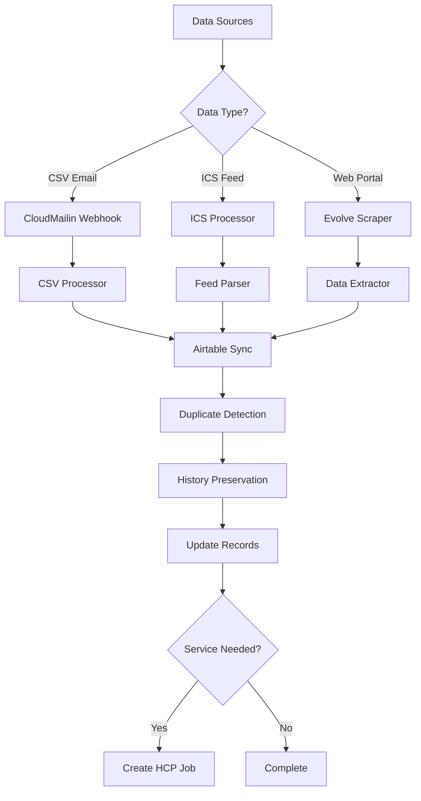
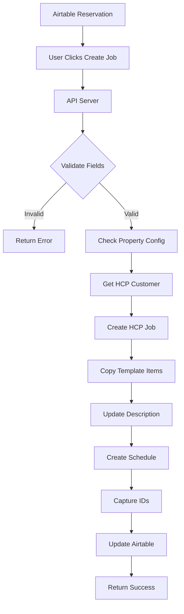
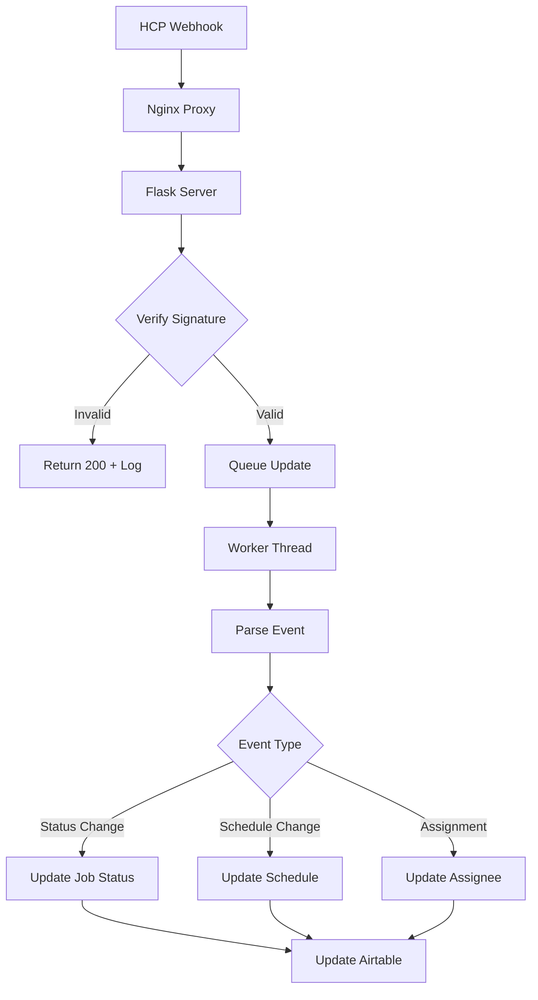

# Technical Setup and Architecture Guide
**Version Date: July 11, 2025**

## Table of Contents
1. [System Overview](#system-overview)
2. [Infrastructure Setup](#infrastructure-setup)
3. [Environment Configuration](#environment-configuration)
4. [Core Components Architecture](#core-components-architecture)
5. [Data Flow Architecture](#data-flow-architecture)
6. [API Integrations](#api-integrations)
7. [Database Schema](#database-schema)
8. [Security Implementation](#security-implementation)
9. [Deployment Procedures](#deployment-procedures)
10. [Monitoring and Maintenance](#monitoring-and-maintenance)
11. [Troubleshooting Guide](#troubleshooting-guide)
12. [Development Workflow](#development-workflow)

---

## System Overview

### Architecture Summary
```
┌─────────────────────────────────────────────────────────────────┐
│                     Property Management Automation               │
├─────────────────┬─────────────────┬─────────────────────────────┤
│  Data Sources   │  Core Engine    │  External Services          │
├─────────────────┼─────────────────┼─────────────────────────────┤
│ • CloudMailin   │ • Python 3.8+   │ • HousecallPro API          │
│ • ICS Feeds     │ • Node.js 18+   │ • Airtable API              │
│ • Evolve Portal │ • TypeScript    │ • MCP Servers               │
│ • Webhooks      │ • Async/Queue   │ • CloudMailin               │
└─────────────────┴─────────────────┴─────────────────────────────┘
```

### Technology Stack
- **Backend**: Python 3.8+, Node.js 18+, TypeScript
- **Web Server**: Nginx with SSL/TLS
- **Process Manager**: systemd
- **Database**: Airtable (SaaS)
- **Infrastructure**: Oracle Cloud Infrastructure (Free Tier)
- **OS**: Oracle Linux 8 (RHEL-compatible)

---

## Infrastructure Setup

### Server Specifications
```yaml
Provider: Oracle Cloud Infrastructure
Tier: Always Free
Instance: 
  Type: VM.Standard.A1.Flex (ARM)
  OCPU: 4
  Memory: 24GB
  Storage: 
    Boot: 200GB
    Block: 200GB
Network:
  Public IP: Static
  Ports: 22, 80, 443, 5000, 5001
  Firewall: iptables + OCI Security Lists
```

### Initial Server Setup

#### 1. System Updates and Basic Tools
```bash
# Update system
sudo dnf update -y

# Install essential packages
sudo dnf install -y \
  python3 python3-pip python3-devel \
  nodejs npm \
  nginx \
  git wget curl \
  chromium-headless \
  gcc make \
  postgresql-devel

# Install Python packages
pip3 install --user virtualenv
```

#### 2. User and Directory Setup
```bash
# Create automation user (if needed)
sudo useradd -m -s /bin/bash automation

# Create directory structure
sudo mkdir -p /home/opc/automation
sudo chown -R opc:opc /home/opc/automation

# Set up log directory
mkdir -p /home/opc/automation/src/automation/logs
```

#### 3. Nginx Configuration
```nginx
# /etc/nginx/conf.d/servativ.conf
server {
    listen 80;
    server_name servativ.themomentcatchers.com;
    return 301 https://$server_name$request_uri;
}

server {
    listen 443 ssl http2;
    server_name servativ.themomentcatchers.com;
    
    ssl_certificate /etc/letsencrypt/live/servativ.themomentcatchers.com/fullchain.pem;
    ssl_certificate_key /etc/letsencrypt/live/servativ.themomentcatchers.com/privkey.pem;
    
    # API Server
    location /api/ {
        proxy_pass http://127.0.0.1:3000/api/;
        proxy_set_header Host $host;
        proxy_set_header X-Real-IP $remote_addr;
        proxy_set_header X-Forwarded-For $proxy_add_x_forwarded_for;
        proxy_set_header X-Forwarded-Proto $scheme;
    }
    
    # Webhook endpoints
    location /webhooks/hcp {
        proxy_pass http://127.0.0.1:5000/webhooks/hcp;
        proxy_set_header Host $host;
        proxy_set_header X-Real-IP $remote_addr;
        proxy_set_header X-HCP-Signature $http_x_hcp_signature;
        proxy_set_header X-HCP-Timestamp $http_x_hcp_timestamp;
    }
    
    location /webhooks/hcp-dev {
        proxy_pass http://127.0.0.1:5001/webhooks/hcp;
        proxy_set_header Host $host;
        proxy_set_header X-Real-IP $remote_addr;
        proxy_set_header X-HCP-Signature $http_x_hcp_signature;
        proxy_set_header X-HCP-Timestamp $http_x_hcp_timestamp;
    }
    
    location /webhooks/csv-email {
        proxy_pass http://127.0.0.1:5000/webhooks/csv-email;
        proxy_set_header Host $host;
        proxy_set_header X-Real-IP $remote_addr;
        client_max_body_size 50M;
    }
}
```

#### 4. SSL Certificate Setup
```bash
# Install Certbot
sudo dnf install -y certbot python3-certbot-nginx

# Obtain certificate
sudo certbot --nginx -d servativ.themomentcatchers.com

# Auto-renewal cron
echo "0 0,12 * * * root python3 -c 'import random; import time; time.sleep(random.random() * 3600)' && certbot renew -q" | sudo tee -a /etc/crontab > /dev/null
```

---

## Environment Configuration

### Environment Structure
```
/home/opc/automation/
├── .env                          # Deprecated - use environment-specific
├── config/
│   └── environments/
│       ├── dev/
│       │   └── .env             # Development environment variables
│       └── prod/
│           └── .env             # Production environment variables
```

### Environment Variables

#### Development Environment (.env)
```bash
# Airtable Configuration
AIRTABLE_API_KEY=key_xxxxxxxxxxxx
AIRTABLE_BASE_ID=app67yWFv0hKdl6jM
AIRTABLE_RESERVATIONS_TABLE=Reservations
AIRTABLE_PROPERTIES_TABLE=Properties
AIRTABLE_CUSTOMERS_TABLE=Customers
AIRTABLE_ICS_FEEDS_TABLE=ICS Feeds
AIRTABLE_AUTOMATION_TABLE=Automation

# HousecallPro Configuration
HCP_API_KEY=sk_test_xxxxxxxxxxxx
HCP_WEBHOOK_SECRET=whsec_xxxxxxxxxxxx

# Job Template IDs (Development)
DEFAULT_JOB_TYPE_ID=jt_dev_turnover
INSPECTION_JOB_TYPE_ID=jt_dev_inspection
RETURN_LAUNDRY_JOB_TYPE_ID=jt_dev_laundry

# API Configuration
API_KEY=dev_api_key_secure_random_string
API_BASE_URL=https://servativ.themomentcatchers.com

# Evolve Configuration
EVOLVE_USERNAME=username@example.com
EVOLVE_PASSWORD=secure_password

# Environment
ENVIRONMENT=development
```

#### Production Environment (.env)
```bash
# Airtable Configuration
AIRTABLE_API_KEY=key_yyyyyyyyyyyy
AIRTABLE_BASE_ID=appZzebEIqCU5R9ER
# ... (similar structure with production values)

# Environment
ENVIRONMENT=production
```

### Python Configuration System

#### Configuration Hierarchy
```python
# src/automation/config.py
class Config:
    def __init__(self):
        self.environment_name = os.environ.get('ENVIRONMENT', 'development')
        self._load_environment_config()
        
    def _load_environment_config(self):
        if self.environment_name == 'production':
            from .config_prod import ProductionConfig
            self._config = ProductionConfig()
        else:
            from .config_dev import DevelopmentConfig
            self._config = DevelopmentConfig()
```

---

## Core Components Architecture

### 1. Python Automation Engine

#### Controller Architecture
```python
# src/automation/controller.py
class AutomationController:
    """
    Central orchestrator for all automation tasks
    """
    def __init__(self, config):
        self.config = config
        self.airtable = AirtableService(config)
        self.logger = self._setup_logger()
        
    async def run_automation(self, automation_name):
        """Execute specific automation with tracking"""
        # 1. Check if automation is enabled in Airtable
        # 2. Execute the automation script
        # 3. Update last run time and status
        # 4. Handle errors and logging
```

#### Script Mapping
```python
AUTOMATION_SCRIPTS = {
    'CSV to Airtable': 'CSVtoAirtable/csvProcess.py',
    'ICS Sync': 'icsAirtableSync/icsProcess.py',
    'Evolve Sync': 'evolve/evolveScrape.py',
    'Update Service Lines': 'hcp/update-service-lines-enhanced.py',
    'HCP Reconcile Jobs': 'hcp/reconcile-jobs.py'
}
```

### 2. CSV Processing Pipeline

#### Processing Flow
```
CloudMailin Email → Webhook → Save CSV → Process → Update Airtable → Archive
```

#### Key Components
```python
# src/automation/scripts/CSVtoAirtable/csvProcess.py
class CSVProcessor:
    def process_file(self, file_path):
        # 1. Detect supplier (iTrip vs Evolve)
        # 2. Parse CSV with appropriate parser
        # 3. Generate UIDs for each reservation
        # 4. Check for duplicates and overlaps
        # 5. Sync with Airtable
        # 6. Move to processed folder
```

### 3. ICS Feed Processing

#### Concurrent Processing Architecture
```python
# src/automation/scripts/icsAirtableSync/icsProcess_optimized.py
async def process_all_feeds():
    """Process all ICS feeds concurrently"""
    async with aiohttp.ClientSession() as session:
        # Create tasks for all active feeds
        tasks = [
            process_single_feed(session, feed) 
            for feed in active_feeds
        ]
        # Process with concurrency limit
        results = await asyncio.gather(*tasks)
```

### 4. Web Scraping (Evolve)

#### Selenium Configuration
```python
def get_chrome_options():
    options = webdriver.ChromeOptions()
    options.add_argument('--headless')
    options.add_argument('--no-sandbox')
    options.add_argument('--disable-dev-shm-usage')
    options.add_argument('--disable-gpu')
    # Timezone override for consistency
    options.add_experimental_option(
        'prefs', 
        {'profile.default_content_setting_values.notifications': 2}
    )
    return options
```

### 5. API Server (Node.js/Express)

#### Server Architecture
```javascript
// src/automation/scripts/airscripts-api/server.js
const app = express();

// Middleware stack
app.use(helmet());
app.use(cors(corsOptions));
app.use(rateLimiter);
app.use(apiKeyAuth);

// Environment-specific routing
app.use('/api/dev', devRoutes);
app.use('/api/prod', prodRoutes);

// Error handling
app.use(errorHandler);
```

### 6. Webhook Server (Flask)

#### Asynchronous Processing
```python
# src/automation/scripts/webhook/webhook.py
from queue import Queue
from threading import Thread

update_queue = Queue()

def webhook_worker():
    """Background worker for processing updates"""
    while True:
        update = update_queue.get()
        try:
            process_webhook_update(update)
        except Exception as e:
            logger.error(f"Worker error: {e}")
        finally:
            update_queue.task_done()

# Start worker thread
worker = Thread(target=webhook_worker, daemon=True)
worker.start()
```

---

## Data Flow Architecture

### 1. Reservation Processing Flow



### 2. Job Creation Flow



### 3. Webhook Processing Flow



---

## API Integrations

### 1. HousecallPro API

#### Authentication
```javascript
const headers = {
    'Authorization': `Bearer ${HCP_API_KEY}`,
    'Content-Type': 'application/json',
    'Accept': 'application/json'
};
```

#### Key Endpoints
```javascript
// Job Management
POST   /v2/jobs                    // Create job
GET    /v2/jobs/:id                // Get job details
PATCH  /v2/jobs/:id                // Update job
DELETE /v2/jobs/:id/schedule       // Remove schedule

// Customer Management
GET    /v2/customers               // List customers
POST   /v2/customers               // Create customer
GET    /v2/customers/:id/addresses // Get addresses

// Line Items
GET    /v2/jobs/:id/line_items    // Get line items
POST   /v2/jobs/:id/line_items    // Create line item
PATCH  /v2/line_items/:id          // Update line item
```

#### Rate Limiting Strategy
```javascript
class RateLimiter {
    constructor() {
        this.requests = [];
        this.limit = 1000;
        this.window = 3600000; // 1 hour
    }
    
    async waitIfNeeded() {
        const now = Date.now();
        this.requests = this.requests.filter(
            time => now - time < this.window
        );
        
        if (this.requests.length >= this.limit) {
            const oldestRequest = this.requests[0];
            const waitTime = this.window - (now - oldestRequest);
            await sleep(waitTime);
        }
        
        this.requests.push(now);
    }
}
```

### 2. Airtable API

#### Python Integration
```python
# Using pyairtable
from pyairtable import Api

class AirtableService:
    def __init__(self, api_key, base_id):
        self.api = Api(api_key)
        self.base = self.api.base(base_id)
        
    def batch_upsert(self, table_name, records, key_field='ID'):
        """Upsert records with duplicate detection"""
        table = self.base.table(table_name)
        
        # Get existing records
        existing = {
            r['fields'][key_field]: r 
            for r in table.all() 
            if key_field in r['fields']
        }
        
        updates = []
        creates = []
        
        for record in records:
            if record[key_field] in existing:
                updates.append({
                    'id': existing[record[key_field]]['id'],
                    'fields': record
                })
            else:
                creates.append({'fields': record})
        
        # Batch operations
        if updates:
            table.batch_update(updates)
        if creates:
            table.batch_create(creates)
```

### 3. MCP (Model Context Protocol) Servers

#### Architecture
```typescript
// tools/hcp-mcp-common/base-server.ts
export abstract class BaseMCPServer {
    protected cache: CacheManager;
    protected rateLimiter: RateLimiter;
    
    abstract getName(): string;
    abstract getTools(): Tool[];
    
    async handleRequest(request: Request): Promise<Response> {
        await this.rateLimiter.checkLimit();
        return this.processRequest(request);
    }
}
```

#### HCP MCP Implementation
```typescript
// tools/hcp-mcp-prod/server.ts
class HCPMCPServer extends BaseMCPServer {
    private analysisTools = {
        analyze_laundry_jobs: new LaundryAnalyzer(),
        analyze_customer_revenue: new RevenueAnalyzer(),
        analyze_job_statistics: new StatsAnalyzer()
    };
    
    async processAnalysis(tool: string, params: any) {
        const analyzer = this.analysisTools[tool];
        if (!analyzer) throw new Error('Unknown tool');
        
        const startTime = Date.now();
        const result = await analyzer.analyze(params);
        
        return {
            ...result,
            executionTime: Date.now() - startTime,
            dataQuality: analyzer.getQualityMetrics()
        };
    }
}
```

---

## Database Schema

### Airtable Base Structure

#### Reservations Table
```
Primary Key: ID (autonumber)
Unique Key: Reservation UID + ICS URL

Core Fields:
- Check-in/Check-out Dates
- Property ID (linked)
- Status (New/Modified/Old/Removed)
- Entry Type (Reservation/Block)
- Service Type
- Job Status
- Service Job ID
- Schedule Sync Details
- Service Sync Details

Computed Fields:
- Final Service Time (formula)
- Next Guest Date
- Same-day Turnover
- Owner Arriving
```

#### Properties Table
```
Primary Key: Property Name

Configuration:
- HCP Customer ID (linked)
- HCP Address ID
- HCP Address
- Job Template IDs
- ICS Feeds (linked)

Relationships:
- Reservations (one-to-many)
- ICS Feeds (one-to-many)
- Customer (many-to-one)
```

#### Customers Table
```
Primary Key: HCP Customer ID

Fields:
- First/Last Name
- Full Name (formula)
- Contact Information
- Properties (one-to-many)
```

---

## Security Implementation

### 1. Authentication Layers

#### API Key Authentication
```javascript
// API Server
const apiKeyAuth = (req, res, next) => {
    const apiKey = req.headers['x-api-key'];
    
    if (!apiKey || apiKey !== process.env.API_KEY) {
        return res.status(401).json({ error: 'Unauthorized' });
    }
    
    next();
};
```

#### Webhook Signature Verification
```python
# Webhook Server
def verify_hcp_signature(payload, timestamp, signature):
    """HMAC-SHA256 signature verification"""
    message = f"{timestamp}.{payload}".encode()
    expected = hmac.new(
        HCP_WEBHOOK_SECRET.encode(),
        message,
        hashlib.sha256
    ).hexdigest()
    
    return hmac.compare_digest(expected, signature)
```

### 2. Environment Isolation

#### File System Separation
```
/home/opc/automation/src/automation/scripts/
├── CSV_process_development/     # Dev incoming
├── CSV_process_production/      # Prod incoming
├── CSV_done_development/        # Dev processed
└── CSV_done_production/         # Prod processed
```

#### Configuration Isolation
- Separate API keys and credentials
- Separate Airtable bases
- Separate webhook endpoints
- Separate log files

### 3. Network Security

#### Firewall Rules
```bash
# Allow required ports
sudo firewall-cmd --permanent --add-port=443/tcp
sudo firewall-cmd --permanent --add-port=80/tcp
sudo firewall-cmd --permanent --add-port=5000/tcp
sudo firewall-cmd --permanent --add-port=5001/tcp
sudo firewall-cmd --reload
```

#### SSL/TLS Configuration
```nginx
ssl_protocols TLSv1.2 TLSv1.3;
ssl_ciphers HIGH:!aNULL:!MD5;
ssl_prefer_server_ciphers on;
ssl_session_cache shared:SSL:10m;
ssl_session_timeout 10m;

# Security headers
add_header Strict-Transport-Security "max-age=31536000" always;
add_header X-Frame-Options "DENY" always;
add_header X-Content-Type-Options "nosniff" always;
add_header X-XSS-Protection "1; mode=block" always;
```

---

## Deployment Procedures

### 1. Code Deployment

#### Git-based Deployment
```bash
# Production deployment
cd /home/opc/automation
git fetch origin
git checkout main
git pull origin main

# Install/update dependencies
pip3 install -r requirements.txt
cd src/automation/scripts/airscripts-api && npm install
cd ../airtable-agent && npm install

# Restart services
sudo systemctl restart airscripts-api-https
sudo systemctl restart webhook
sudo systemctl restart webhook-dev
```

### 2. Service Management

#### Systemd Service Files

##### API Server Service
```ini
# /etc/systemd/system/airscripts-api-https.service
[Unit]
Description=AirScripts API Server (HTTPS)
After=network.target

[Service]
Type=simple
User=opc
WorkingDirectory=/home/opc/automation/src/automation/scripts/airscripts-api
Environment="NODE_ENV=production"
Environment="PORT=3000"
ExecStart=/usr/bin/node server.js
Restart=always
RestartSec=10

[Install]
WantedBy=multi-user.target
```

##### Webhook Server Service
```ini
# /etc/systemd/system/webhook.service
[Unit]
Description=Webhook Server (Production)
After=network.target

[Service]
Type=simple
User=opc
WorkingDirectory=/home/opc/automation/src/automation/scripts/webhook
Environment="FLASK_ENV=production"
Environment="ENVIRONMENT=production"
ExecStart=/usr/bin/python3 webhook.py
Restart=always
RestartSec=10

[Install]
WantedBy=multi-user.target
```

### 3. Cron Jobs

#### Production Automation
```bash
# Run every 4 hours
0 0,4,8,12,16,20 * * * /usr/bin/python3 /home/opc/automation/src/run_automation_prod.py >> /home/opc/automation/src/automation/logs/automation_prod_cron.log 2>&1
```

#### Development Automation
```bash
# Run every 4 hours, staggered by 10 minutes
10 0,4,8,12,16,20 * * * /usr/bin/python3 /home/opc/automation/src/run_automation_dev.py >> /home/opc/automation/src/automation/logs/automation_dev_cron.log 2>&1
```

---

## Monitoring and Maintenance

### 1. Log Management

#### Log Files Structure
```
src/automation/logs/
├── automation_dev.log           # Dev automation runs
├── automation_prod.log          # Prod automation runs
├── webhook.log                  # Prod webhook activity
├── webhook_development.log      # Dev webhook activity
├── csv_sync.log                # CSV processing
├── ics_sync.log                # ICS processing
└── airscripts-api.log          # API server logs
```

#### Log Rotation Configuration
```bash
# /etc/logrotate.d/automation
/home/opc/automation/src/automation/logs/*.log {
    daily
    rotate 30
    compress
    delaycompress
    missingok
    notifempty
    create 0644 opc opc
}
```

### 2. Health Monitoring

#### Health Check Endpoints
```javascript
// API Server Health Check
app.get('/health', async (req, res) => {
    const health = {
        status: 'ok',
        timestamp: new Date().toISOString(),
        uptime: process.uptime(),
        memory: process.memoryUsage(),
        checks: {
            airtable: await checkAirtableConnection(),
            hcp: await checkHCPConnection()
        }
    };
    
    res.json(health);
});
```

#### Monitoring Script
```bash
#!/bin/bash
# Health check script

# Check services
services=("airscripts-api-https" "webhook" "webhook-dev" "nginx")

for service in "${services[@]}"; do
    if systemctl is-active --quiet $service; then
        echo "✅ $service is running"
    else
        echo "❌ $service is not running"
        # Send alert
    fi
done

# Check disk space
df -h | grep -E '^/dev/' | awk '{print $5 " " $1}' | while read output; do
    usage=$(echo $output | awk '{print $1}' | cut -d'%' -f1)
    partition=$(echo $output | awk '{print $2}')
    if [ $usage -ge 80 ]; then
        echo "⚠️ Disk usage on $partition is $usage%"
    fi
done
```

### 3. Performance Monitoring

#### Key Metrics
```python
# Performance tracking
class PerformanceMonitor:
    def __init__(self):
        self.metrics = {
            'csv_processing_time': [],
            'ics_sync_duration': [],
            'api_response_times': [],
            'webhook_processing_time': []
        }
    
    def record_metric(self, metric_name, duration):
        self.metrics[metric_name].append({
            'timestamp': datetime.now(),
            'duration': duration
        })
        
    def get_average(self, metric_name, window_minutes=60):
        cutoff = datetime.now() - timedelta(minutes=window_minutes)
        recent = [
            m['duration'] 
            for m in self.metrics[metric_name] 
            if m['timestamp'] > cutoff
        ]
        return sum(recent) / len(recent) if recent else 0
```

---

## Troubleshooting Guide

### Common Issues and Solutions

#### 1. Webhook Not Receiving Events
```bash
# Check service status
sudo systemctl status webhook

# Check nginx is routing correctly
curl -X POST https://servativ.themomentcatchers.com/webhooks/hcp -d '{"test":true}'

# Check logs
tail -f /home/opc/automation/src/automation/logs/webhook.log

# Verify webhook URL in HCP dashboard
```

#### 2. CSV Files Not Processing
```bash
# Check CloudMailin webhook
tail -f /home/opc/automation/src/automation/logs/webhook.log | grep csv-email

# Verify directory permissions
ls -la /home/opc/automation/src/automation/scripts/CSV_process_production/

# Run manual processing
cd /home/opc/automation
python3 src/automation/scripts/CSVtoAirtable/csvProcess.py --file /path/to/csv
```

#### 3. ICS Feeds Timing Out
```python
# Increase timeout in icsProcess.py
FEED_TIMEOUT = 30  # Increase from 15

# Check specific feed
python3 -c "
import requests
response = requests.get('https://feed-url.ics', timeout=30)
print(f'Status: {response.status_code}, Size: {len(response.content)}')
"
```

#### 4. Memory Issues
```bash
# Check memory usage
free -h
ps aux | sort -k 4 -r | head -20

# Restart memory-heavy services
sudo systemctl restart airscripts-api-https

# Clear cache
find /tmp -name "*.cache" -type f -delete
```

---

## Development Workflow

### 1. Local Development Setup

#### Clone Repository
```bash
git clone <repository-url>
cd automation
```

#### Python Environment
```bash
# Create virtual environment
python3 -m venv venv
source venv/bin/activate

# Install dependencies
pip install -r requirements.txt
```

#### Node.js Setup
```bash
# Install Node dependencies
cd src/automation/scripts/airscripts-api
npm install

cd ../airtable-agent
npm install
```

### 2. Testing Procedures

#### Unit Tests
```python
# Run Python tests
pytest tests/

# Run specific test
pytest tests/test_csv_processor.py::test_uid_generation
```

#### Integration Tests
```bash
# Test CSV processing
python3 src/automation/scripts/CSVtoAirtable/csvProcess.py \
    --file testing/test-scenarios/itrip-sample.csv \
    --dry-run

# Test ICS sync
python3 src/automation/scripts/icsAirtableSync/icsProcess.py \
    --feed-url "https://example.com/test.ics" \
    --dry-run
```

### 3. Code Quality

#### Python Linting
```bash
# Format code
black src/

# Sort imports
isort src/

# Type checking
mypy src/
```

#### JavaScript/TypeScript
```bash
# Lint JavaScript
cd src/automation/scripts/airscripts-api
npm run lint

# Format code
npm run format
```

### 4. Git Workflow

#### Branch Strategy
```bash
# Feature development
git checkout -b feature/new-feature
# Make changes
git commit -m "feat: add new feature"
git push origin feature/new-feature

# Hotfix
git checkout -b hotfix/critical-fix
# Fix issue
git commit -m "fix: resolve critical issue"
git push origin hotfix/critical-fix
```

---

## Maintenance Checklist

### Daily Tasks
- [ ] Check automation logs for errors
- [ ] Verify webhook processing
- [ ] Monitor system resources
- [ ] Review any failed jobs

### Weekly Tasks
- [ ] Analyze performance metrics
- [ ] Clean up old log files
- [ ] Review disk usage
- [ ] Check for security updates

### Monthly Tasks
- [ ] Full system backup
- [ ] Review and optimize slow queries
- [ ] Update dependencies
- [ ] Security audit

### Quarterly Tasks
- [ ] Load testing
- [ ] Disaster recovery drill
- [ ] Architecture review
- [ ] Cost optimization review

---

This technical guide provides comprehensive documentation for understanding, maintaining, and extending the property management automation system. Keep this guide updated as the system evolves.