# System Overview - System Logical Flow

## Main System Architecture


## Data Flow Diagram


## Environment Separation Flow

```mermaid
graph TD
    subgraph "Development Environment"
        DEV_CM[Dev CloudMailin]
        DEV_AT[(Dev Airtable<br/>app67yWFv0hKdl6jM)]
        DEV_HCP[Dev HCP<br/>Boris Account]
        DEV_API[/api/dev/*]
        DEV_WH[/webhooks/hcp-dev]
    end
    
    subgraph "Production Environment"
        PROD_CM[Prod CloudMailin]
        PROD_AT[(Prod Airtable<br/>appZzebEIqCU5R9ER)]
        PROD_HCP[Prod HCP<br/>Customer Account]
        PROD_API[/api/prod/*]
        PROD_WH[/webhooks/hcp]
    end
    
    DEV_CM --> DEV_AT
    DEV_AT <--> DEV_API
    DEV_API <--> DEV_HCP
    DEV_HCP --> DEV_WH
    DEV_WH --> DEV_AT
    
    PROD_CM --> PROD_AT
    PROD_AT <--> PROD_API
    PROD_API <--> PROD_HCP
    PROD_HCP --> PROD_WH
    PROD_WH --> PROD_AT
    
    style DEV_AT fill:#e1f5fe
    style PROD_AT fill:#ffebee
```

## Process Orchestration Flow


## Error Handling Flow


## Integration State Machine


## Component Communication


## Daily Operation Timeline

```mermaid
gantt
    title Daily Automation Schedule
    dateFormat HH:mm
    axisFormat %H:%M
    
    section Production
    ICS Sync         :00:00, 10m
    CSV Process      :00:10, 5m
    Evolve Scrape    :00:15, 15m
    HCP Sync         :00:30, 10m
    
    section Production
    ICS Sync         :04:00, 10m
    CSV Process      :04:10, 5m
    Evolve Scrape    :04:15, 15m
    HCP Sync         :04:30, 10m
    
    section Development
    ICS Sync         :00:10, 10m
    CSV Process      :00:20, 5m
    Evolve Scrape    :00:25, 15m
    HCP Sync         :00:40, 10m
```



## Example Scenarios

### 1. Happy Path - New Reservation


### 2. Error Case - Duplicate Reservation


### 3. Edge Case - System Recovery


---

## Flow Legend

- **Rectangles**: System components
- **Cylinders**: Databases
- **Diamonds**: Decision points
- **Arrows**: Data flow direction
- **Subgraphs**: Logical groupings

---

**Document Version**: 1.0.0
**Last Updated**: July 11, 2025
**Diagrams**: Mermaid v10.0+