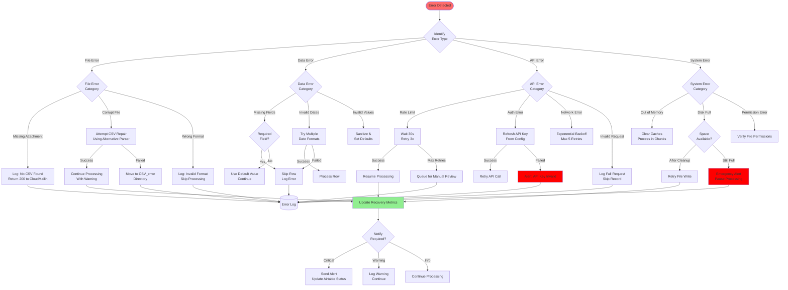

# CSV Processing - Error Handling Flow

**Feature:** 01-csv-processing  
**Purpose:** Comprehensive error handling strategies for CSV processing  
**Last Updated:** July 14, 2025

---

## 🚨 Error Handling Flow



---

## 📋 Error Categories & Handling

### 1. **File-Level Errors**

#### Missing Attachment
```python
if not attachments:
    logging.warning("No CSV attachment found in email")
    return {"status": "success", "message": "No CSV to process"}
```

#### Corrupt CSV
```python
try:
    df = pd.read_csv(file_path)
except pd.errors.ParserError:
    # Try alternative parser
    try:
        df = pd.read_csv(file_path, error_bad_lines=False, warn_bad_lines=True)
        logging.warning(f"CSV repaired with {len(df)} valid rows")
    except:
        shutil.move(file_path, error_directory)
        logging.error(f"Corrupt CSV moved to error directory: {file_path}")
```

### 2. **Data-Level Errors**

#### Missing Required Fields
```python
REQUIRED_FIELDS = ['Confirmation Code', 'Property ID', 'Check In', 'Check Out']

for field in REQUIRED_FIELDS:
    if not row.get(field):
        logging.error(f"Missing required field '{field}' in row: {row.get('Confirmation Code', 'UNKNOWN')}")
        continue  # Skip this row
```

#### Date Parsing Errors
```python
DATE_FORMATS = [
    '%m/%d/%Y',
    '%Y-%m-%d',
    '%d/%m/%Y',
    '%B %d, %Y',
    '%b %d, %Y'
]

def parse_date_flexible(date_string):
    for fmt in DATE_FORMATS:
        try:
            return datetime.strptime(date_string, fmt).strftime('%m/%d/%Y')
        except ValueError:
            continue
    
    # Last resort - use dateutil
    try:
        return parser.parse(date_string).strftime('%m/%d/%Y')
    except:
        raise ValueError(f"Unable to parse date: {date_string}")
```

### 3. **API-Level Errors**

#### Rate Limiting
```python
@retry(
    stop=stop_after_attempt(3),
    wait=wait_exponential(multiplier=1, min=4, max=60),
    retry=retry_if_exception_type(requests.exceptions.HTTPError)
)
def update_airtable_record(record_id, fields):
    try:
        response = table.update(record_id, fields)
        return response
    except HTTPError as e:
        if e.response.status_code == 429:  # Rate limit
            wait_time = int(e.response.headers.get('Retry-After', 30))
            logging.warning(f"Rate limited. Waiting {wait_time} seconds...")
            time.sleep(wait_time)
            raise
        else:
            raise
```

#### Network Errors
```python
def robust_api_call(func, *args, **kwargs):
    max_retries = 5
    backoff_factor = 2
    
    for attempt in range(max_retries):
        try:
            return func(*args, **kwargs)
        except (ConnectionError, Timeout) as e:
            if attempt == max_retries - 1:
                logging.error(f"Network error after {max_retries} attempts: {e}")
                raise
            
            wait_time = backoff_factor ** attempt
            logging.warning(f"Network error, retrying in {wait_time}s...")
            time.sleep(wait_time)
```

### 4. **System-Level Errors**

#### Memory Management
```python
def process_large_csv(file_path, chunk_size=1000):
    try:
        # Process in chunks to avoid memory issues
        for chunk in pd.read_csv(file_path, chunksize=chunk_size):
            process_chunk(chunk)
            
            # Explicit garbage collection after each chunk
            gc.collect()
            
    except MemoryError:
        logging.error("Out of memory - switching to line-by-line processing")
        process_line_by_line(file_path)
```

#### Disk Space
```python
def check_disk_space(required_mb=100):
    stat = os.statvfs('/home/opc/automation')
    available_mb = (stat.f_bavail * stat.f_frsize) / 1024 / 1024
    
    if available_mb < required_mb:
        # Try to free space
        cleanup_old_files()
        
        # Re-check
        stat = os.statvfs('/home/opc/automation')
        available_mb = (stat.f_bavail * stat.f_frsize) / 1024 / 1024
        
        if available_mb < required_mb:
            raise IOError(f"Insufficient disk space: {available_mb}MB available, {required_mb}MB required")
```

---

## 🔔 Error Notification Strategy

### Severity Levels

| Level | Criteria | Action |
|-------|----------|--------|
| **CRITICAL** | System errors, API auth failures | Immediate alert, pause processing |
| **ERROR** | Failed records, corrupt files | Log details, continue processing |
| **WARNING** | Repaired data, retries | Log warning, monitor frequency |
| **INFO** | Skipped duplicates, no changes | Standard logging only |

### Notification Channels
1. **Log Files**: All errors logged to `csv_process_errors.log`
2. **Airtable Status**: Critical errors update automation status
3. **Console Output**: Real-time error display during manual runs
4. **Future**: Email/Slack alerts for critical errors

---

## 📊 Error Metrics Tracking

```python
ERROR_METRICS = {
    'files_processed': 0,
    'files_failed': 0,
    'rows_processed': 0,
    'rows_skipped': 0,
    'api_retries': 0,
    'api_failures': 0,
    'recovery_success': 0,
    'critical_errors': []
}

# Updated in Airtable automation status
```

---

## 🔗 Related Documentation
- [Main Process Flow](./main-process-flow.md)
- [CSV Processing Business Logic](../BusinessLogicAtoZ.md)
- [Error Handling Recovery Feature](../../15-error-handling-recovery/)