# CSV Processing - System Logical Flow

## Main CSV Processing Flow

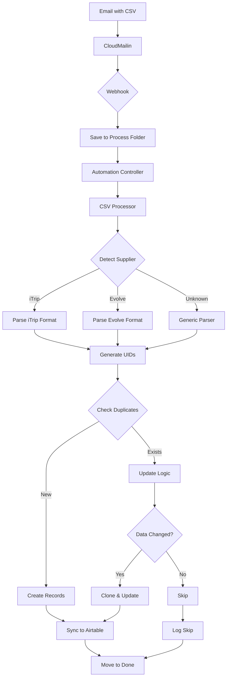

## CloudMailin Webhook Flow

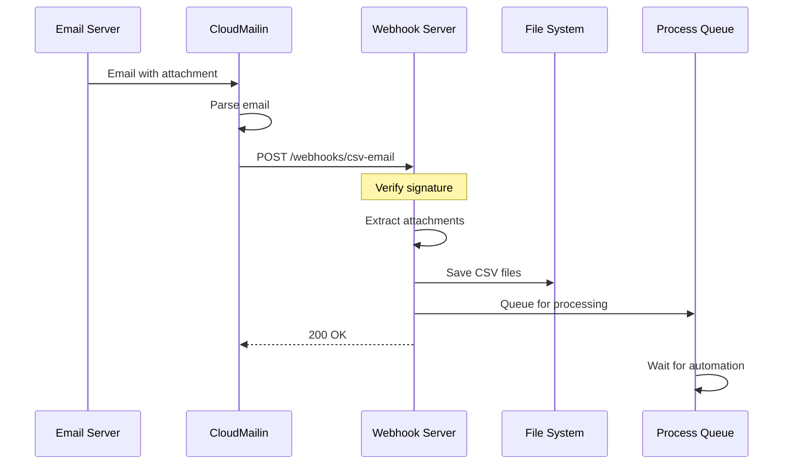

## Supplier Detection Logic

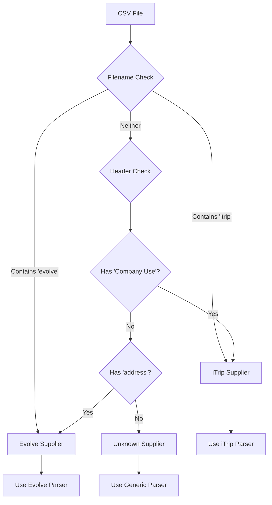

## UID Generation Flow

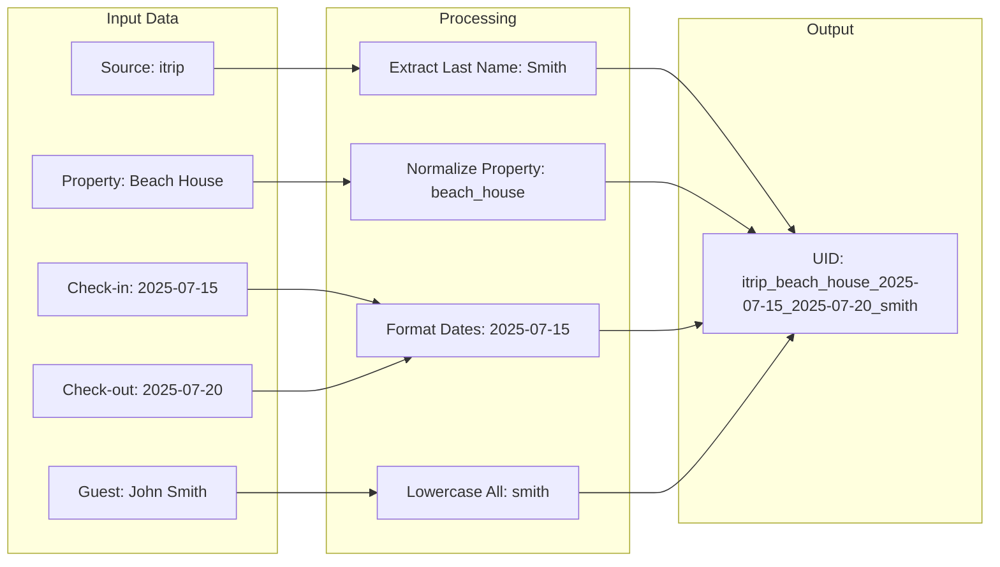

## Duplicate Detection State Machine

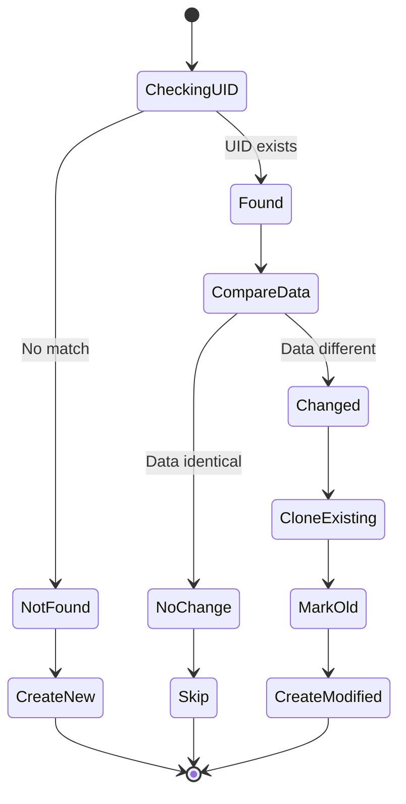

## Property Matching Flow

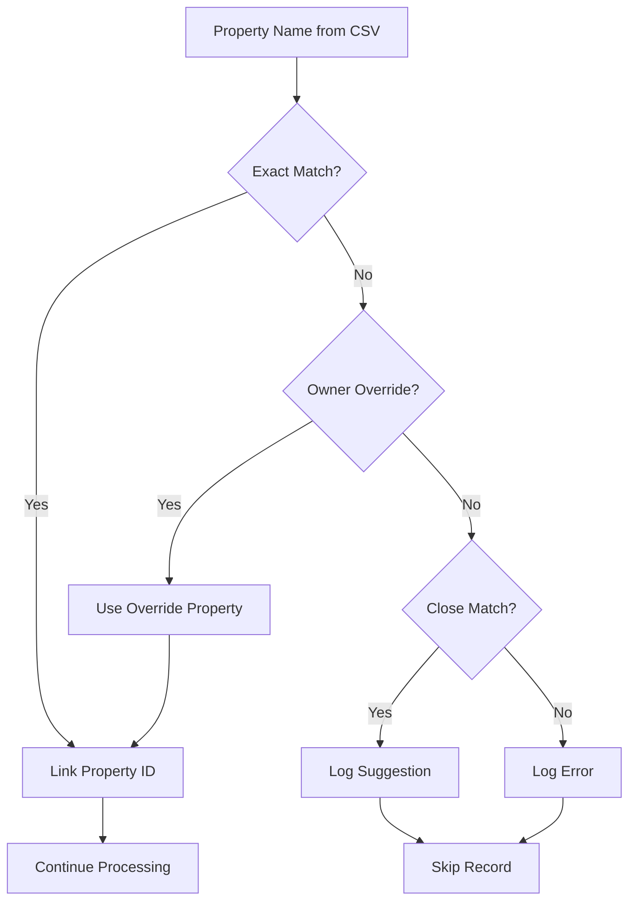

## Error Handling Flow

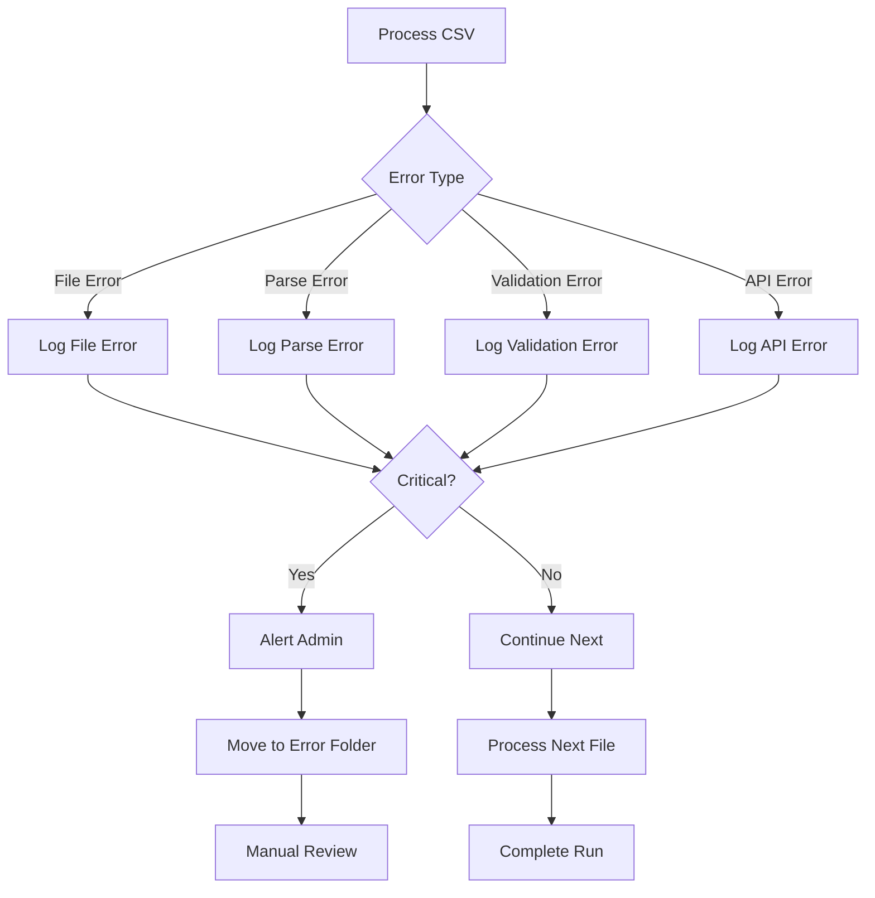

## Date Processing Pipeline

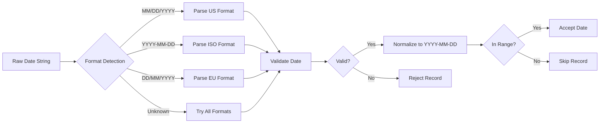

## Example Scenarios

### 1. Happy Path - New iTrip Reservation
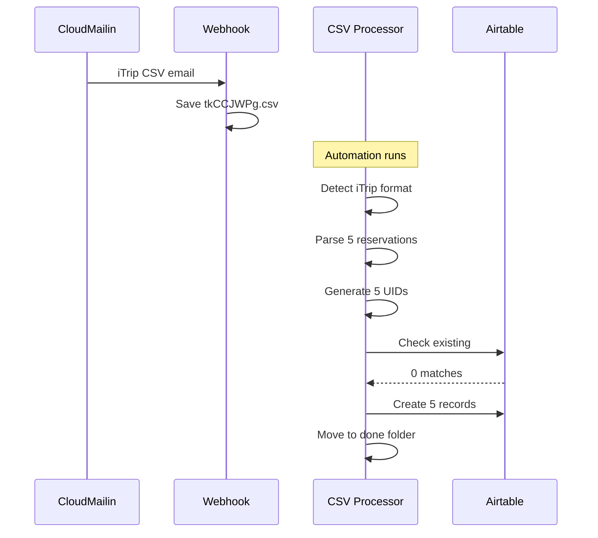

### 2. Error Case - Missing Property
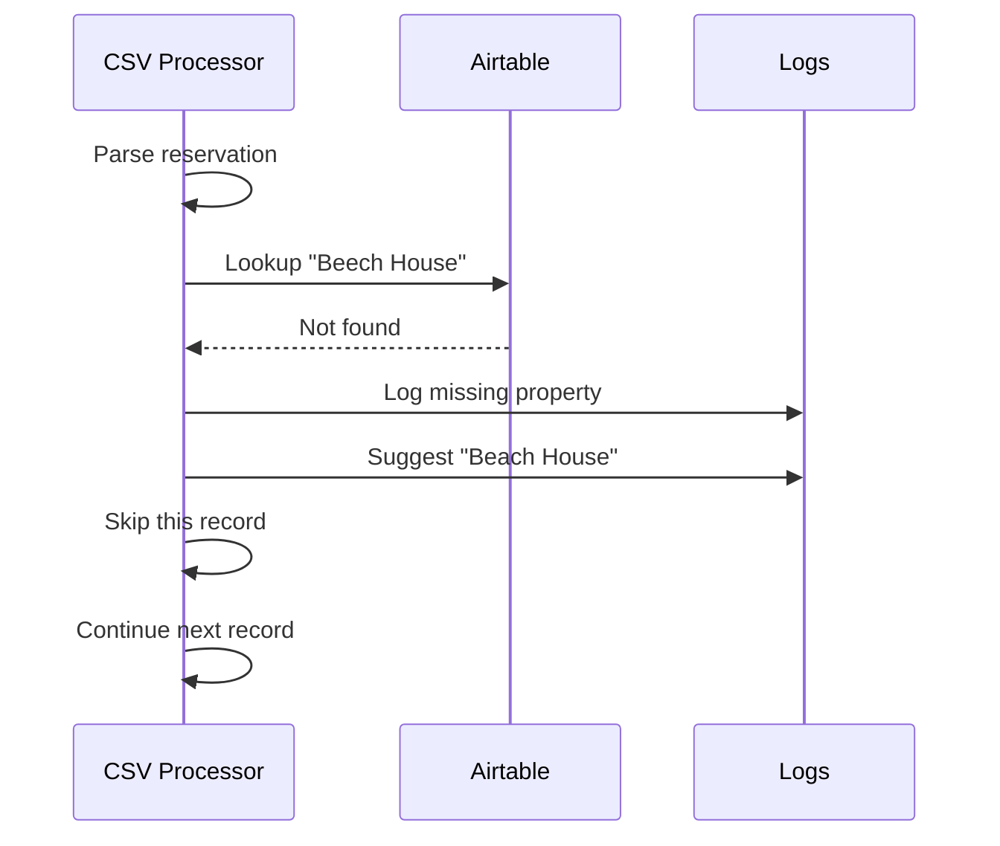

### 3. Edge Case - Duplicate with Changes
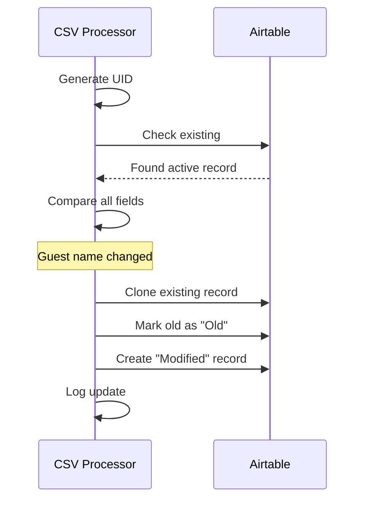

---

## Flow Legend

- **Rectangles**: Process steps
- **Diamonds**: Decision points
- **Parallelograms**: Input/Output
- **Cylinders**: Data stores
- **Swim lanes**: Different systems

---

**Document Version**: 1.0.0
**Last Updated**: July 11, 2025
**Mermaid Version**: v10.0+