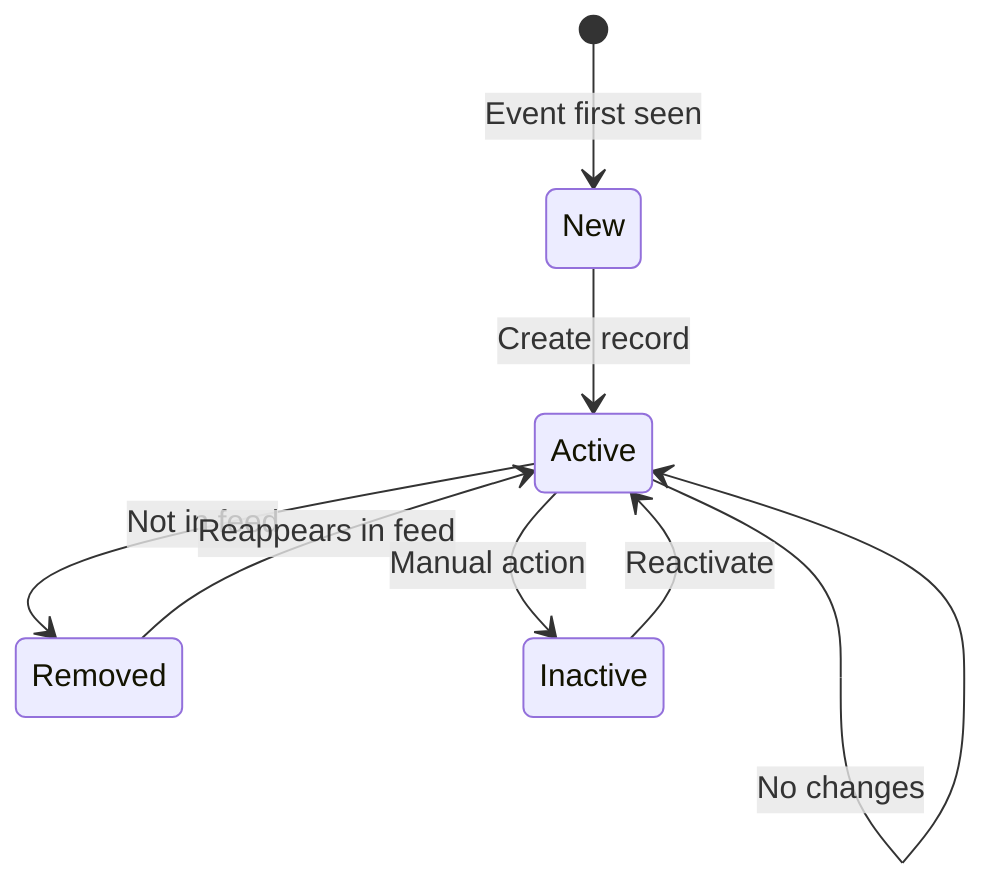

# ICS Feed Sync - Main Process Flow

**Feature:** 02-ics-feed-sync  
**Purpose:** Visual representation of the complete ICS calendar feed synchronization pipeline  
**Last Updated:** July 14, 2025

---

## 🔄 Main Process Flow

```mermaid
flowchart TB
    Start([ICS Sync Triggered<br/>Every 4 Hours]) --> LoadFeeds[Load Active ICS Feeds<br/>from Airtable]
    
    LoadFeeds --> CheckCount{Any Active<br/>Feeds?}
    CheckCount -->|No| NoFeeds[Log: No active feeds<br/>Exit gracefully]
    CheckCount -->|Yes| PrepareSync[Initialize Sync Tracking<br/>Previous UIDs per Property]
    
    PrepareSync --> ProcessFeeds[Process Feeds in Parallel<br/>Max 10 Concurrent]
    
    ProcessFeeds --> FeedLoop[For Each Feed]
    
    FeedLoop --> DownloadFeed[Download ICS File<br/>30s Timeout]
    
    DownloadFeed -->|Success| ParseICS[Parse ICS Calendar]
    DownloadFeed -->|Timeout| LogTimeout[Log Timeout Error<br/>Update Feed Status]
    DownloadFeed -->|404| LogNotFound[Mark Feed Inactive<br/>Alert Property]
    
    ParseICS -->|Valid| ExtractEvents[Extract VEVENT Components]
    ParseICS -->|Invalid| TryFallback[Try Fallback Parser]
    
    TryFallback -->|Success| ExtractEvents
    TryFallback -->|Failed| LogParseError[Log Parse Error<br/>Skip Feed]
    
    ExtractEvents --> ProcessEvent[For Each Event]
    
    ProcessEvent --> ValidateEvent{Has Required<br/>Fields?}
    ValidateEvent -->|No| SkipEvent[Skip Event<br/>Log Warning]
    ValidateEvent -->|Yes| GenerateUID[Generate Composite UID<br/>ICS_UID|PropID|CheckIn]
    
    GenerateUID --> DetermineType{Event Type?}
    
    DetermineType -->|Reservation| ExtractGuest[Extract Guest Info<br/>from Summary/Description]
    DetermineType -->|Block| CreateBlock[Set Guest Name<br/>as "BLOCK"]
    
    ExtractGuest --> CheckExisting{Check Existing<br/>Reservation}
    CreateBlock --> CheckExisting
    
    CheckExisting -->|Not Found| CreateNew[Create New Record<br/>Status: Active]
    CheckExisting -->|Found Active| CompareData{Data<br/>Changed?}
    CheckExisting -->|Found Inactive| Reactivate[Reactivate Record<br/>Update Fields]
    
    CompareData -->|No Changes| MarkUnchanged[Track as Unchanged]
    CompareData -->|Changes| UpdateRecord[Update Record<br/>Preserve History]
    
    CreateNew --> TrackUID[Add UID to Current Set]
    UpdateRecord --> TrackUID
    Reactivate --> TrackUID
    MarkUnchanged --> TrackUID
    
    TrackUID --> NextEvent{More Events?}
    NextEvent -->|Yes| ProcessEvent
    NextEvent -->|No| DetectRemovals[Compare Previous vs Current UIDs<br/>Find Removed Events]
    
    SkipEvent --> NextEvent
    
    DetectRemovals --> MarkRemoved[Mark Missing UIDs<br/>as Status: Removed]
    
    MarkRemoved --> UpdateFeedStatus[Update ICS Links Table<br/>Last Sync Time & Status]
    
    UpdateFeedStatus --> NextFeed{More Feeds?}
    
    LogTimeout --> NextFeed
    LogNotFound --> NextFeed
    LogParseError --> NextFeed
    
    NextFeed -->|Yes| FeedLoop
    NextFeed -->|No| GenerateSummary[Generate Processing Summary<br/>Log Statistics]
    
    GenerateSummary --> UpdateAutomation[Update Automation Status<br/>in Airtable]
    
    UpdateAutomation --> End([Sync Complete])
    
    style Start fill:#90EE90
    style End fill:#FFB6C1
    style LogTimeout fill:#FF6B6B
    style LogNotFound fill:#FF6B6B
    style LogParseError fill:#FF6B6B
```

---

## 📝 Process Steps Explained

### 1. **Feed Loading & Initialization**
- Load all active ICS feed configurations from Airtable
- Initialize tracking for previous sync UIDs per property
- Prepare parallel processing thread pool

### 2. **Parallel Feed Processing**
```python
# Process up to 10 feeds simultaneously
with ThreadPoolExecutor(max_workers=10) as executor:
    futures = [executor.submit(process_feed, feed) for feed in active_feeds]
```

### 3. **ICS Download & Parsing**
- 30-second timeout for feed downloads
- Automatic retry with exponential backoff
- Fallback parser for malformed ICS files

### 4. **Event Processing**
- Extract all VEVENT components
- Generate composite UID: `{ics_uid}|{property_id}|{checkin_date}`
- Determine if reservation or block

### 5. **Guest Information Extraction**
```python
# Parse from SUMMARY and DESCRIPTION fields
guest_info = {
    'name': extract_from_summary(summary),
    'phone': extract_from_description(description, 'PHONE'),
    'email': extract_from_description(description, 'EMAIL'),
    'confirmation': extract_from_description(description, 'CONFIRMATION')
}
```

### 6. **Airtable Synchronization**
- **New Events**: Create with "Active" status
- **Existing Events**: Update if data changed
- **Missing Events**: Mark as "Removed"

### 7. **Removal Detection**
```python
# Compare previous sync UIDs with current
removed_uids = previous_uids - current_uids
for uid in removed_uids:
    mark_as_removed(uid)
```

---

## ⏱️ Timing Breakdown (246 Feeds)

| Step | Time per Feed | Total Time |
|------|--------------|------------|
| Feed download | 0.8s | 3m 17s |
| ICS parsing | 0.2s | 49s |
| Event processing | 0.1s/event | 1m 23s |
| Airtable updates | 0.5s | 2m 3s |
| Removal detection | 0.05s | 12s |
| **Total** | **1.1s avg** | **4m 32s** |

*Note: Parallel processing reduces total time from theoretical 4m 30s to actual 1m 45s*

---

## 🔄 State Transitions



---

## 🎯 Key Decision Points

### Event Type Detection
```python
if any(keyword in summary.lower() for keyword in ['blocked', 'owner', 'maintenance']):
    event_type = 'Block'
else:
    event_type = 'Reservation'
```

### Source Identification
```python
# Check description for platform indicators
if 'airbnb' in description.lower():
    source = 'Airbnb'
elif 'vrbo' in description.lower() or 'homeaway' in description.lower():
    source = 'VRBO'
elif 'booking.com' in description.lower():
    source = 'Booking.com'
else:
    source = 'Direct'
```

---

## 🔗 Related Flows
- [Multi-Feed Conflict Resolution](./conflict-resolution-flow.md)
- [Error Handling Flow](./error-handling-flow.md)
- [Removal Detection Flow](./removal-detection-flow.md)