# ICS Feed Sync - System Logical Flow

## Main ICS Processing Flow

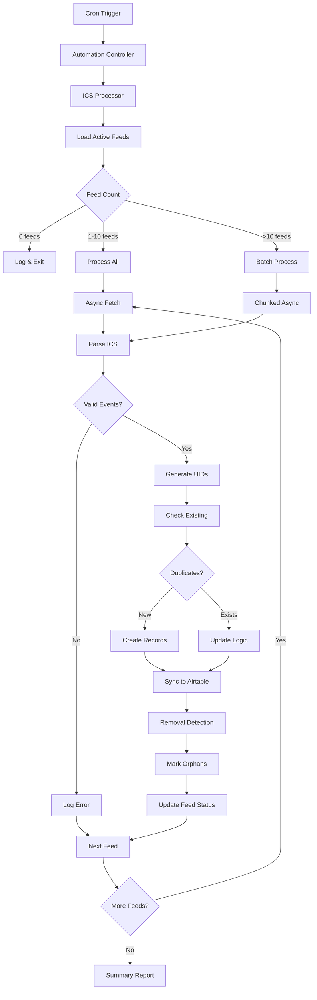

## Concurrent Feed Processing

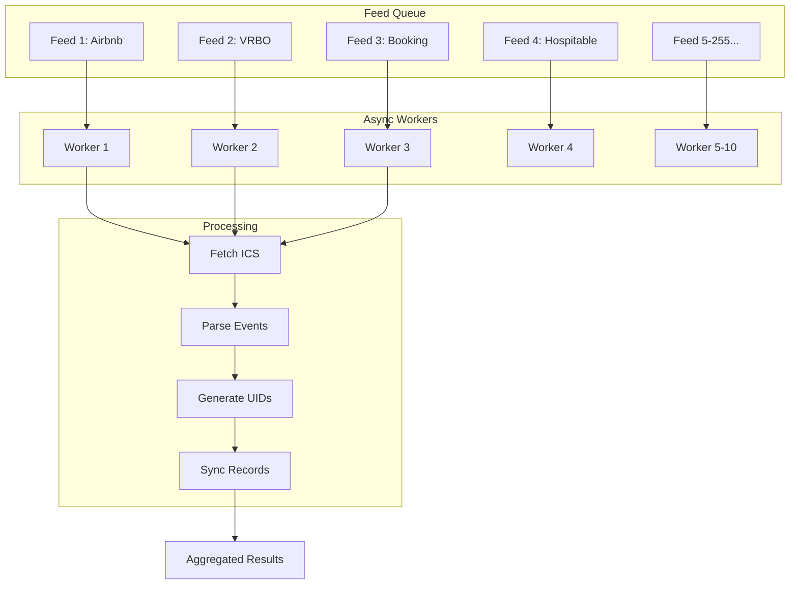

## Event Parsing Pipeline

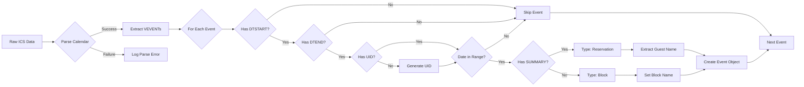

## Composite UID Generation

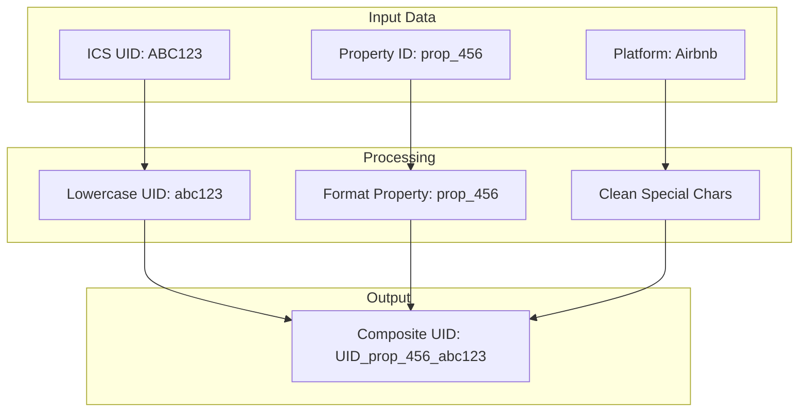

## Duplicate Detection Flow

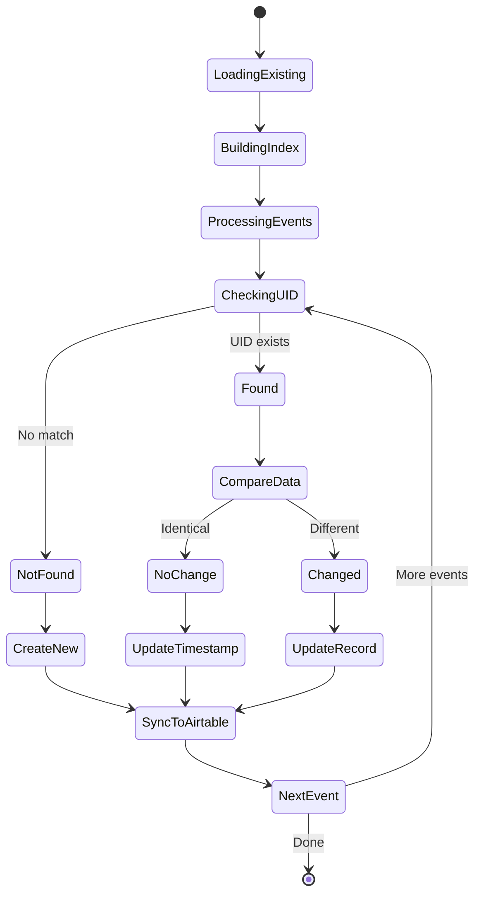

## Removal Detection Algorithm

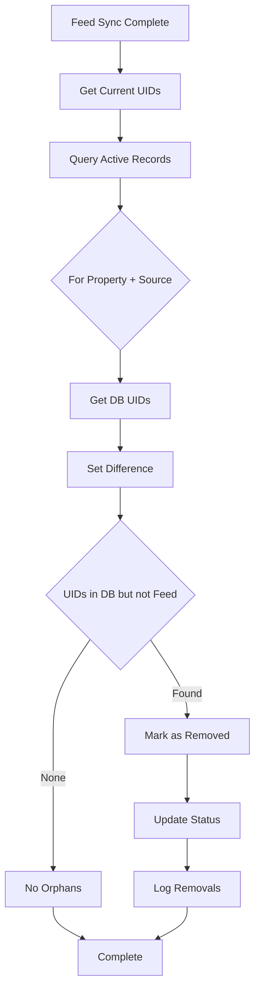

## Entry Type Determination

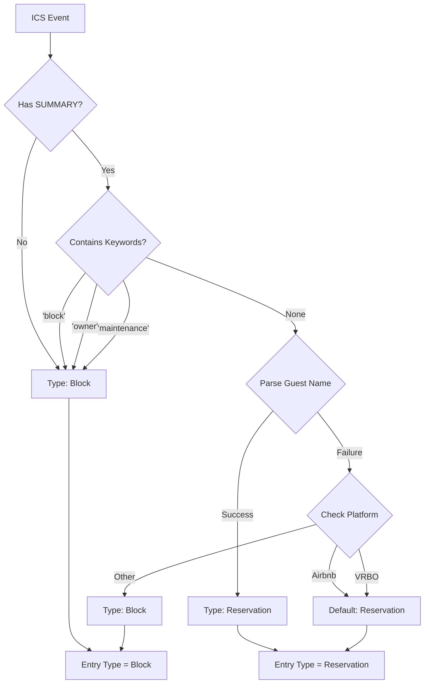

## Error Handling Flow

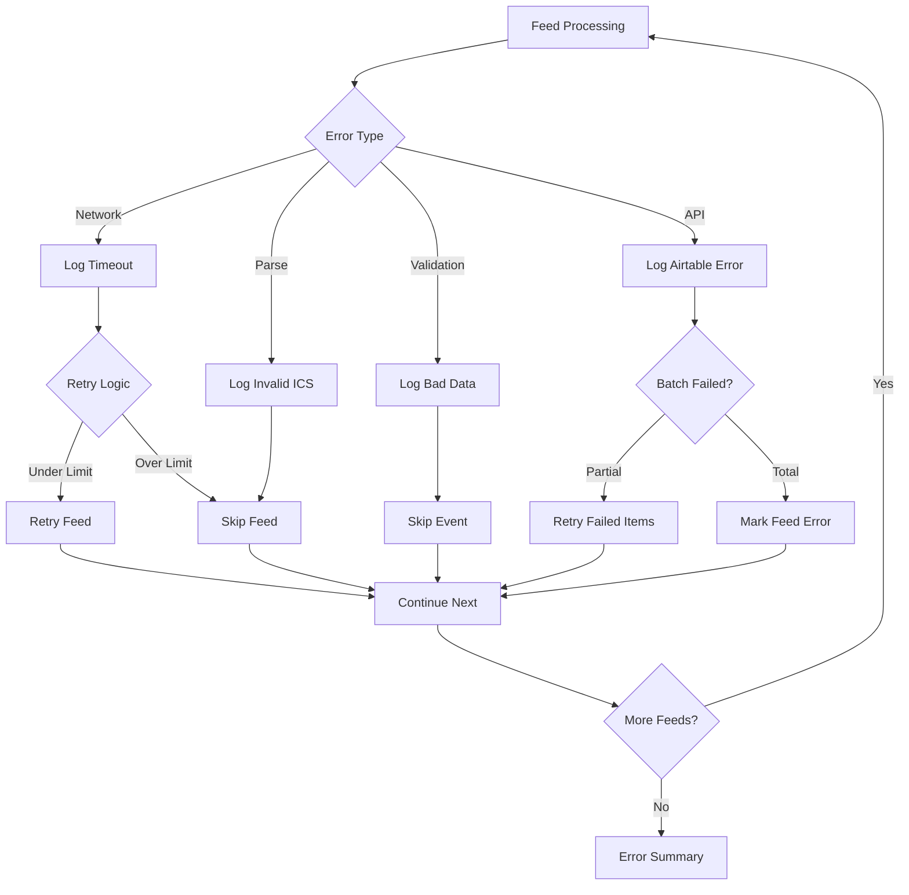

## Example Scenarios

### 1. Happy Path - New Airbnb Reservation

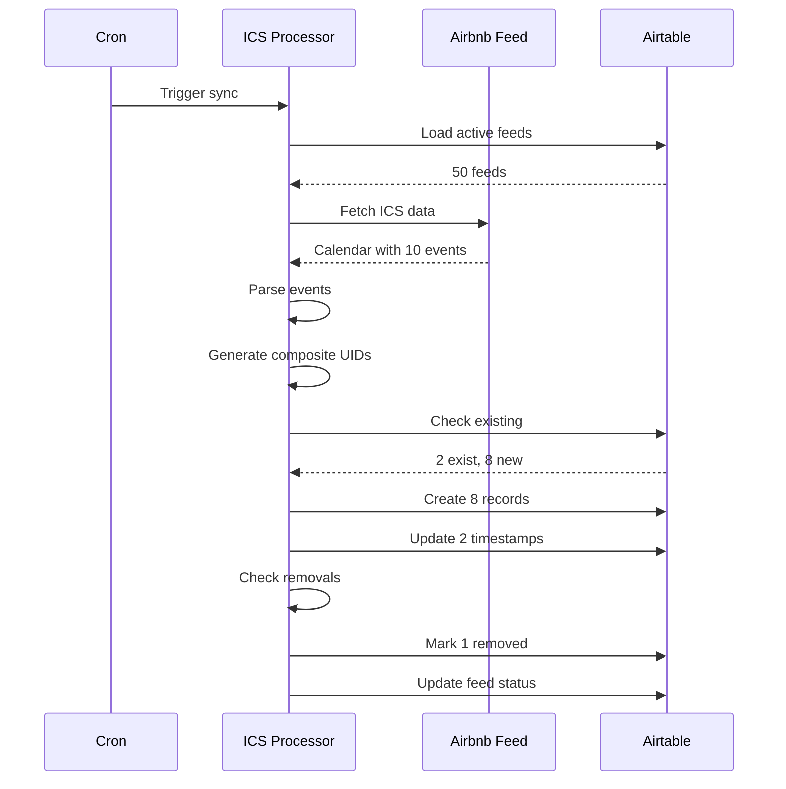

### 2. Error Case - Feed Timeout

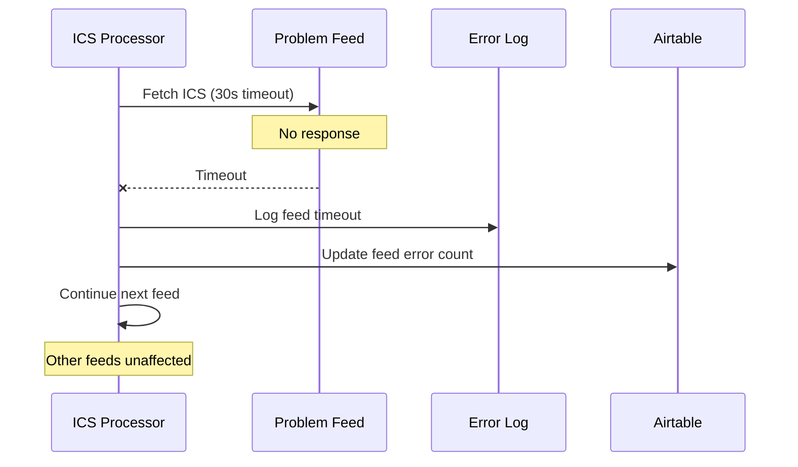

### 3. Edge Case - Platform Migration

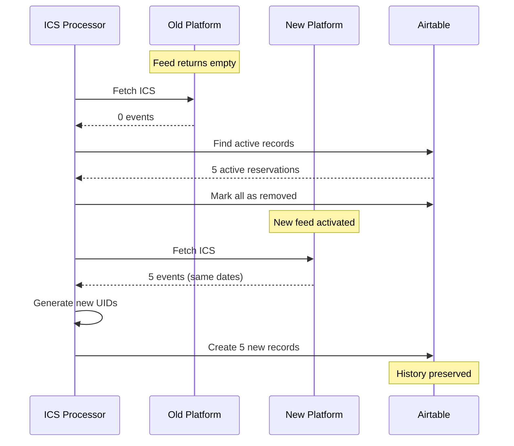

## Performance Optimization

```mermaid
graph TD
    subgraph "Memory Management"
        A1[Stream ICS Data]
        A2[Process Events Individually]
        A3[Batch Airtable Updates]
        A4[Clear Processed Data]
    end
    
    subgraph "Concurrency Control"
        B1[Semaphore: 10 feeds]
        B2[Timeout: 30 seconds]
        B3[Error Isolation]
        B4[Progress Tracking]
    end
    
    subgraph "Database Efficiency"
        C1[Bulk Queries]
        C2[Indexed Lookups]
        C3[Minimal API Calls]
        C4[Cached Property Data]
    end
    
    A1 --> A2
    A2 --> A3
    A3 --> A4
    
    B1 --> B2
    B2 --> B3
    B3 --> B4
    
    C1 --> C2
    C2 --> C3
    C3 --> C4
```

---

## Flow Legend

- **Rectangles**: Process steps
- **Diamonds**: Decision points
- **Parallelograms**: Input/Output
- **Subgraphs**: Logical groupings
- **Arrows**: Flow direction
- **Dashed Lines**: Optional paths

---

**Document Version**: 1.0.0
**Last Updated**: July 11, 2025
**Mermaid Version**: v10.0+