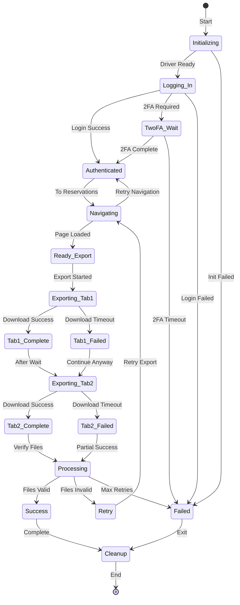

# Evolve Scraping - Main Process Flow

**Feature:** 03-evolve-scraping  
**Purpose:** Visual representation of the complete Evolve web scraping pipeline  
**Last Updated:** July 14, 2025

---

## 🔄 Main Process Flow

```mermaid
flowchart TB
    Start([Evolve Scraper Started]) --> CheckEnv{Check<br/>Environment}
    
    CheckEnv -->|Development| SetDevConfig[Set Dev Configuration<br/>Download to CSV_process_development]
    CheckEnv -->|Production| SetProdConfig[Set Prod Configuration<br/>Download to CSV_process_production]
    
    SetDevConfig --> LoadCreds[Load Credentials<br/>from .env]
    SetProdConfig --> LoadCreds
    
    LoadCreds --> InitDriver[Initialize Chrome WebDriver<br/>Headless Mode]
    
    InitDriver -->|Success| NavigateLogin[Navigate to<br/>login.evolve.com]
    InitDriver -->|Failed| RetryInit{Retry<br/>Count < 3?}
    
    RetryInit -->|Yes| WaitRetry[Wait 5 seconds]
    RetryInit -->|No| FailExit[Log Error<br/>Exit with Code 1]
    
    WaitRetry --> InitDriver
    
    NavigateLogin --> EnterCreds[Enter Username<br/>and Password]
    
    EnterCreds --> SubmitLogin[Click Login Button]
    
    SubmitLogin --> Check2FA{2FA<br/>Required?}
    
    Check2FA -->|Yes| Wait2FA[Wait for User<br/>Max 5 minutes]
    Check2FA -->|No| CheckDashboard{Dashboard<br/>Loaded?}
    
    Wait2FA --> CheckDashboard
    
    CheckDashboard -->|No| LoginError[Log Login Error<br/>Check Error Message]
    CheckDashboard -->|Yes| NavigateReservations[Navigate to<br/>Reservations Page]
    
    LoginError --> CleanupDriver[Cleanup WebDriver]
    
    NavigateReservations --> WaitPageLoad[Wait for Table Load<br/>Max 20 seconds]
    
    WaitPageLoad -->|Timeout| RefreshPage[Refresh Page<br/>Retry Navigation]
    WaitPageLoad -->|Success| ScrollToExport[Scroll to<br/>Export Button]
    
    RefreshPage --> NavigateReservations
    
    ScrollToExport --> ClickExport[Click Export Button<br/>Using JavaScript]
    
    ClickExport --> WaitDropdown{Export Menu<br/>Visible?}
    
    WaitDropdown -->|No| RetryClick[Retry Click<br/>Different Method]
    WaitDropdown -->|Yes| ExportTab1[Click "Current Reservations"<br/>Export Option]
    
    RetryClick --> ClickExport
    
    ExportTab1 --> MonitorDownload1[Monitor Download Directory<br/>for New CSV]
    
    MonitorDownload1 --> CheckFile1{File<br/>Downloaded?}
    
    CheckFile1 -->|No| Timeout1{Timeout<br/>< 60s?}
    CheckFile1 -->|Yes| RenameFile1[Rename with Timestamp<br/>_tab1.csv suffix]
    
    Timeout1 -->|Yes| MonitorDownload1
    Timeout1 -->|No| LogError1[Log Download Error<br/>Tab 1 Failed]
    
    RenameFile1 --> WaitBetween[Wait 5 seconds<br/>Between Exports]
    LogError1 --> WaitBetween
    
    WaitBetween --> ExportTab2[Click "Future Reservations"<br/>Export Option]
    
    ExportTab2 --> MonitorDownload2[Monitor Download Directory<br/>for New CSV]
    
    MonitorDownload2 --> CheckFile2{File<br/>Downloaded?}
    
    CheckFile2 -->|No| Timeout2{Timeout<br/>< 60s?}
    CheckFile2 -->|Yes| RenameFile2[Rename with Timestamp<br/>_tab2.csv suffix]
    
    Timeout2 -->|Yes| MonitorDownload2
    Timeout2 -->|No| LogError2[Log Download Error<br/>Tab 2 Failed]
    
    RenameFile2 --> VerifyFiles[Verify Downloaded Files<br/>Check Sizes]
    LogError2 --> VerifyFiles
    
    VerifyFiles --> ProcessFiles{Both Files<br/>Valid?}
    
    ProcessFiles -->|Yes| LogSuccess[Log Success<br/>2 Files Downloaded]
    ProcessFiles -->|Partial| LogPartial[Log Partial Success<br/>1 File Downloaded]
    ProcessFiles -->|No| LogFailure[Log Complete Failure<br/>0 Files Downloaded]
    
    LogSuccess --> TriggerCSV[Trigger CSV Processing<br/>for Downloaded Files]
    LogPartial --> TriggerCSV
    LogFailure --> CheckRetry{Retry<br/>Attempts < 3?}
    
    CheckRetry -->|Yes| IncrementRetry[Increment Retry Count<br/>Wait 30 seconds]
    CheckRetry -->|No| FinalCleanup[Final Cleanup<br/>Exit with Error]
    
    IncrementRetry --> NavigateReservations
    
    TriggerCSV --> UpdateStatus[Update Automation Status<br/>in Airtable]
    
    UpdateStatus --> CleanupDriver
    FinalCleanup --> CleanupDriver
    
    CleanupDriver --> KillChrome[Kill Remaining<br/>Chrome Processes]
    
    KillChrome --> End([Scraping Complete])
    
    style Start fill:#90EE90
    style End fill:#FFB6C1
    style FailExit fill:#FF6B6B
    style LoginError fill:#FF6B6B
    style LogError1 fill:#FFA500
    style LogError2 fill:#FFA500
    style LogFailure fill:#FF6B6B
```

---

## 📝 Process Steps Explained

### 1. **Environment Configuration**
```python
# Environment determines download directory
if os.getenv('ENVIRONMENT') == 'production':
    download_dir = '/home/opc/automation/CSV_process_production'
else:
    download_dir = '/home/opc/automation/CSV_process_development'
```

### 2. **WebDriver Initialization**
- Chrome in headless mode for server compatibility
- Custom download directory configuration
- Retry logic for initialization failures

### 3. **Login Process**
- Navigate to login.evolve.com
- Enter credentials from environment variables
- Handle optional 2FA with 5-minute timeout

### 4. **Navigation & Export**
- Navigate to reservations page
- Scroll export button into view
- Use JavaScript click to avoid interception

### 5. **Sequential Tab Export**
```python
# Export tabs one at a time to avoid conflicts
tabs = ['Current Reservations', 'Future Reservations']
for i, tab in enumerate(tabs):
    export_tab(tab)
    wait(5)  # Wait between exports
```

### 6. **Download Monitoring**
- Watch download directory for new CSV files
- Verify file size stability
- Rename with timestamp and tab suffix

### 7. **Error Recovery**
- Retry failed exports up to 3 times
- Refresh page on navigation failures
- Continue with partial success

### 8. **Cleanup**
- Properly quit WebDriver
- Kill any orphaned Chrome processes
- Free system resources

---

## ⏱️ Timing Breakdown

| Step | Average Time | Max Time |
|------|-------------|----------|
| WebDriver init | 3s | 10s |
| Login process | 8s | 15s |
| 2FA (if needed) | Variable | 300s |
| Navigation | 5s | 20s |
| Export Tab 1 | 45s | 60s |
| Wait between | 5s | 5s |
| Export Tab 2 | 42s | 60s |
| File processing | 10s | 20s |
| Cleanup | 2s | 5s |
| **Total** | **2m 10s** | **8m 5s** |

---

## 🔄 State Machine



---

## 🎯 Decision Points

### Login Verification
```python
# Check multiple indicators for successful login
indicators = [
    driver.current_url.endswith('/dashboard'),
    presence_of_element('.dashboard-container'),
    absence_of_element('.login-error')
]
logged_in = all(indicators)
```

### Export Method Selection
```python
# Try multiple click methods in order
click_methods = [
    lambda: element.click(),
    lambda: driver.execute_script("arguments[0].click();", element),
    lambda: ActionChains(driver).move_to_element(element).click().perform()
]
```

### Download Verification
```python
# Verify download completed
def is_download_complete(filepath):
    if not os.path.exists(filepath):
        return False
    if filepath.endswith('.crdownload'):
        return False
    # Check file size stability
    size1 = os.path.getsize(filepath)
    time.sleep(1)
    size2 = os.path.getsize(filepath)
    return size1 == size2 and size1 > 0
```

---

## 🔗 Related Flows
- [Error Recovery Flow](./error-recovery-flow.md)
- [Download Monitoring Flow](./download-monitoring-flow.md)
- [CSV Processing Integration](./csv-integration-flow.md)