# Evolve Portal Scraping - System Logical Flow

## Main Scraping Flow

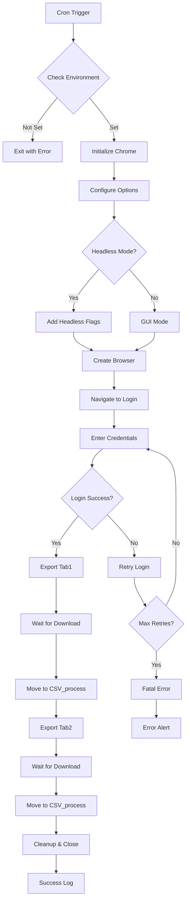

## Browser Initialization Flow

```mermaid
graph LR
    subgraph "Chrome Options"
        A1[Base Options]
        A2[--headless]
        A3[--no-sandbox]
        A4[--disable-gpu]
        A5[--window-size=1920,1080]
    end
    
    subgraph "Download Config"
        B1[Create /tmp/evolve_downloads]
        B2[Set download.default_directory]
        B3[Clear existing files]
        B4[Set permissions]
    end
    
    subgraph "Driver Setup"
        C1[Locate ChromeDriver]
        C2[Check compatibility]
        C3[Initialize WebDriver]
        C4[Set timeouts]
    end
    
    A1 --> A2
    A2 --> A3
    A3 --> A4
    A4 --> A5
    
    A5 --> B1
    B1 --> B2
    B2 --> B3
    B3 --> B4
    
    B4 --> C1
    C1 --> C2
    C2 --> C3
    C3 --> C4
```

## Login Authentication Flow

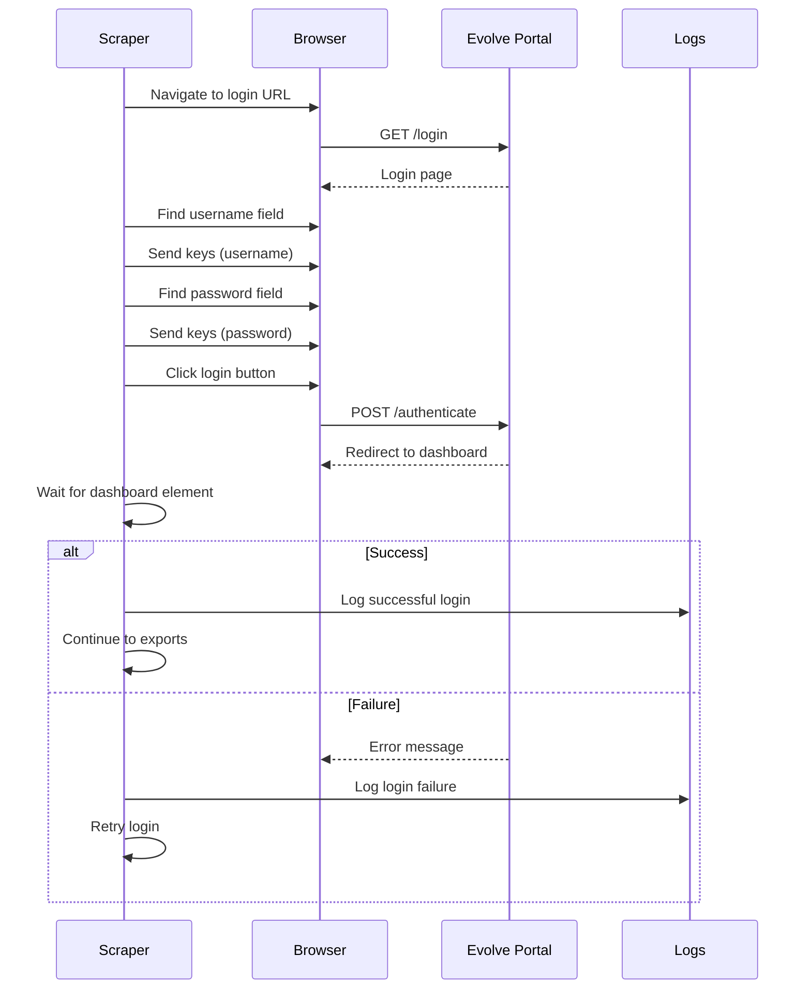

## Tab Export Navigation

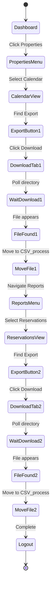

## Element Wait Strategy

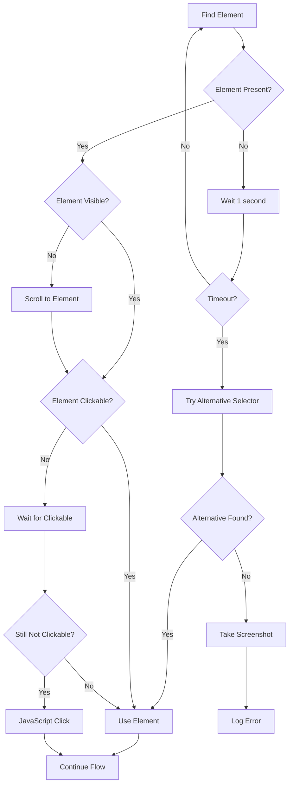

## File Download Management

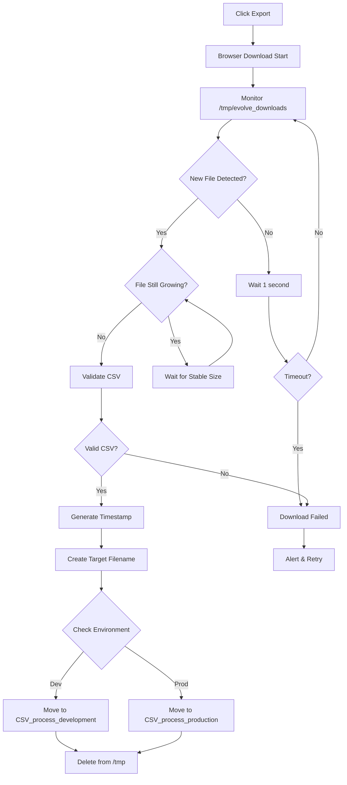

## Error Recovery Flow

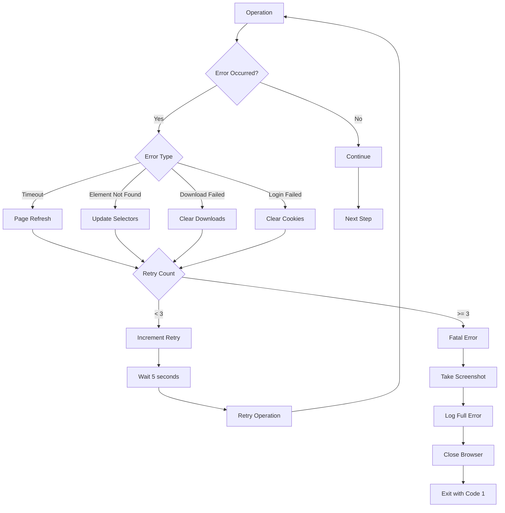

## Sequential Processing Mode

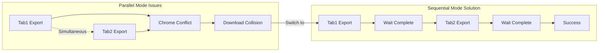

## Example Scenarios

### 1. Happy Path - Successful Export

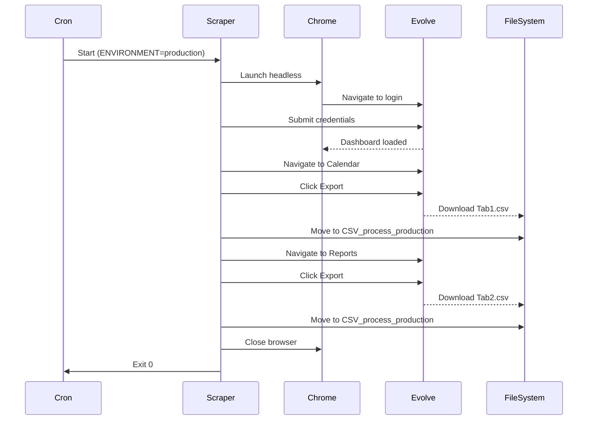

### 2. Error Case - Login Failure

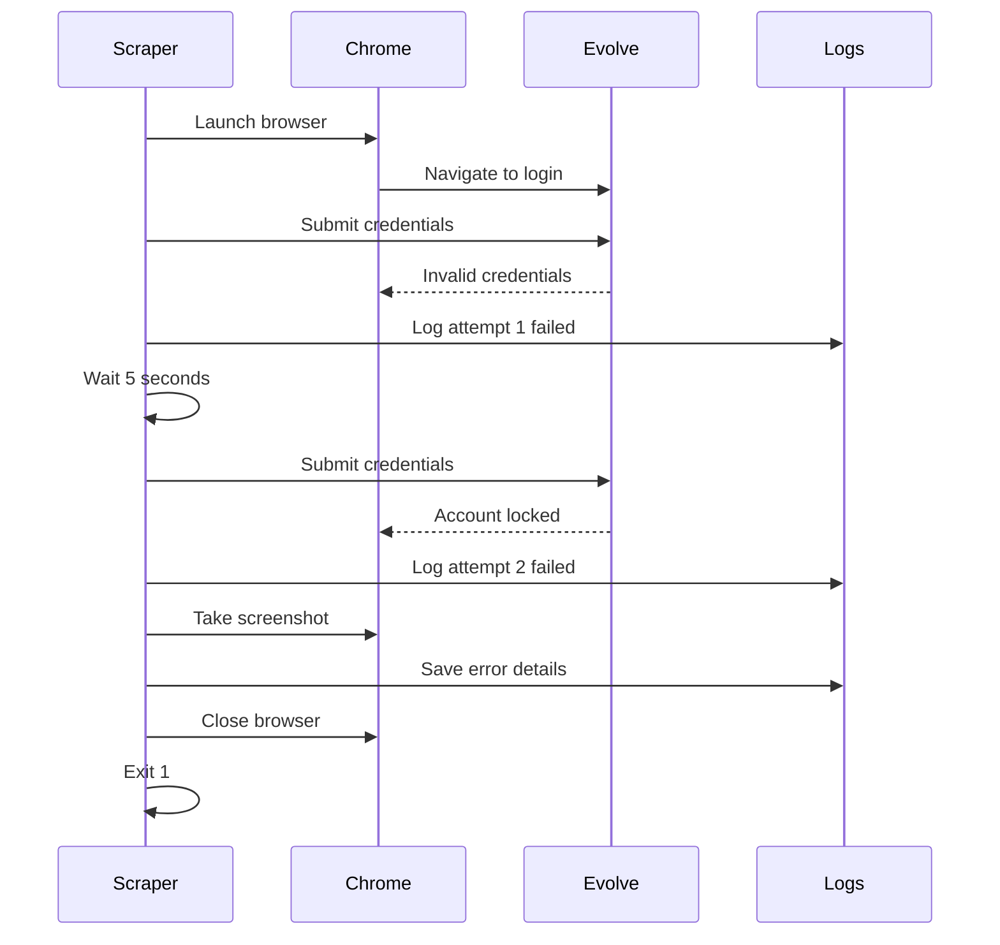

### 3. Recovery Case - Element Not Found

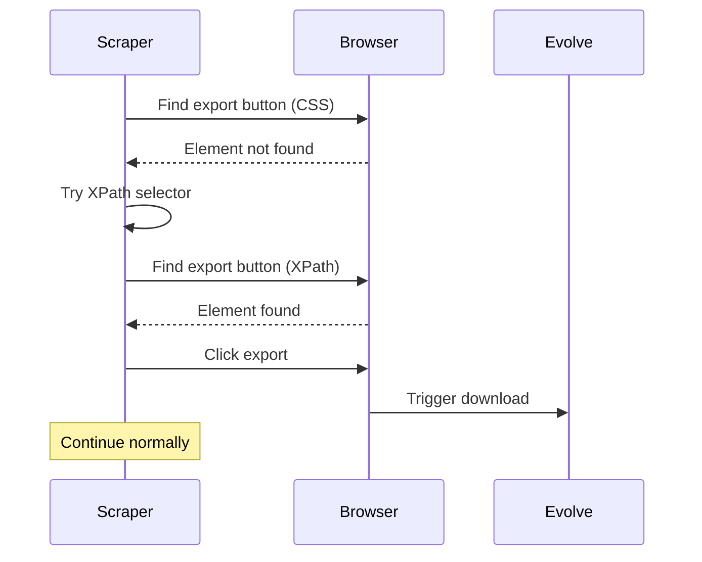

## Environment-Specific Routing

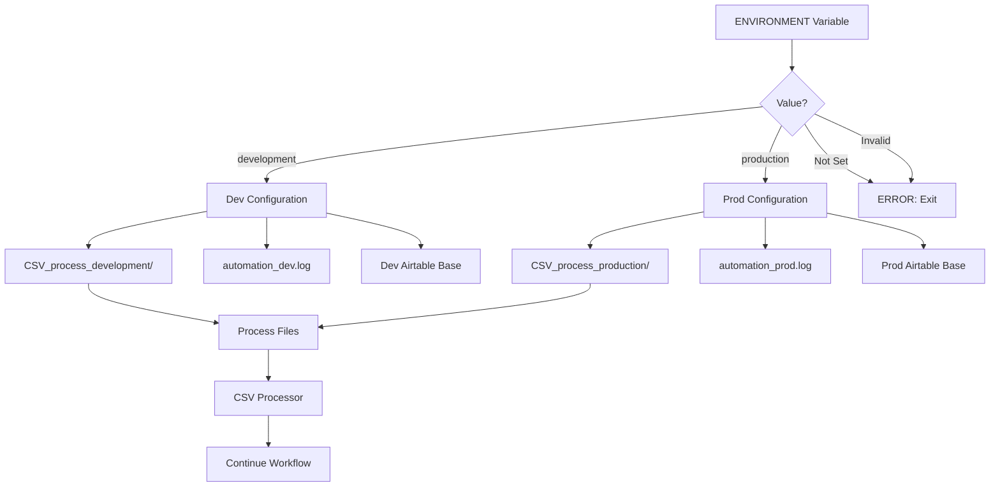

---

## Flow Legend

- **Rectangles**: Process steps
- **Diamonds**: Decision points
- **Parallelograms**: Input/Output
- **Circles**: Start/End states
- **Dashed Lines**: Problematic flows
- **Solid Lines**: Recommended flows

---

**Document Version**: 1.0.0
**Last Updated**: July 11, 2025
**Mermaid Version**: v10.0+