# HousecallPro Integration - System Logical Flow

## Main Integration Flow

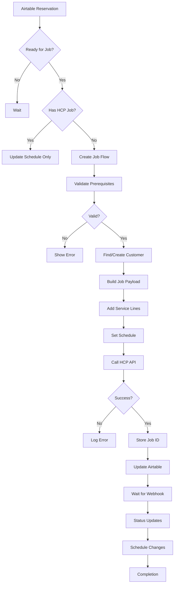

## Job Creation Detailed Flow

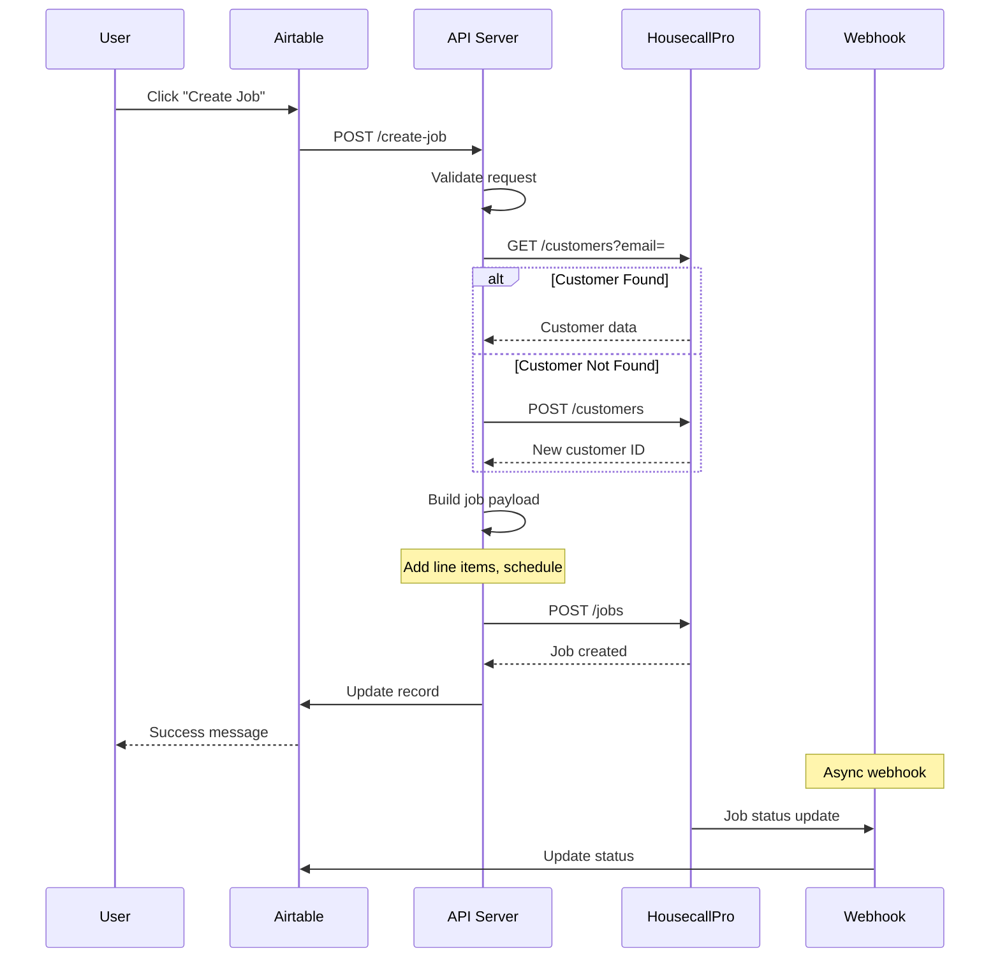

## Service Line Name Construction

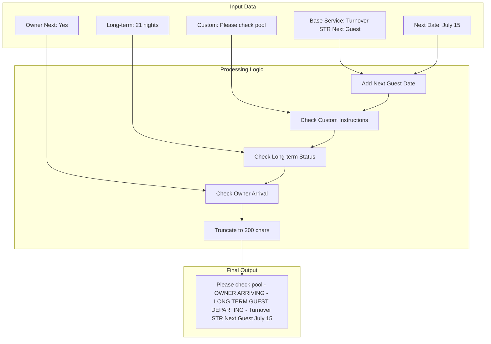

## Status Synchronization Flow

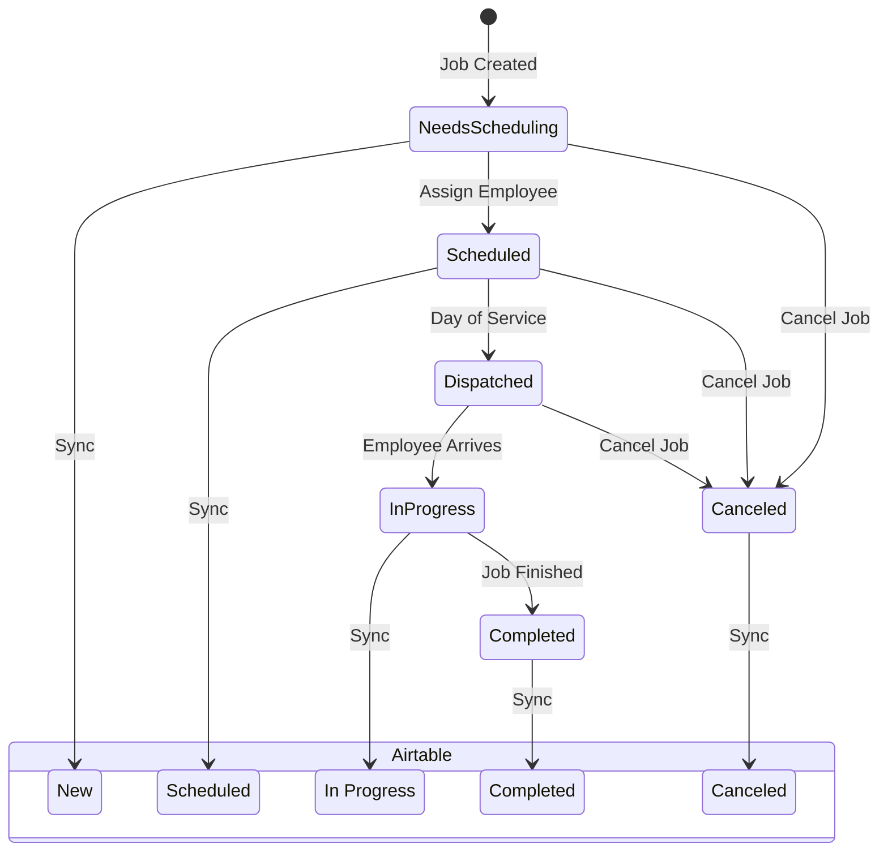

## Webhook Processing Flow

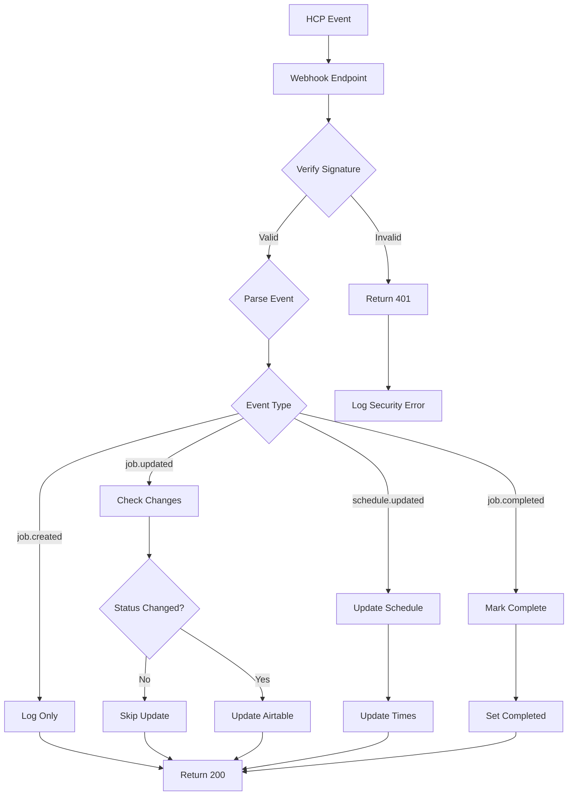

## Customer Matching Algorithm

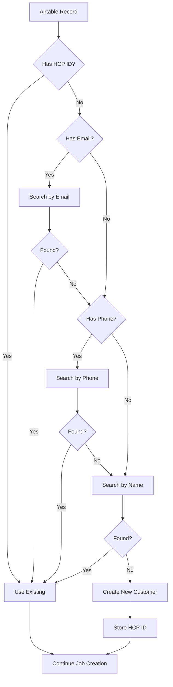

## Schedule Update Flow

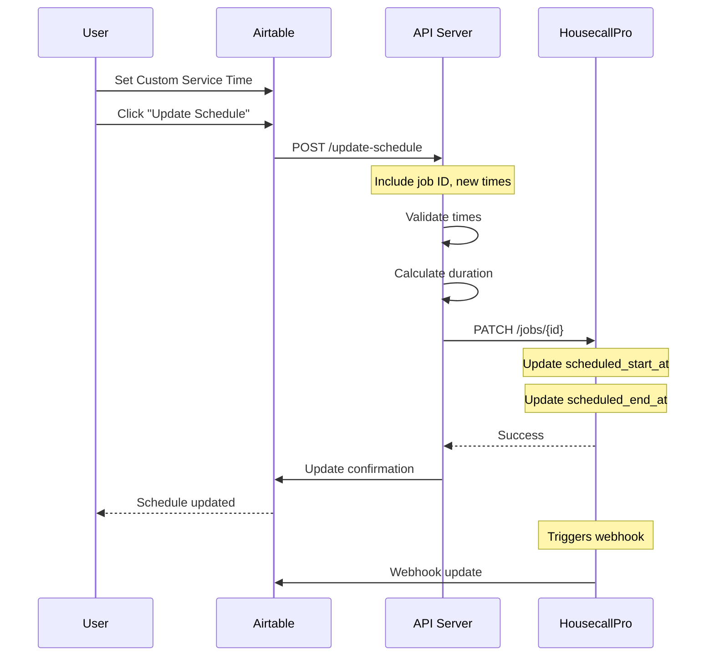

## Error Handling Flow

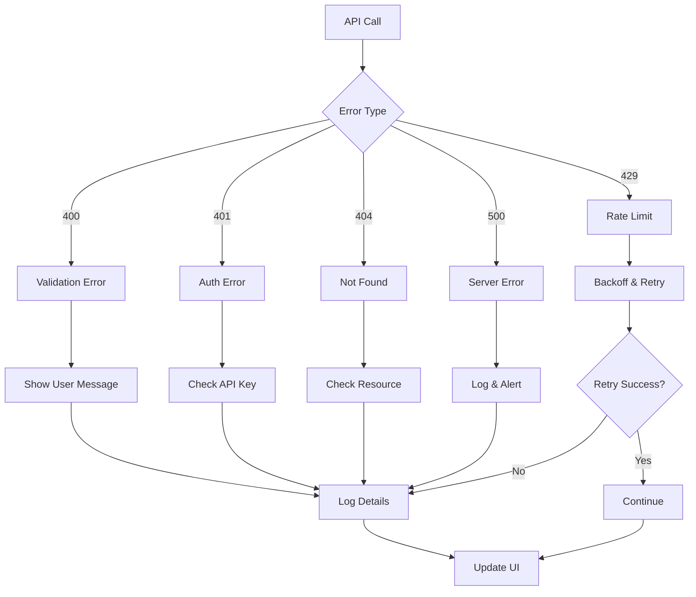

## Long-term Guest Detection

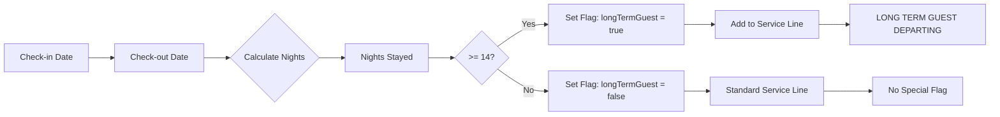

## Owner Arrival Detection

```mermaid
graph TD
    A[Reservation Checkout] --> B[Query Future Entries]
    B --> C{Same Property?}
    
    C -->|No| D[No Owner]
    C -->|Yes| E{Next Entry Type?}
    
    E -->|Reservation| F[No Owner]
    E -->|Block| G{Check-in Date}
    
    G --> H{Same/Next Day?}
    H -->|No| I[No Owner]
    H -->|Yes| J{Guest Name Match?}
    
    J -->|Owner| K[Set ownerArriving = true]
    J -->|Other| L[Check Keywords]
    
    L --> M{Contains 'owner'?}
    M -->|Yes| K
    M -->|No| I
    
    K --> N[Add "OWNER ARRIVING"]
    I --> O[Standard Service]
    F --> O
    D --> O
```

## Example Scenarios

### 1. Happy Path - New Job Creation

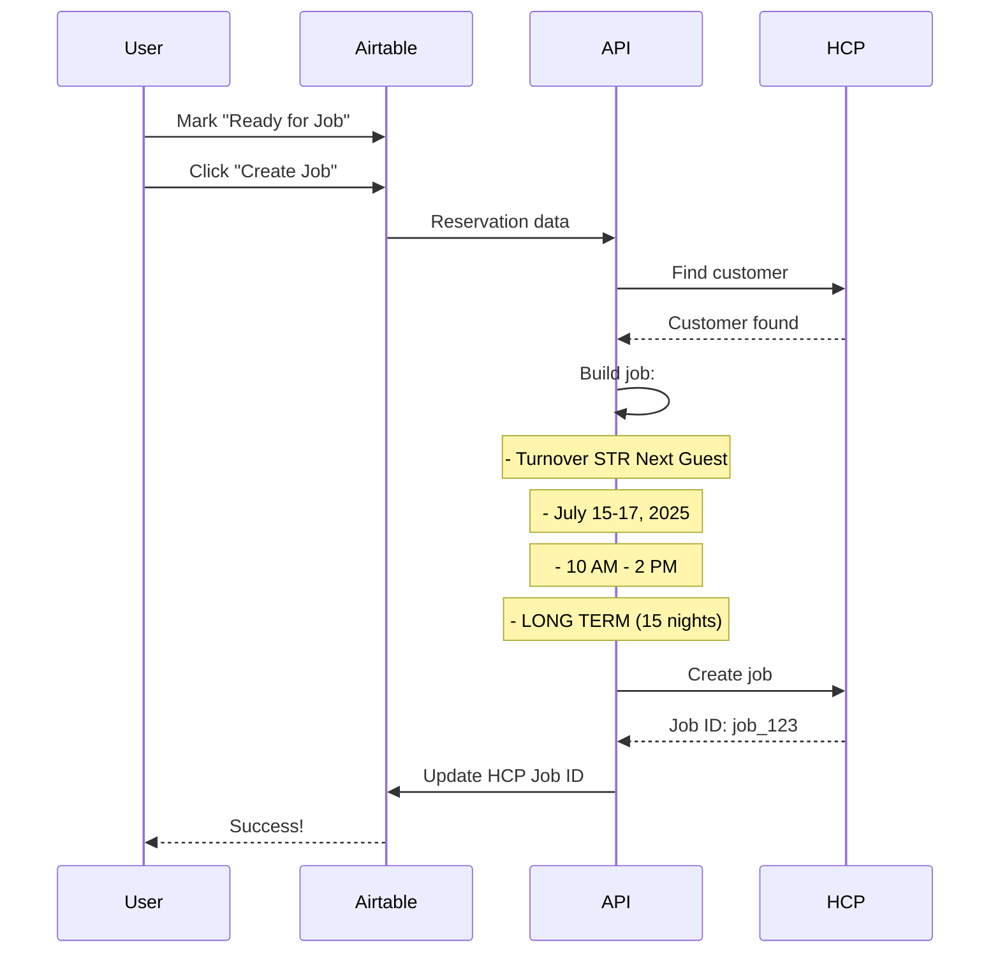

### 2. Error Case - Missing Customer

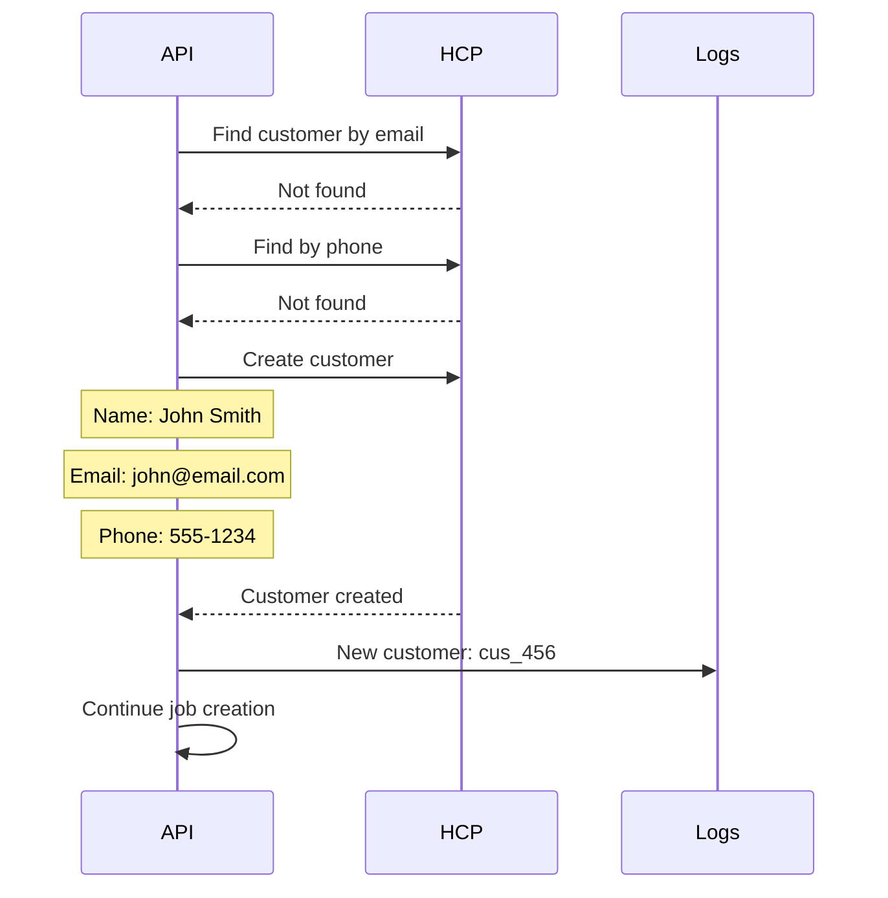

### 3. Webhook Case - Status Update

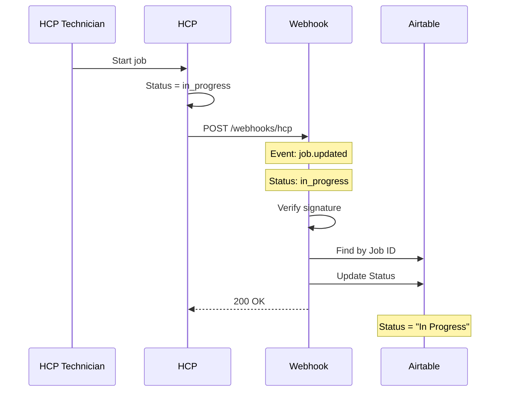

---

## Flow Legend

- **Rectangles**: Process steps
- **Diamonds**: Decision points
- **Parallelograms**: Input/Output
- **Cylinders**: Data stores
- **Notes**: Important details
- **Alt blocks**: Conditional logic

---

**Document Version**: 1.0.0
**Last Updated**: July 11, 2025
**Mermaid Version**: v10.0+