# Airtable Integration - System Logical Flow

## Main Integration Architecture

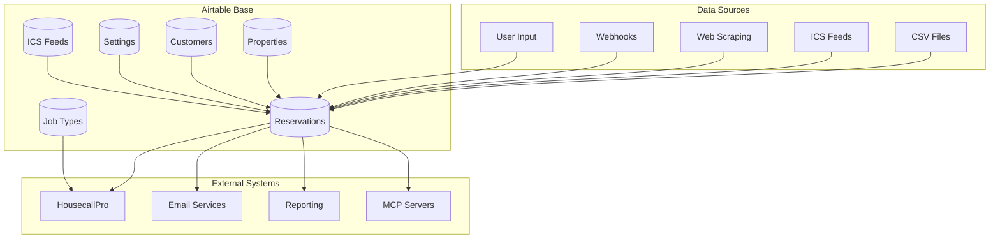

## CRUD Operations Flow

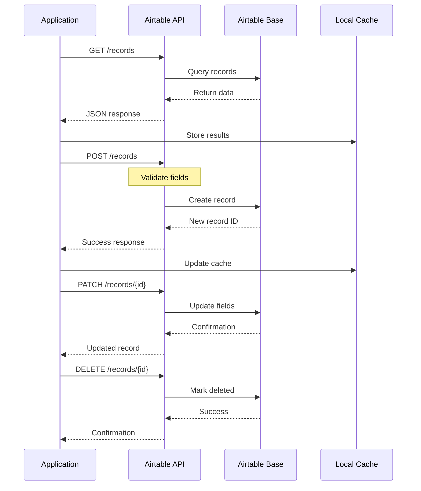

## Field Type Validation Flow

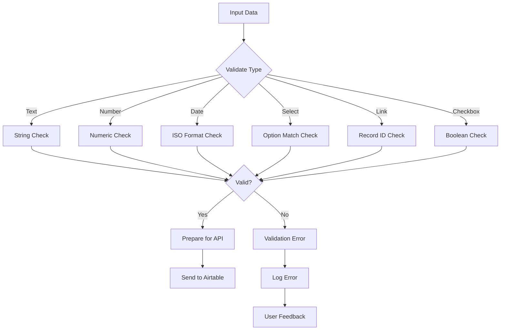

## Batch Operation Processing

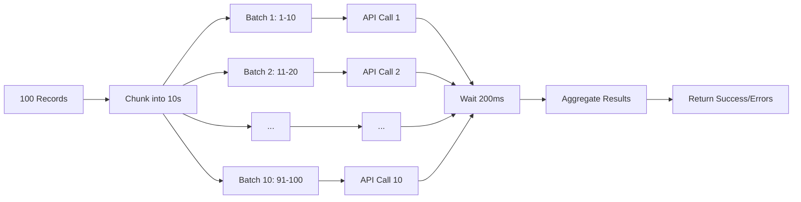

## Rate Limiting Strategy

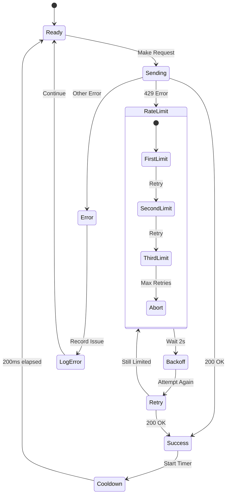

## Linked Record Management

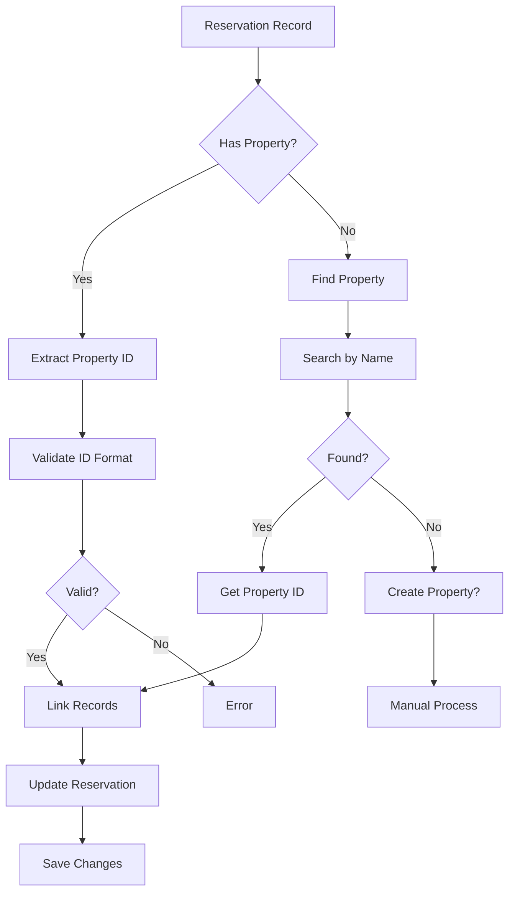

## Environment-Specific Routing

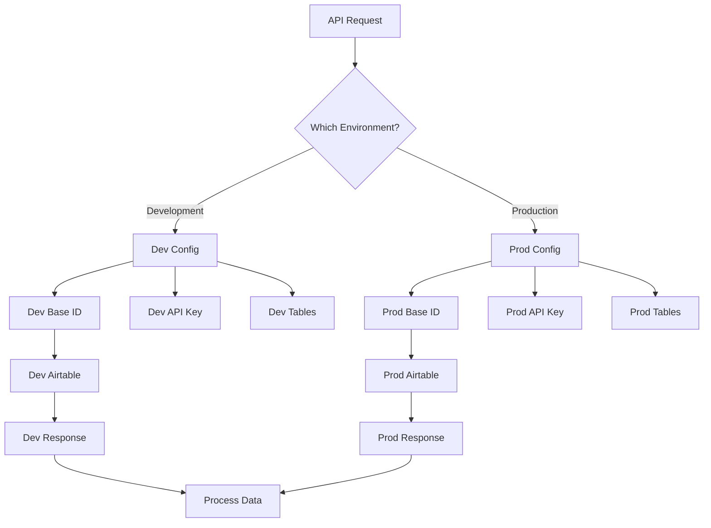

## Status Transition Management

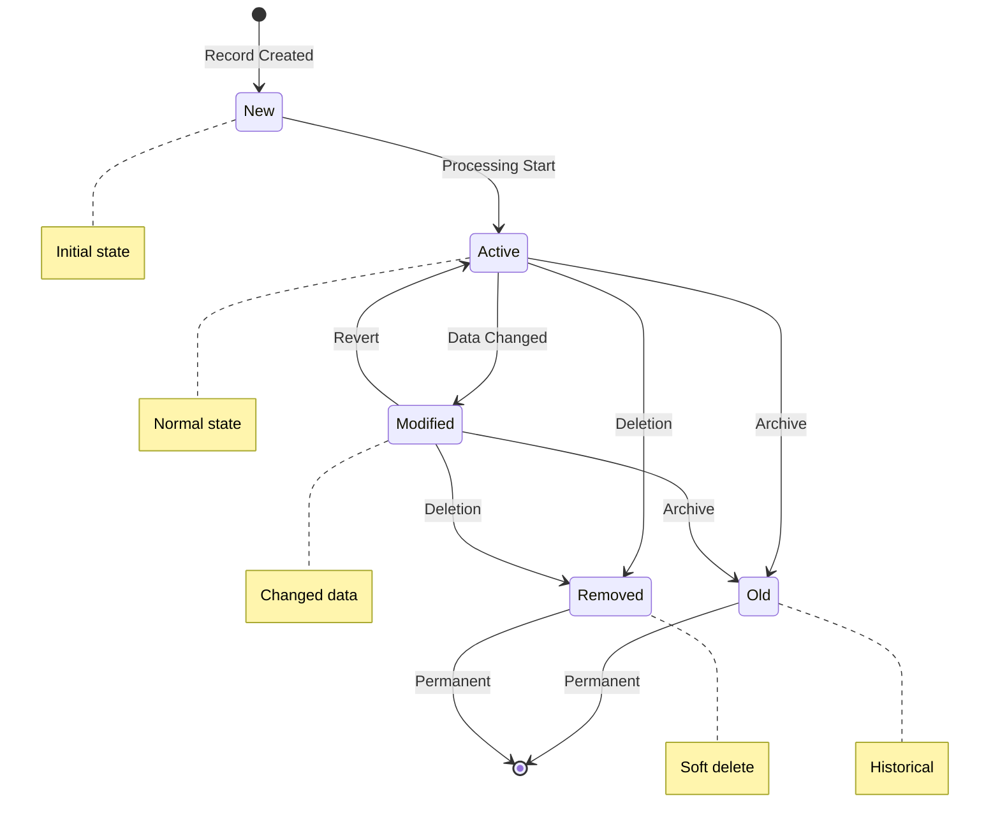

## Pagination Flow

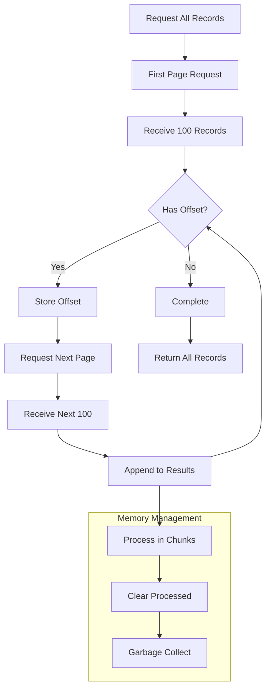

## Error Recovery Patterns

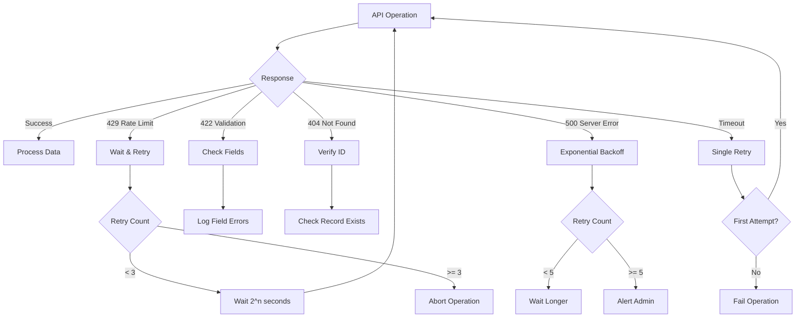

## Example Scenarios

### 1. Creating a Reservation

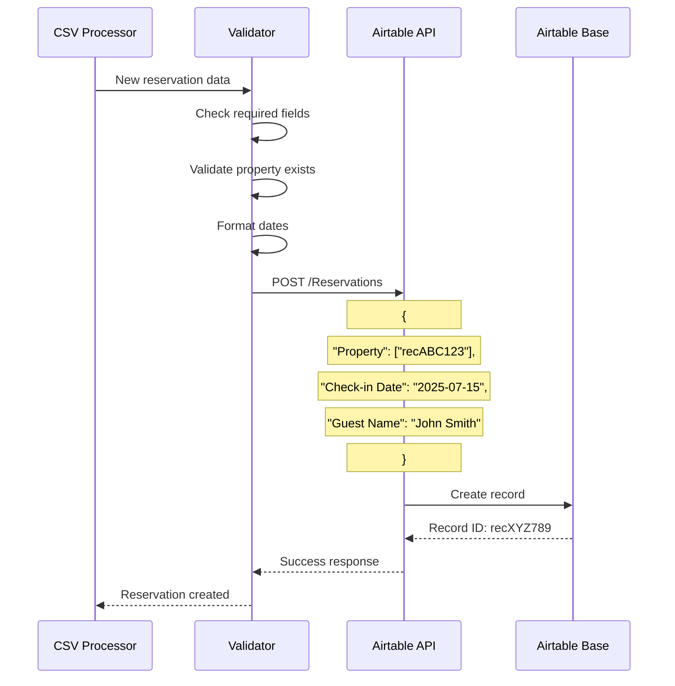

### 2. Bulk Update with Rate Limiting

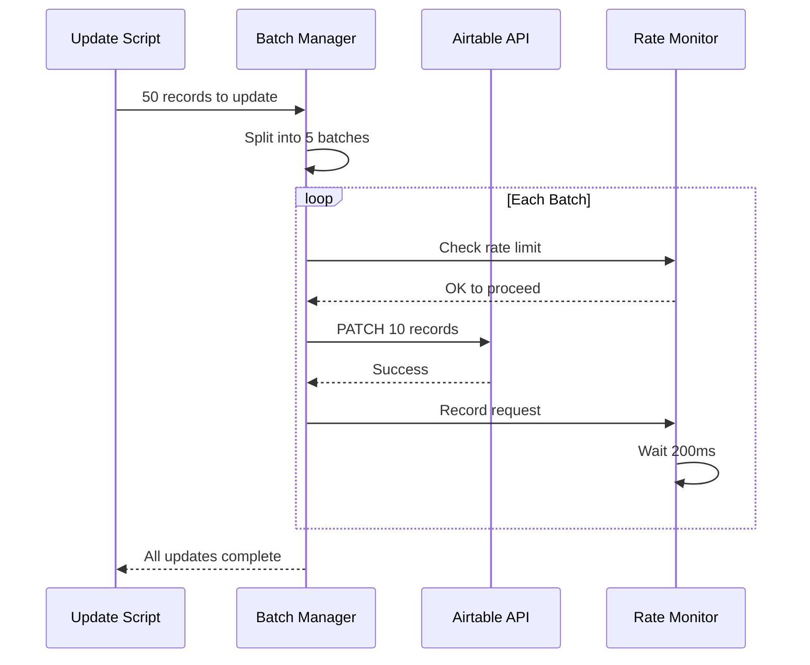

### 3. Complex Query with Filtering

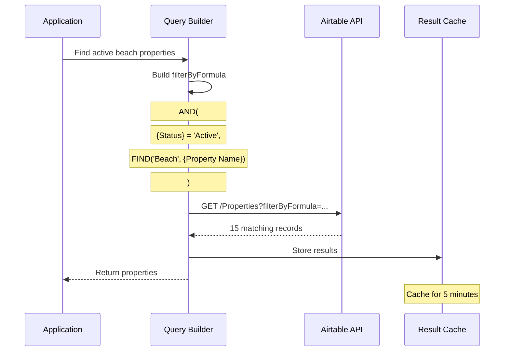

---

## Flow Legend

- **Rectangles**: Process steps
- **Diamonds**: Decision points
- **Cylinders**: Data storage
- **Parallelograms**: Input/Output
- **Notes**: Important details

---

**Document Version**: 1.0.0
**Last Updated**: July 11, 2025
**Mermaid Version**: v10.0+