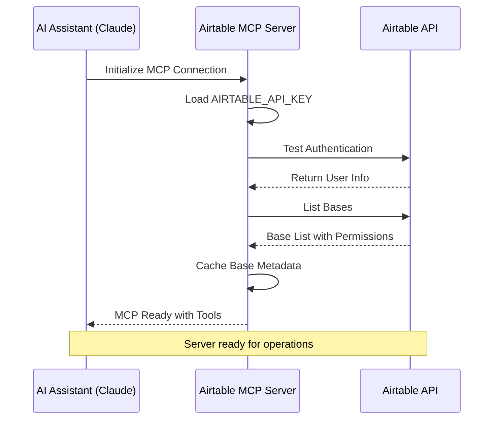
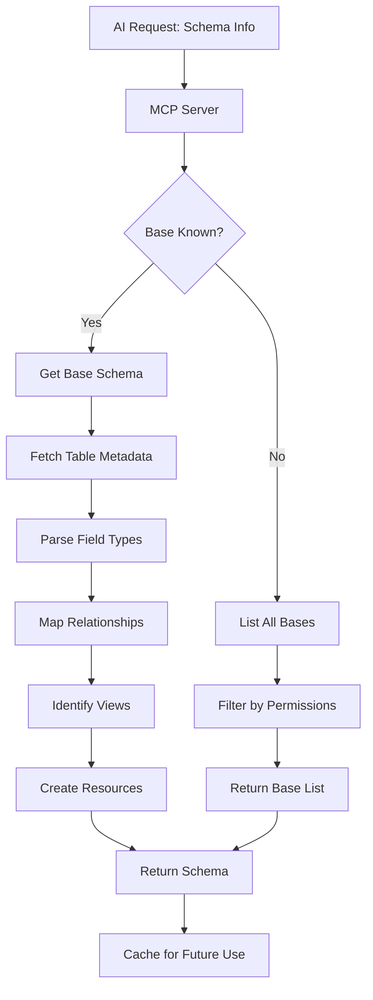
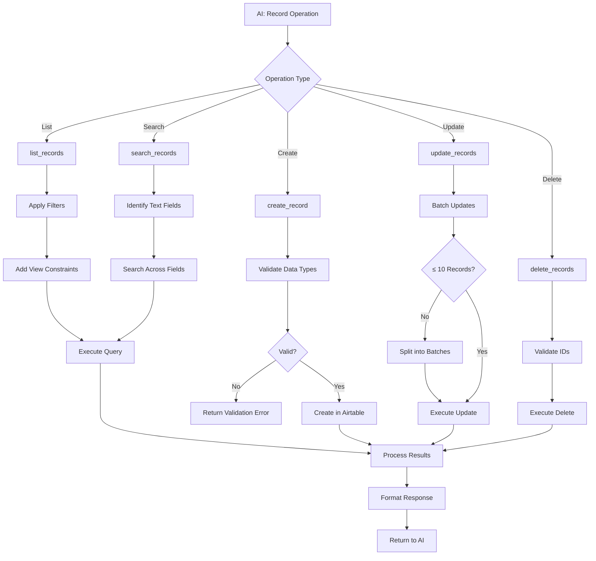
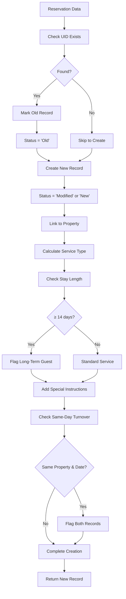
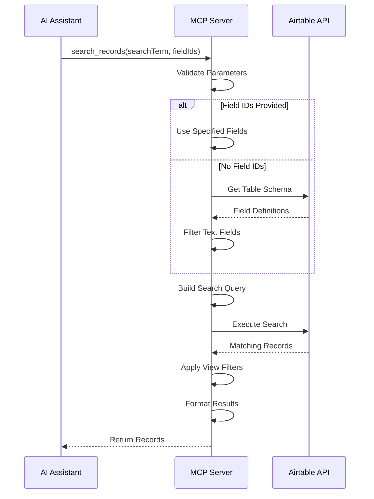
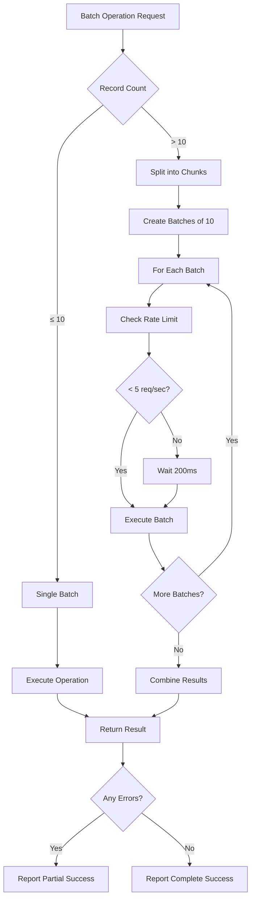
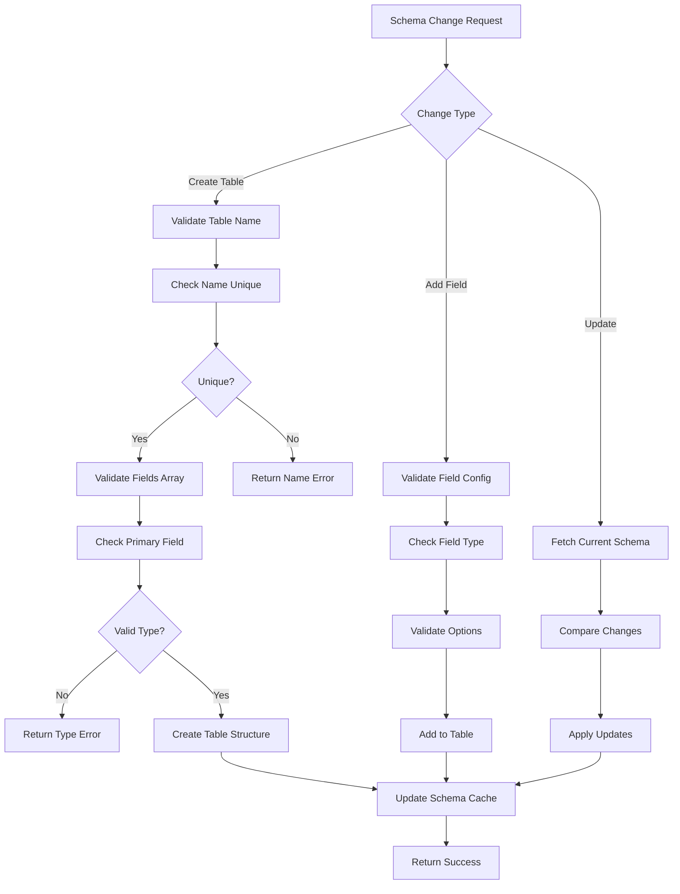
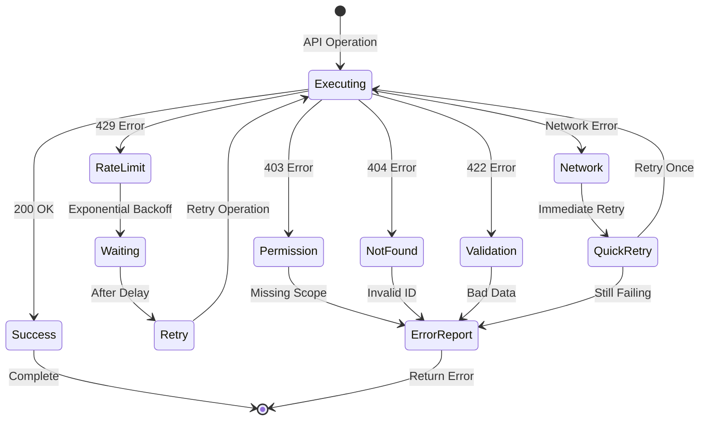
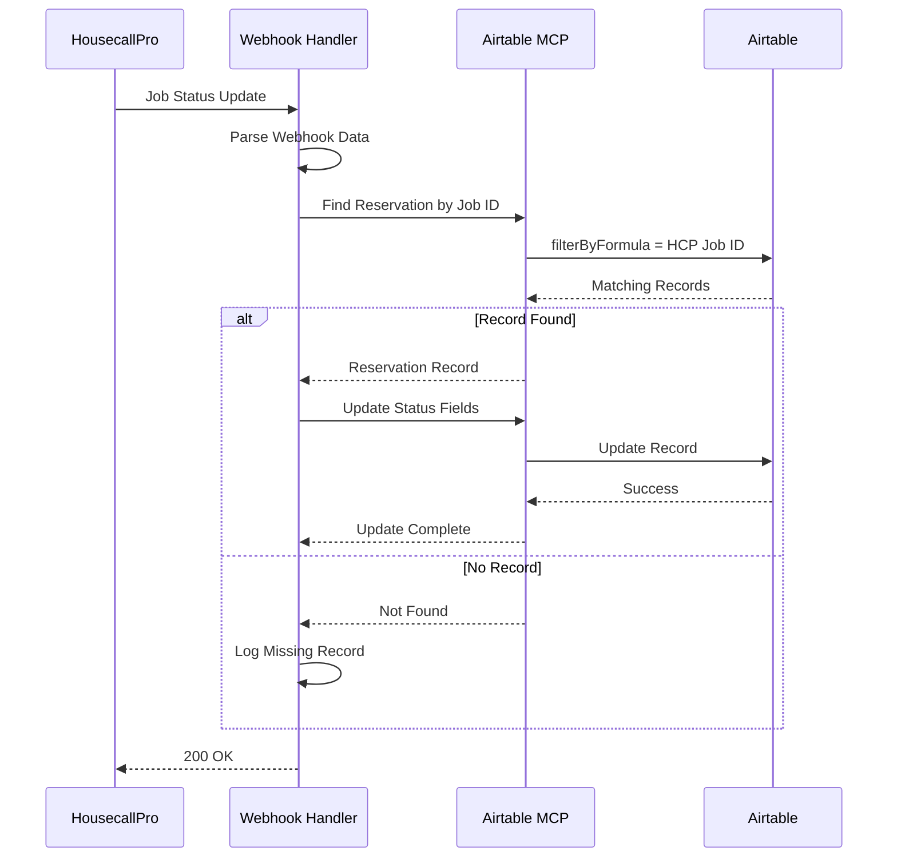
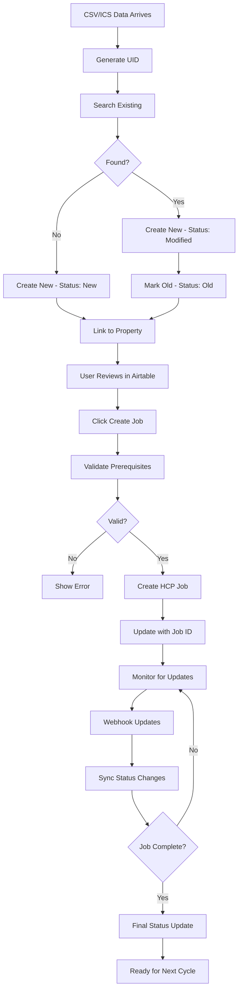

# Airtable MCP Server - Mermaid Flow Diagrams

## 1. MCP Connection and Authentication Flow

## 2. Schema Discovery Workflow

## 3. Record Operations Flow

## 4. Property Management Integration Flow

## 5. Search and Filter Operations

## 6. Batch Operations and Rate Limiting

## 7. Table and Field Management Flow

## 8. Error Handling and Recovery Flow

## 9. Webhook Integration Flow

## 10. Complete Reservation Lifecycle

---

## Flow Diagram Legend

### Symbols Used
- **Rectangle**: Process or action
- **Diamond**: Decision point
- **Parallelogram**: Input/output
- **Circle**: Start/end point
- **Note**: Additional context

### Status Values
- **New**: First time seeing this reservation
- **Modified**: Updated version of existing
- **Old**: Previous version (kept for history)
- **Removed**: No longer active

### Integration Points
- **MCP Protocol**: AI ↔ Server communication
- **Airtable API**: Server ↔ Database
- **Webhook**: External system updates
- **Schema Resources**: Metadata access

---

**Document Version**: 1.0.0  
**Last Updated**: July 12, 2025  
**Total Diagrams**: 10 comprehensive flow diagrams