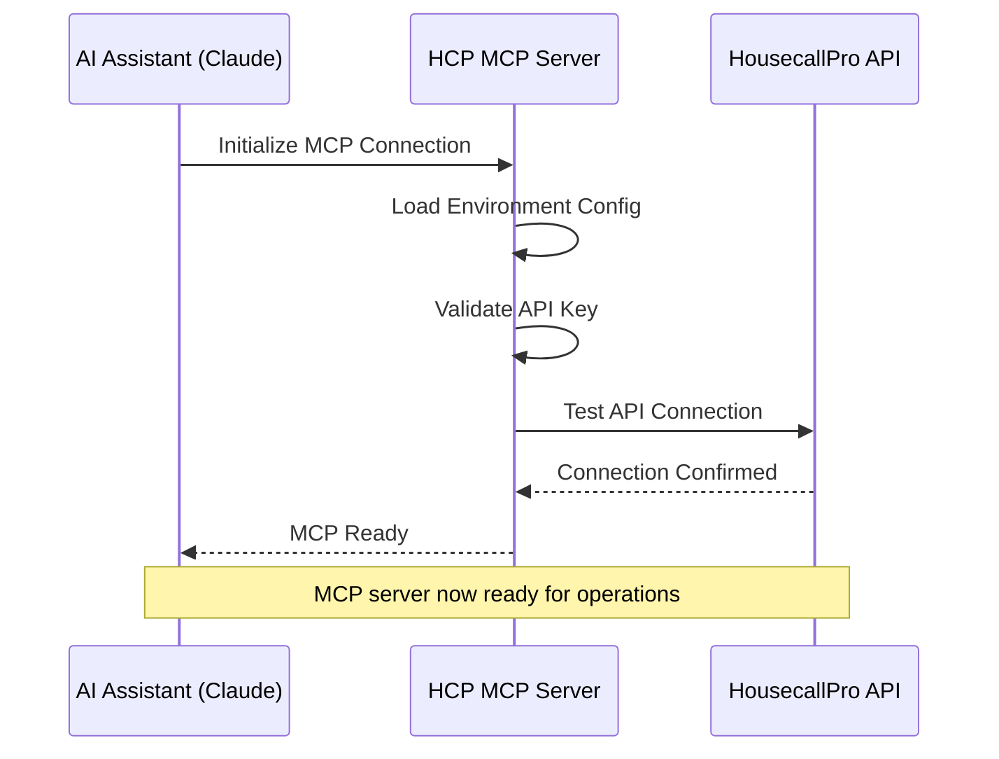
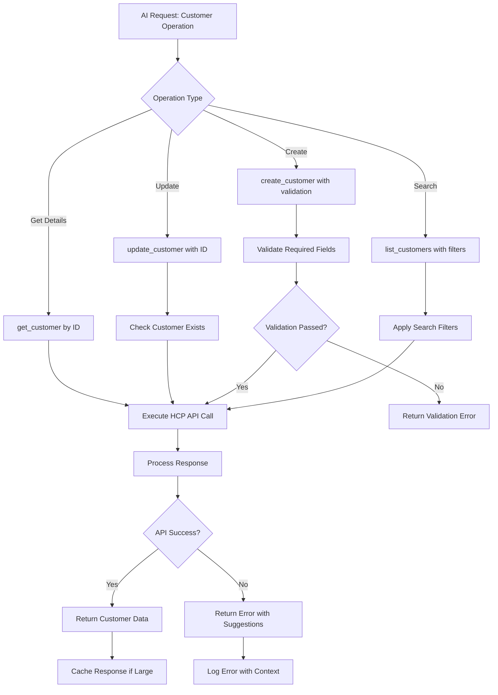
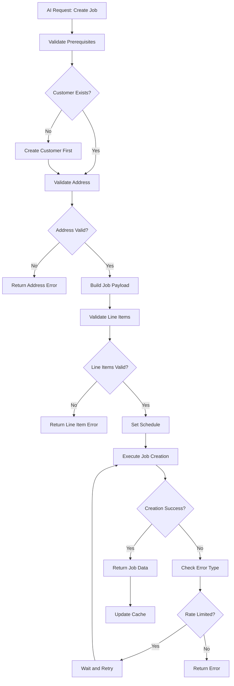
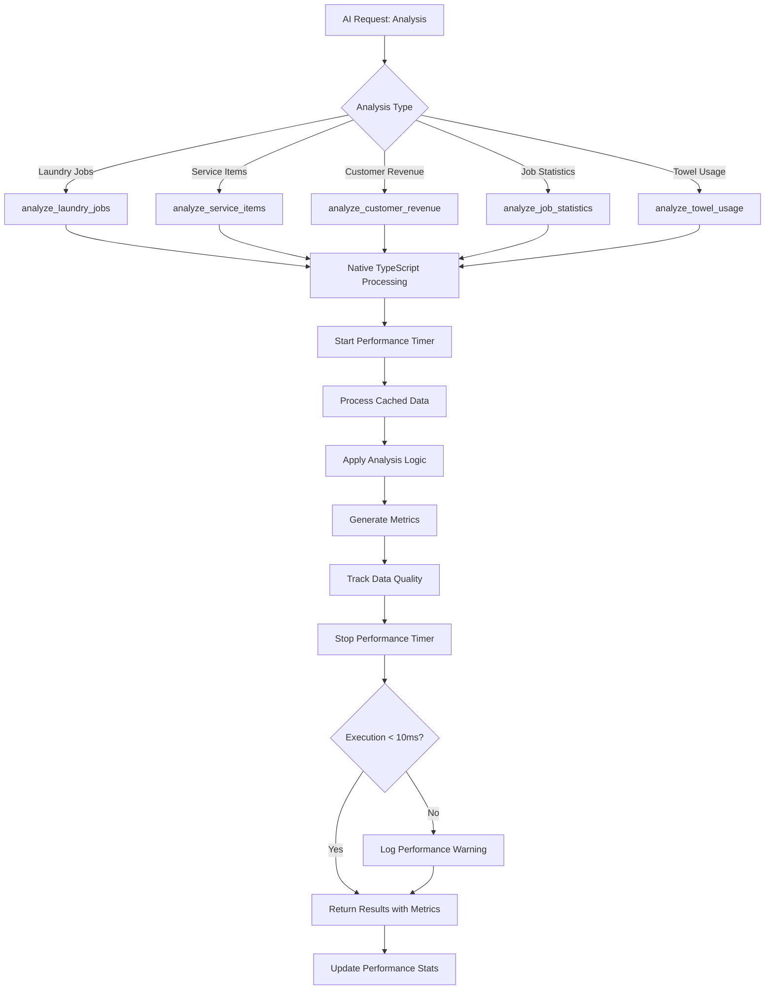
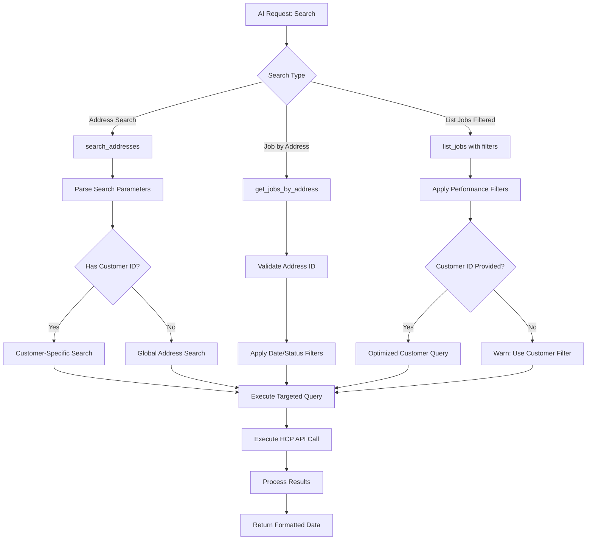
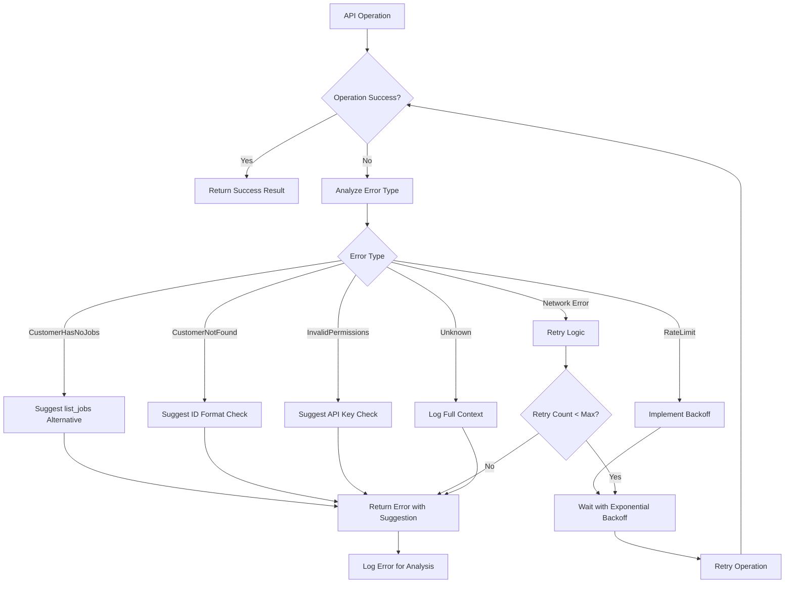
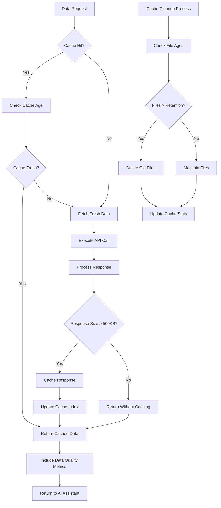
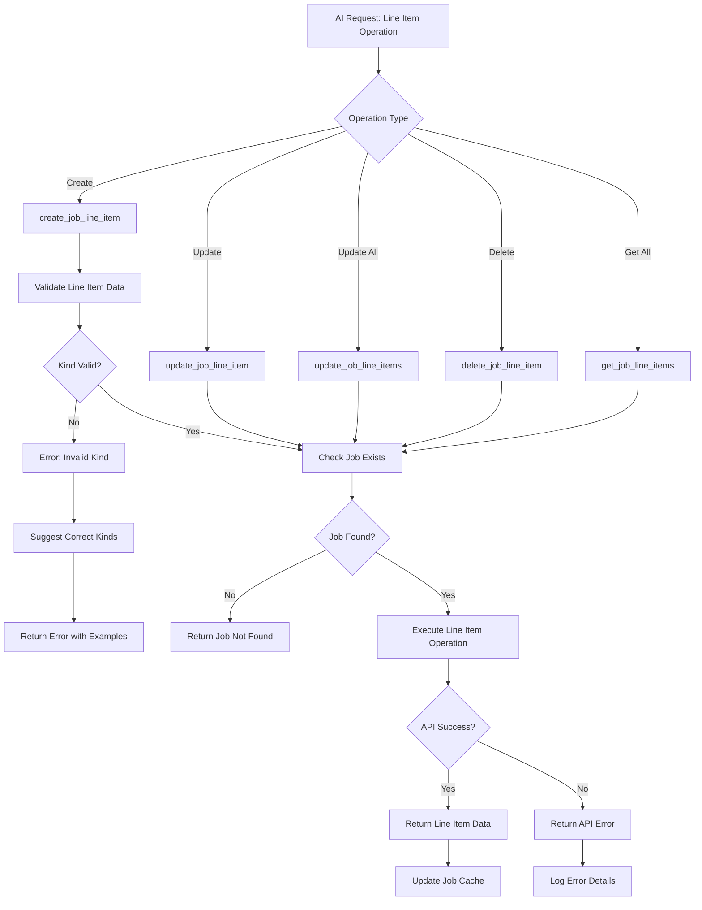
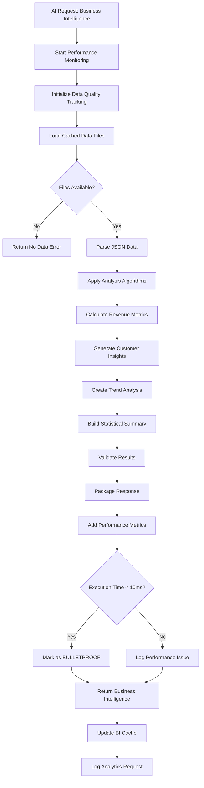
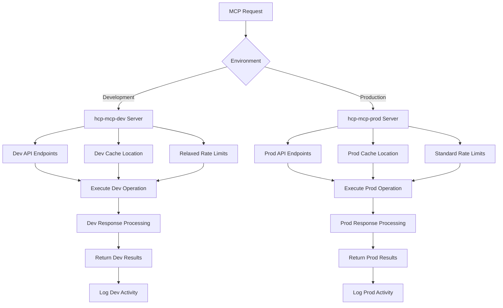

# HousecallPro MCP Server - Mermaid Flow Diagrams

## 1. MCP Connection and Authentication Flow

## 2. Customer Management Workflow

## 3. Job Creation and Management Flow

## 4. BULLETPROOF Analysis Tools Flow

## 5. Advanced Search Operations Flow

## 6. Error Handling and Recovery Flow

## 7. Cache System Operations Flow

## 8. Line Item Management Flow

## 9. Business Intelligence Dashboard Flow

## 10. Multi-Environment Operations Flow

---

**Document Version**: 1.0.0  
**Last Updated**: July 12, 2025  
**Total Diagrams**: 10 comprehensive flow diagrams