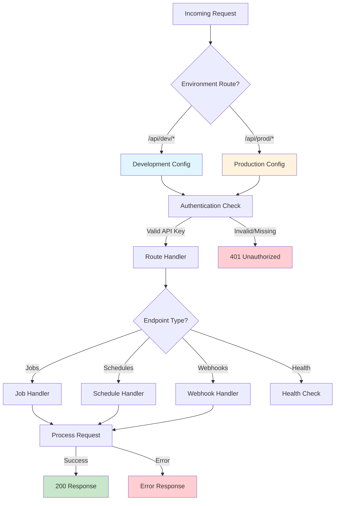
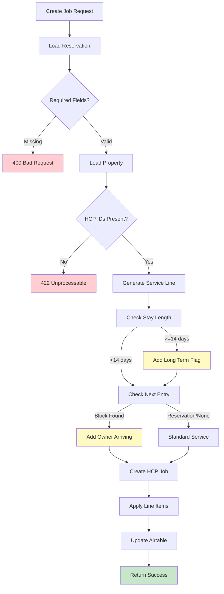
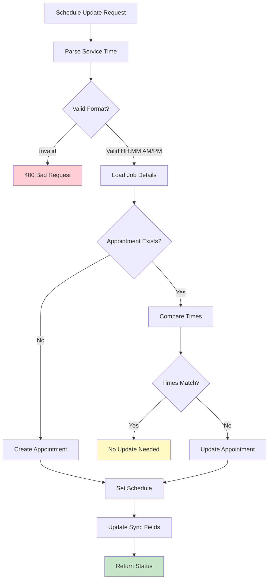
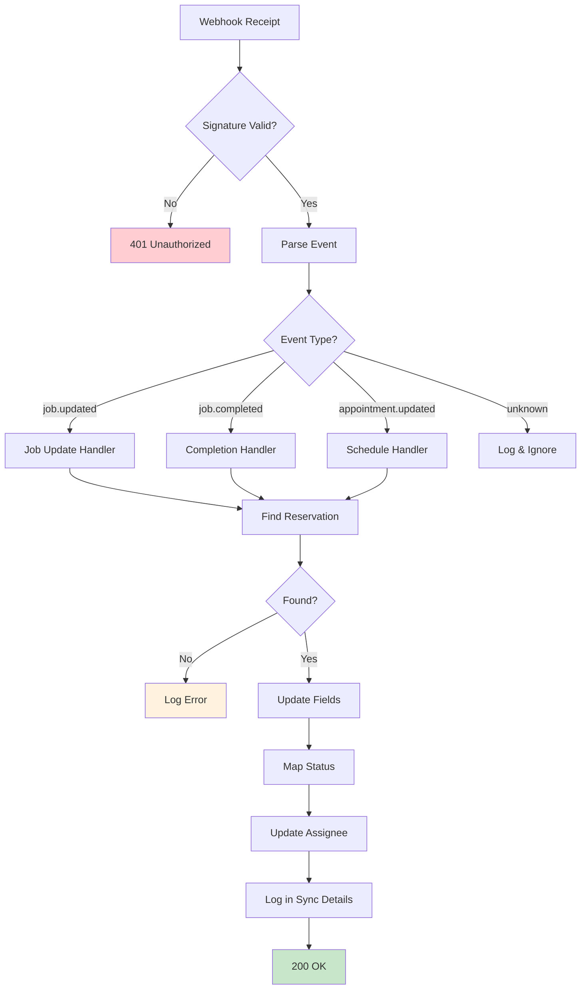
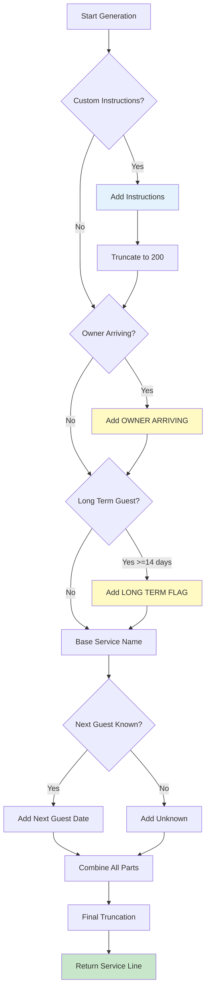
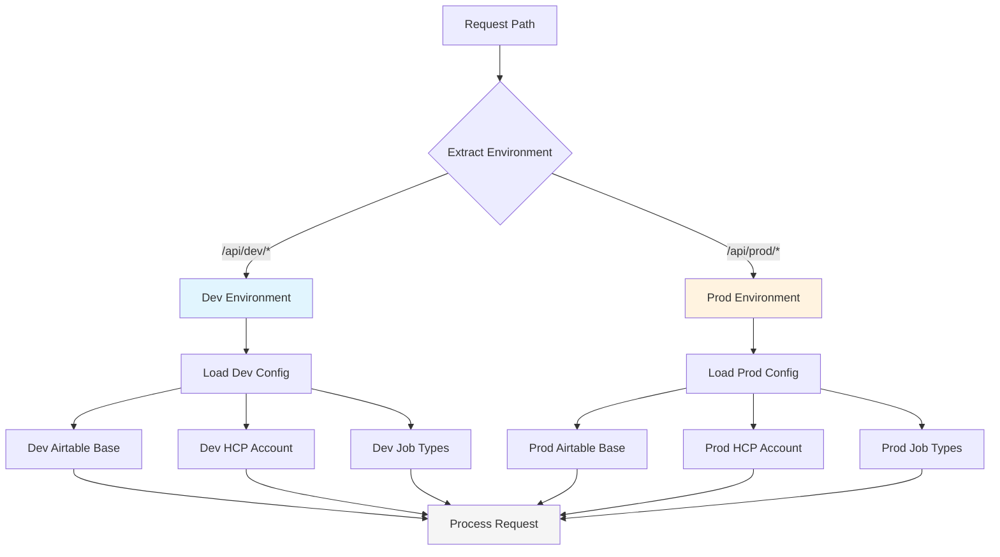
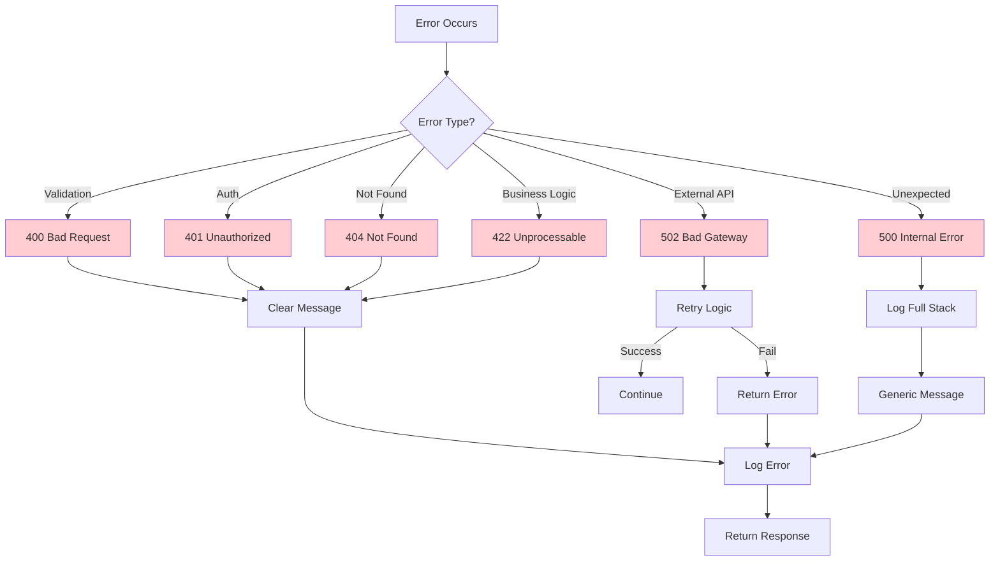
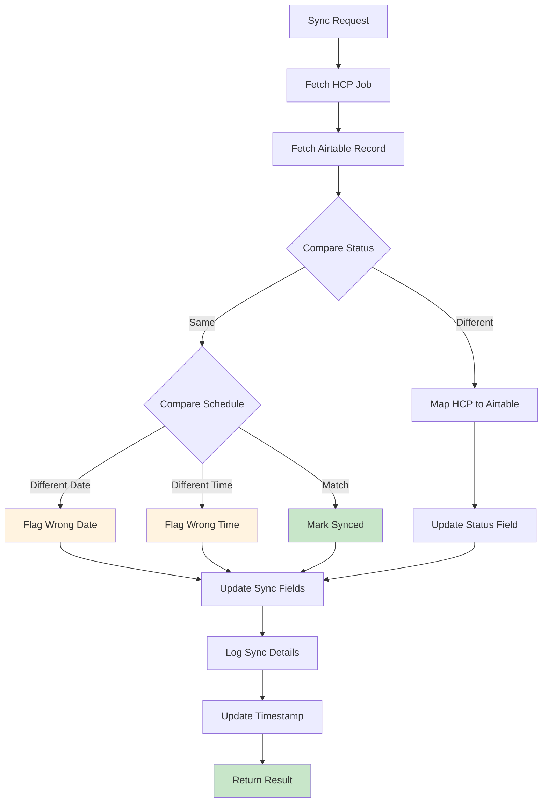

# API Server - Mermaid Flow Diagrams

## Overview
Visual representations of the API Server's core workflows, including job creation, schedule management, webhook processing, and environment routing.

## 1. Main API Request Flow

## 2. Job Creation Workflow

## 3. Schedule Management Flow

## 4. Webhook Processing Flow

## 5. Service Line Generation Logic

## 6. Environment Configuration Flow

## 7. Error Handling Cascade

## 8. Status Synchronization Flow

---

**Document Version**: 1.0.0
**Last Updated**: July 12, 2025
**Related**: BusinessLogicAtoZ.md, SYSTEM_LOGICAL_FLOW.md, README.md