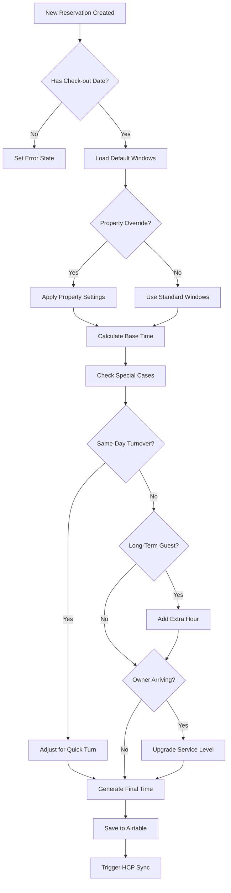
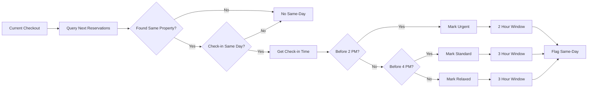
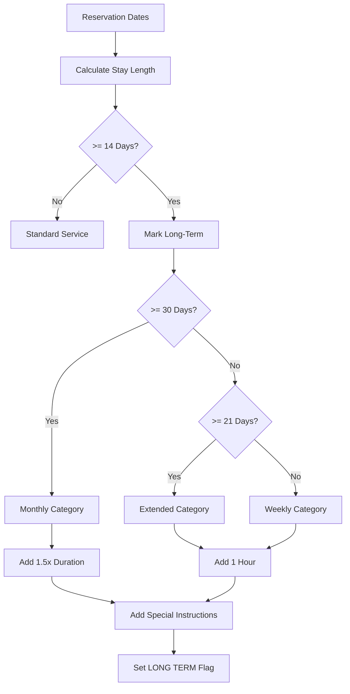
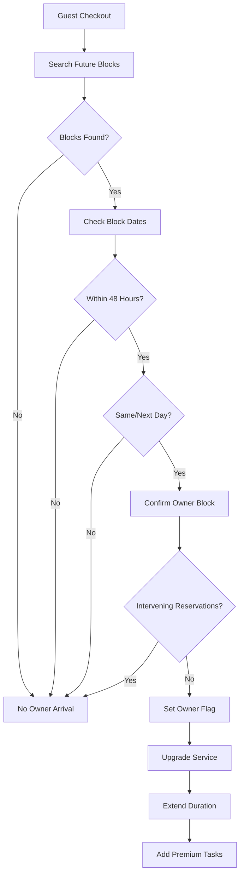
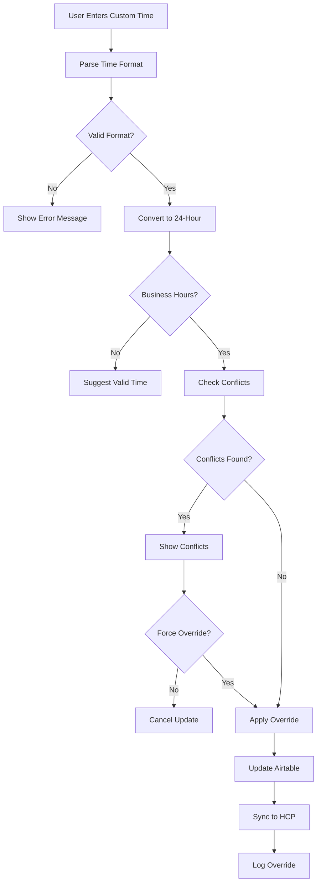
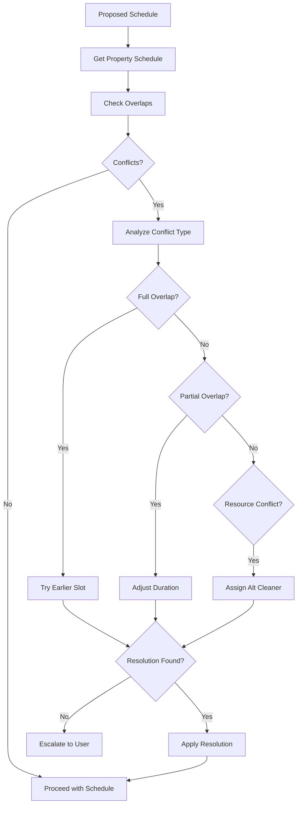
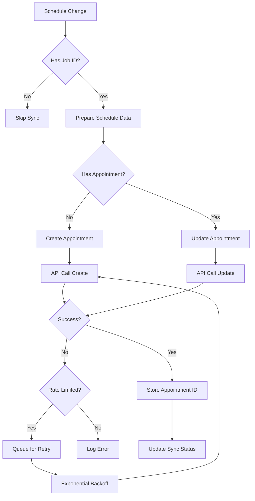
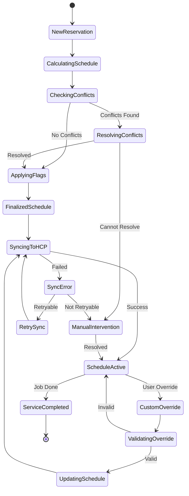

# Schedule Management - Visual Workflow Diagrams

## Overview
This document contains Mermaid diagrams visualizing the schedule management workflows, including automatic calculation, special case detection, conflict resolution, and synchronization processes.

## 1. Main Schedule Generation Flow

## 2. Same-Day Turnover Detection

## 3. Long-Term Guest Detection

## 4. Owner Arrival Detection

## 5. Custom Time Override Process

## 6. Schedule Conflict Resolution

## 7. HousecallPro Synchronization

## 8. Complete Schedule State Machine

## Key Visual Elements Explained

### Color Coding (when rendered)
- **Green**: Successful paths
- **Red**: Error states
- **Yellow**: Warning/attention needed
- **Blue**: Normal process flow

### Decision Points
- **Diamond shapes**: Logic branches
- **Rectangles**: Process steps
- **Rounded rectangles**: Start/end points

### Flow Direction
- **Top to bottom**: Main process flow
- **Left to right**: Sub-processes
- **Loops**: Retry mechanisms

## Integration Points Highlighted

1. **Airtable Integration**
   - Read reservation data
   - Save calculated times
   - Update flags and status

2. **HousecallPro Integration**
   - Create appointments
   - Update schedules
   - Handle sync errors

3. **User Interface**
   - Custom time input
   - Conflict resolution
   - Override confirmations

---

**Document Version**: 1.0.0
**Last Updated**: July 12, 2025
**Diagram Count**: 8
**Related**: BusinessLogicAtoZ.md, SYSTEM_LOGICAL_FLOW.md