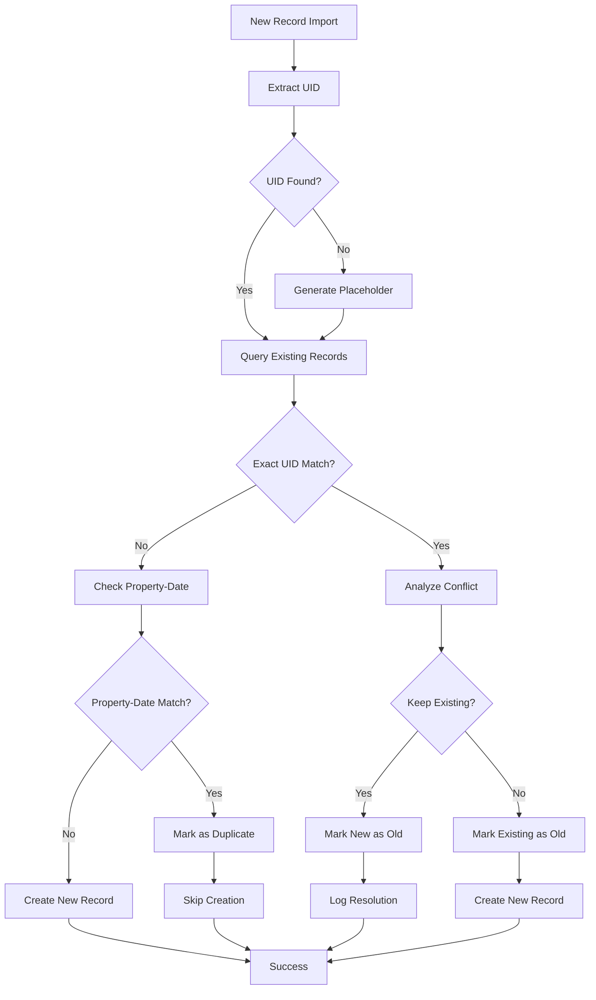
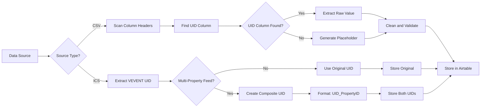
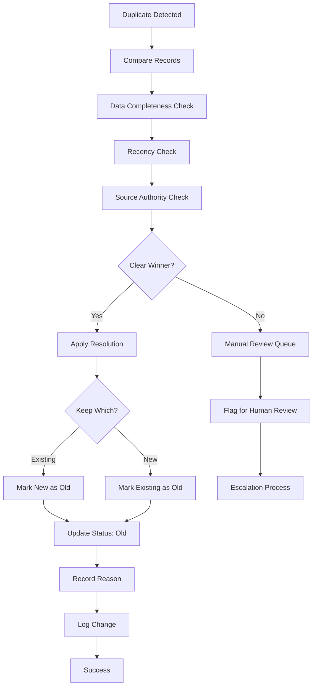
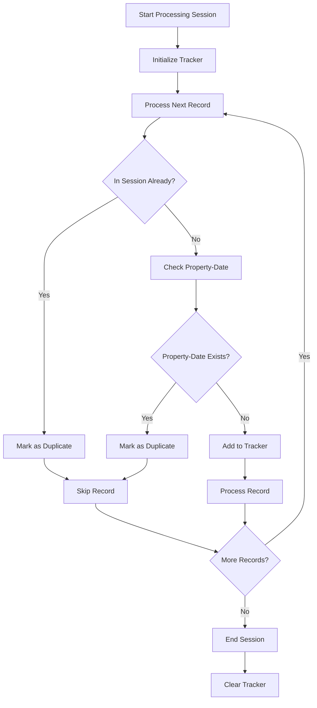
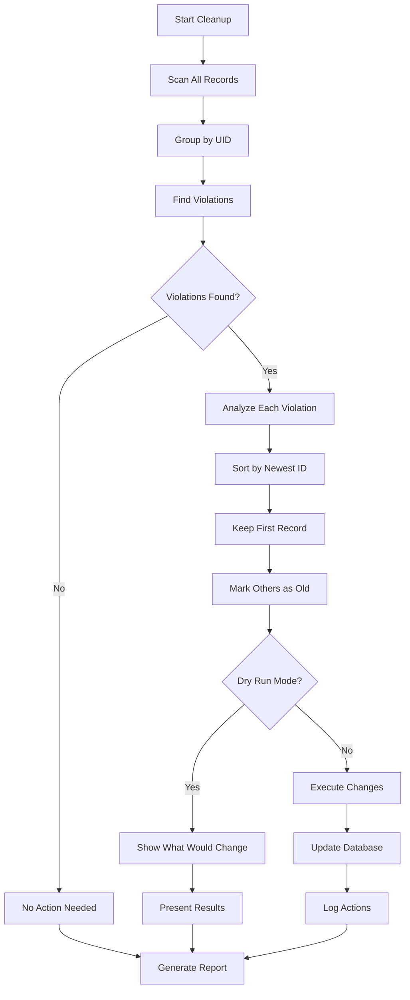
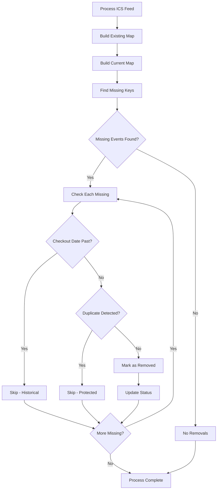
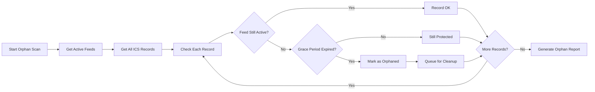
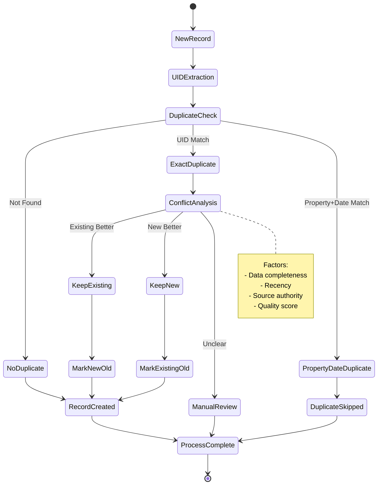

# Duplicate Detection - Visual Workflow Diagrams

## Overview
This document contains Mermaid diagrams visualizing the duplicate detection workflows, including UID generation, duplicate identification, status resolution, and cleanup processes.

## 1. Main Duplicate Detection Flow

## 2. UID Generation Process

## 3. Status-Based Conflict Resolution

## 4. Session Tracking Workflow

## 5. Cleanup Script Operations

## 6. ICS Removal Detection

## 7. Orphaned Record Detection

## 8. Complete State Machine

## Key Visual Elements Explained

### Decision Flow Colors (when rendered)
- **Green**: Successful processing paths
- **Red**: Error or conflict states  
- **Yellow**: Warning/attention needed
- **Blue**: Normal process flow
- **Purple**: Manual intervention required

### Shape Meanings
- **Diamond**: Decision points requiring logic evaluation
- **Rectangle**: Process steps or actions
- **Rounded Rectangle**: Start/end points
- **Hexagon**: Database operations
- **Circle**: State transitions

### Flow Patterns
- **Parallel Flows**: Concurrent processing paths
- **Loop Backs**: Retry or batch processing
- **Branch Points**: Multiple possible outcomes
- **Merge Points**: Convergence of different paths

## Integration Points Highlighted

### 1. Database Integration
- Read existing records for comparison
- Write new records with proper status
- Update status changes with audit trails
- Query for cleanup and analysis operations

### 2. Source System Integration
- CSV file parsing and UID extraction
- ICS feed processing and composite UID creation
- Multi-system duplicate detection
- Source authority hierarchy enforcement

### 3. User Interface Integration
- Manual review queue for complex conflicts
- Cleanup script execution with dry-run options
- Status change reporting and audit trails
- Error notification and escalation procedures

### 4. Monitoring Integration
- Duplicate detection rate tracking
- Cleanup operation success metrics
- Performance monitoring for large batches
- Alert generation for unusual patterns

---

**Document Version**: 1.0.0
**Last Updated**: July 12, 2025
**Diagram Count**: 8
**Related**: BusinessLogicAtoZ.md, SYSTEM_LOGICAL_FLOW.md