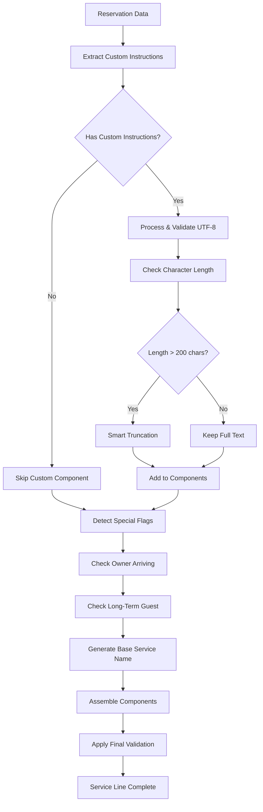
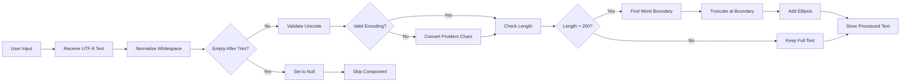
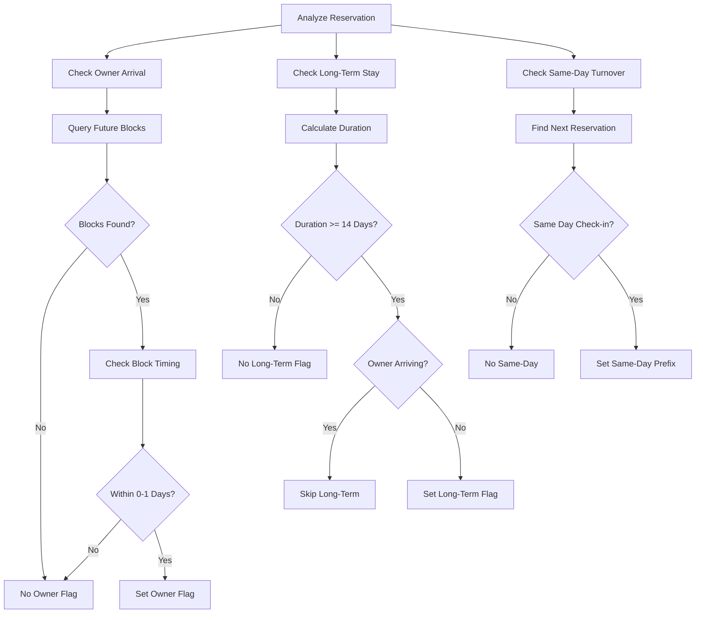
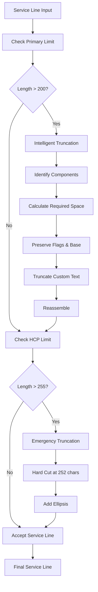
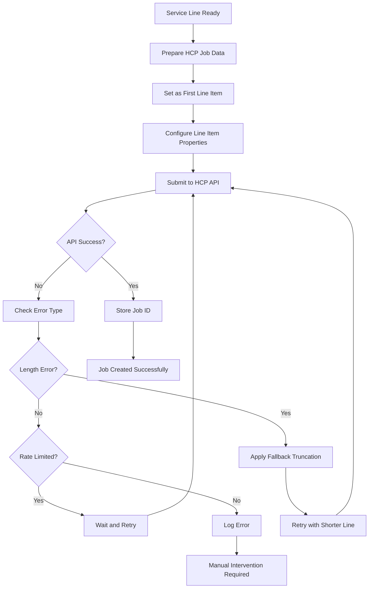
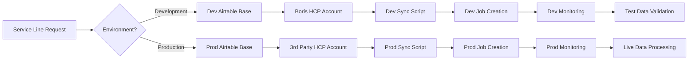
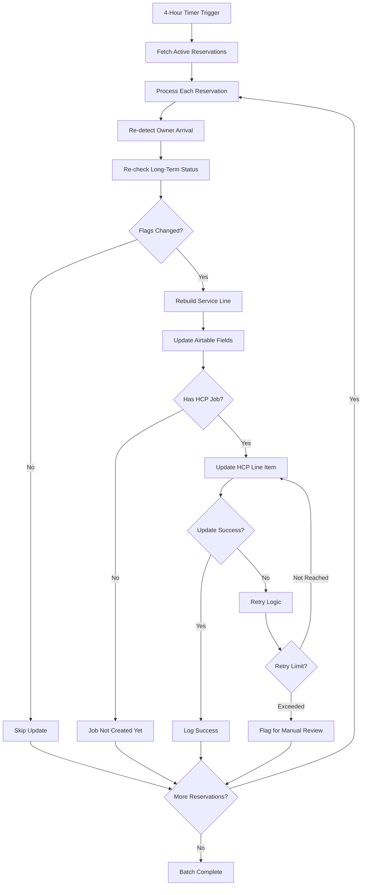

# Service Line Management - Visual Workflow Diagrams

## Overview
This document contains Mermaid diagrams visualizing the service line management workflows, including custom instruction processing, flag detection, service line assembly, and HousecallPro integration.

## 1. Main Service Line Assembly Flow



## 2. Custom Instructions Processing



## 3. Special Flag Detection Workflow



## 4. Hierarchical Component Assembly

```mermaid
graph TD
    A[Start Assembly] --> B[Initialize Parts Array]
    B --> C{Has Custom Instructions?}
    C -->|Yes| D[Add Custom Text]
    C -->|No| E[Check Flags]
    D --> E
    E --> F{Owner Arriving?}
    F -->|Yes| G[Add OWNER ARRIVING]
    F -->|No| H{Long-Term Guest?}
    G --> H
    H -->|Yes| I[Add LONG TERM GUEST DEPARTING]
    H -->|No| J[Add Base Service Name]
    I --> J
    J --> K[Join with " - " Separator]
    K --> L[Validate Final Length]
    L --> M{Length Acceptable?}
    M -->|Yes| N[Return Service Line]
    M -->|No| O[Apply Emergency Truncation]
    O --> N
```

## 5. Character Limit Enforcement



## 6. HousecallPro Integration Process



## 7. Environment-Specific Processing



## 8. Scheduled Update Flow



## Key Visual Elements Explained

### Flow Direction Patterns
- **Top to Bottom**: Main process flows
- **Left to Right**: Sub-process details
- **Circular**: Retry and validation loops
- **Branching**: Decision points and alternatives

### Component Color Coding (when rendered)
- **Green**: Successful processing
- **Red**: Error conditions
- **Yellow**: Warning states
- **Blue**: Normal operations
- **Purple**: Manual intervention

### Shape Significance
- **Rectangles**: Process steps
- **Diamonds**: Decision points
- **Rounded Rectangles**: Start/end points
- **Hexagons**: Database operations
- **Circles**: State indicators

## Integration Points Highlighted

### 1. Airtable Integration
- **Read Operations**: Custom instructions, reservation data
- **Write Operations**: Flag updates, processed service lines
- **Field Monitoring**: Change detection for real-time updates
- **Validation**: Data quality checks before processing

### 2. HousecallPro Integration
- **Job Creation**: Service line as first line item name
- **API Limitations**: Character limits and update restrictions
- **Error Handling**: Retry logic and fallback procedures
- **Environment Separation**: Dev vs production account isolation

### 3. User Interface Integration
- **Input Collection**: Custom instruction entry in Airtable
- **Feedback Provision**: Truncation warnings and limitations
- **Manual Override**: Direct HCP editing for post-creation changes
- **Status Reporting**: Update success and failure notifications

### 4. Automation Integration
- **Scheduled Processing**: 4-hour batch updates
- **Event Triggers**: Real-time field change responses
- **Flag Detection**: Automatic owner arrival and long-term analysis
- **Cross-System Synchronization**: Consistent data across platforms

---

**Document Version**: 1.0.0
**Last Updated**: July 12, 2025
**Diagram Count**: 8
**Related**: BusinessLogicAtoZ.md, SYSTEM_LOGICAL_FLOW.md