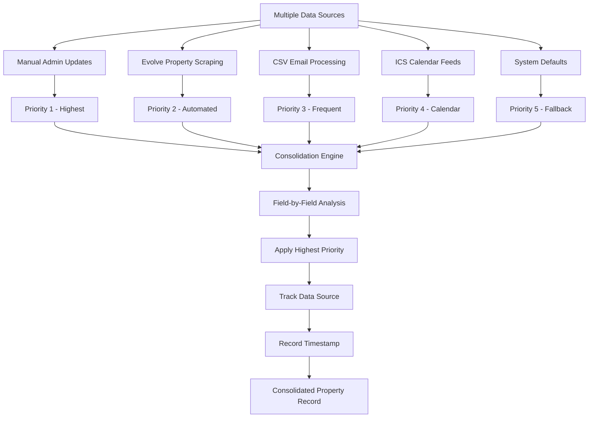
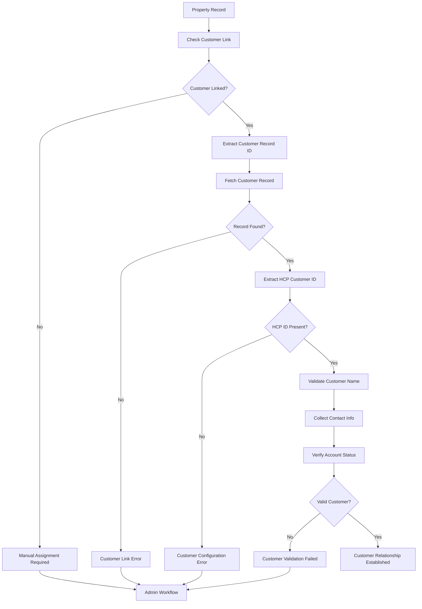
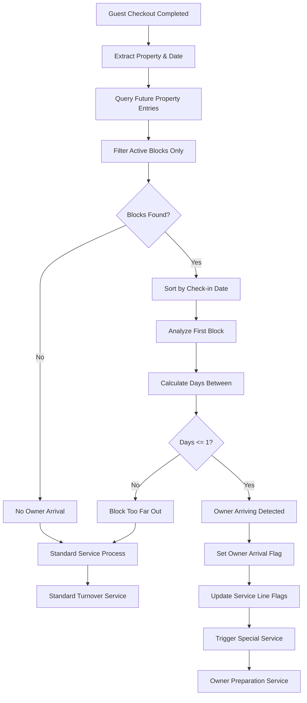
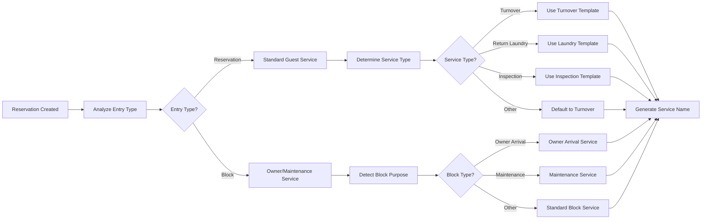
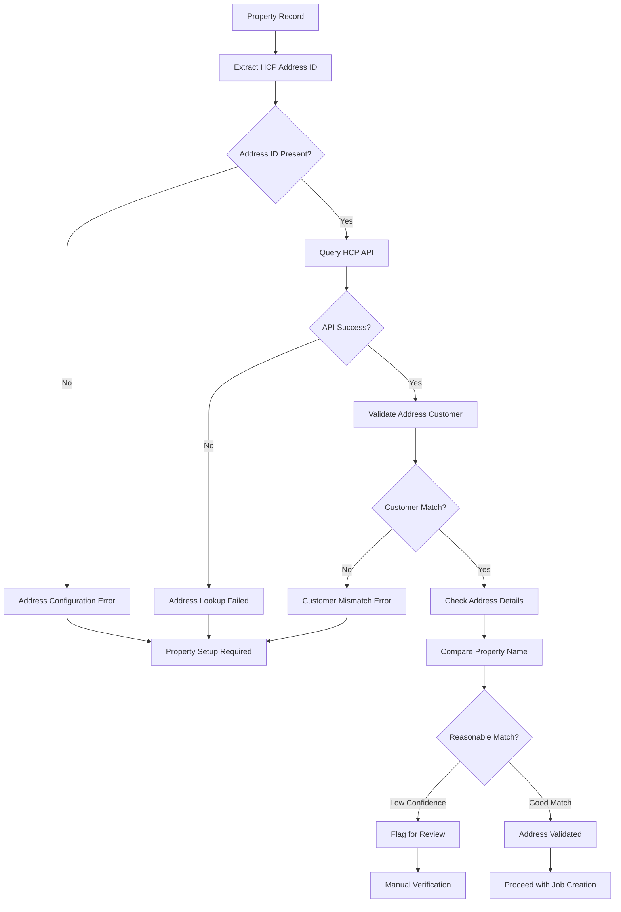
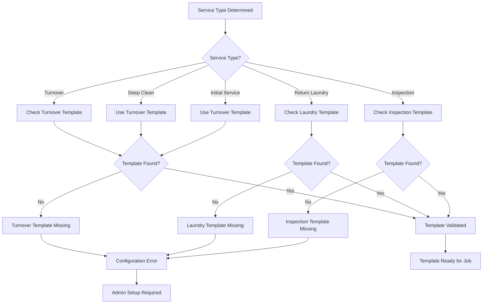
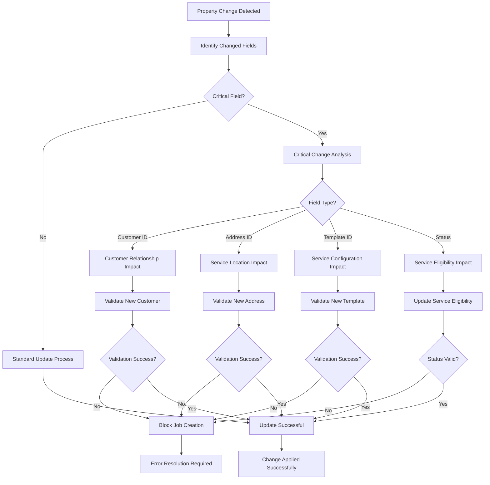
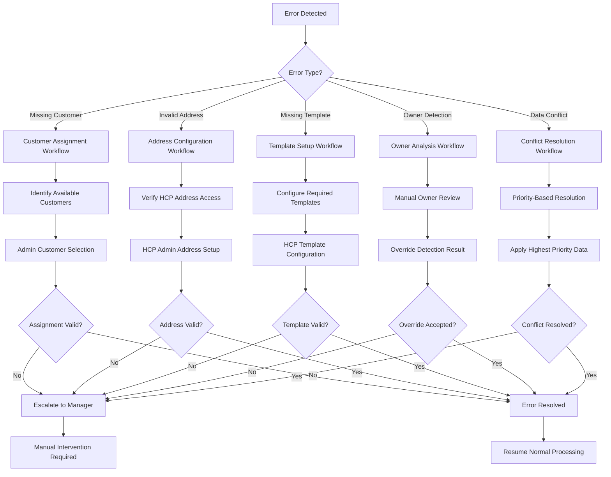

# Customer & Property Management - Visual Workflow Diagrams

## Overview
This document contains Mermaid diagrams visualizing the customer and property management workflows, including property data consolidation, customer relationship management, owner detection algorithms, service assignments, and HousecallPro integration processes.

## 1. Property Data Consolidation Flow

## 2. Customer Relationship Management Process

## 3. Owner Arrival Detection Algorithm

## 4. Property-Based Service Assignment

## 5. HCP Address Validation Process

## 6. Service Template Configuration Management

## 7. Data Quality and Validation Workflow

## 8. Error Recovery and Resolution Process

## Key Visual Elements Explained

### Flow Direction Patterns
- **Top to Bottom**: Main process flows and decision trees
- **Left to Right**: Sequential processing steps
- **Circular**: Validation and retry loops
- **Branching**: Multiple outcome scenarios and error paths

### Component Color Coding (when rendered)
- **Green**: Successful processing and validation
- **Red**: Error conditions and failures
- **Yellow**: Warning states and manual review required
- **Blue**: Normal operational processing
- **Purple**: Administrative intervention needed

### Shape Significance
- **Rectangles**: Process steps and operations
- **Diamonds**: Decision points and validations
- **Rounded Rectangles**: Start/end points and states
- **Hexagons**: Database operations and API calls
- **Circles**: State indicators and status markers

## Integration Points Highlighted

### 1. Airtable Integration
- **Property Records**: Central property registry with comprehensive metadata
- **Customer Records**: Customer information and HCP relationship mapping
- **Reservation Records**: Booking data with property and customer associations
- **Status Tracking**: Property and customer relationship status management

### 2. HousecallPro Integration
- **Customer Validation**: Verify customer existence and accessibility
- **Address Management**: Validate service locations and customer associations
- **Template Configuration**: Manage job templates and service configurations
- **Job Creation**: Property-based service assignment and scheduling

### 3. Multi-Source Data Integration
- **Evolve Platform**: Automated property listing and characteristic updates
- **CSV Processing**: Bulk reservation and property data imports
- **ICS Feeds**: Calendar and booking information integration
- **Manual Administration**: Override and correction capabilities

### 4. Error Handling Integration
- **Validation Workflows**: Systematic property and customer validation
- **Recovery Procedures**: Automated error detection and resolution guidance
- **Escalation Paths**: Administrative intervention for complex issues
- **Audit Trails**: Complete change tracking and resolution documentation

## Business Logic Flow Patterns

### Property Lifecycle Management
1. **Data Ingestion**: Multi-source property information collection
2. **Consolidation**: Priority-based data resolution and storage
3. **Validation**: Customer relationship and HCP integration verification
4. **Activation**: Service template configuration and readiness checking
5. **Operation**: Active service assignment and owner detection
6. **Maintenance**: Ongoing validation and relationship management

### Customer Relationship Lifecycle
1. **Discovery**: Property-customer relationship identification
2. **Validation**: Customer record and HCP integration verification
3. **Association**: Property-customer link establishment and validation
4. **Monitoring**: Ongoing relationship status and configuration checking
5. **Maintenance**: Relationship updates and conflict resolution
6. **Resolution**: Error handling and administrative intervention

### Service Assignment Lifecycle
1. **Context Analysis**: Reservation type and property characteristic evaluation
2. **Template Selection**: Service type to HCP template mapping
3. **Name Generation**: Descriptive service name creation with context
4. **Validation**: Template availability and configuration verification
5. **Assignment**: Service type and template assignment to reservation
6. **Delivery**: Job creation and service execution preparation

---

**Document Version**: 1.0.0
**Last Updated**: July 12, 2025
**Diagram Count**: 8
**Related**: BusinessLogicAtoZ.md, SYSTEM_LOGICAL_FLOW.md