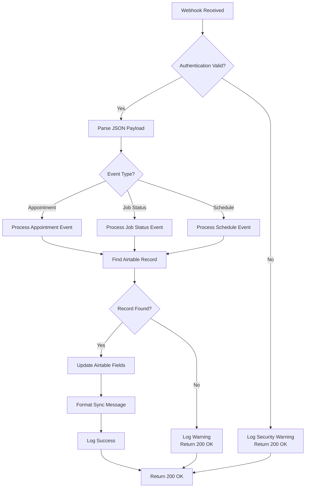
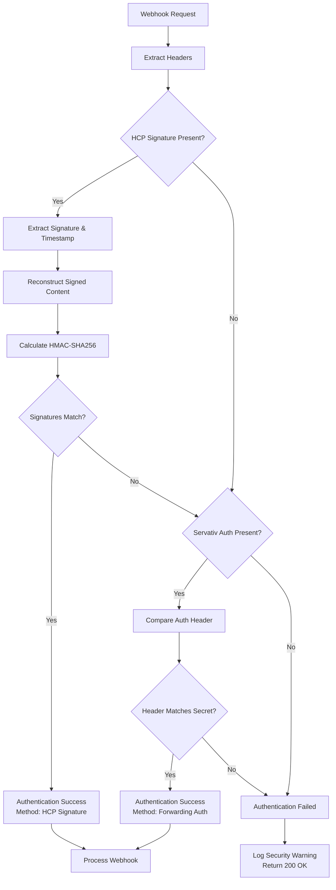
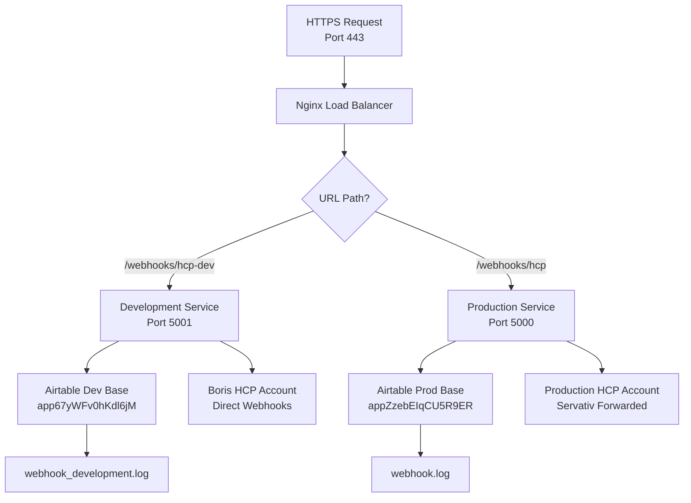
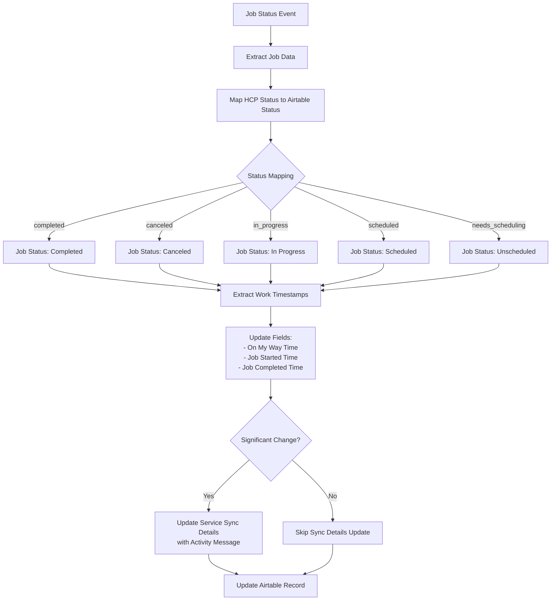
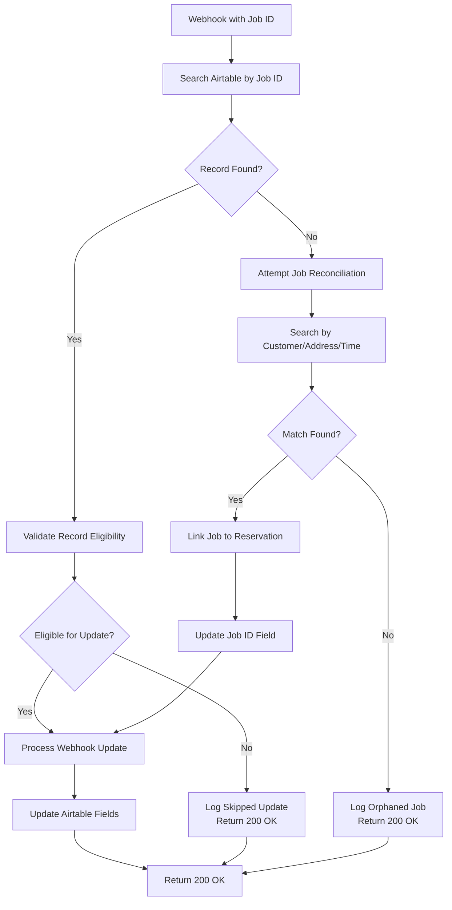
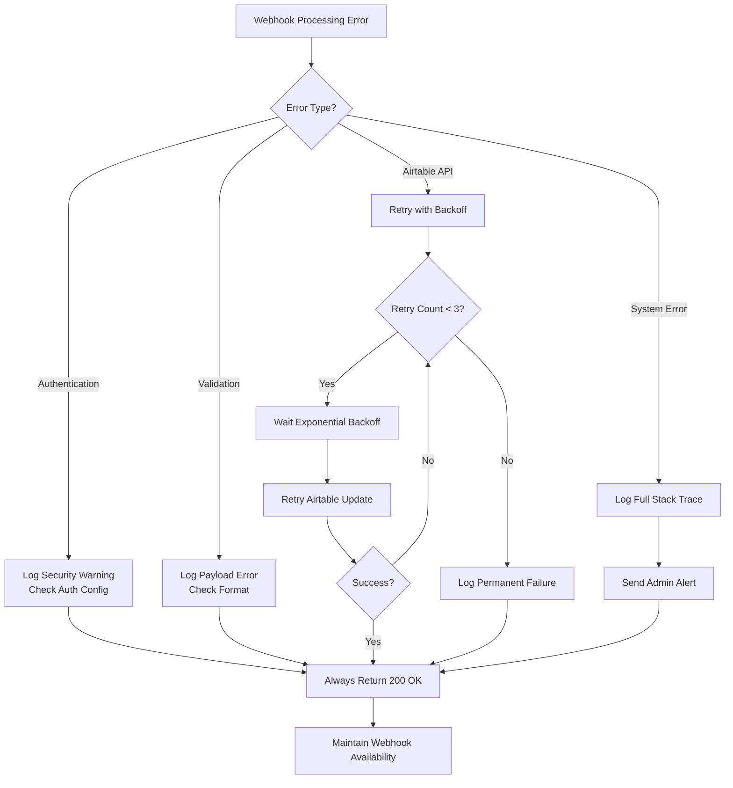
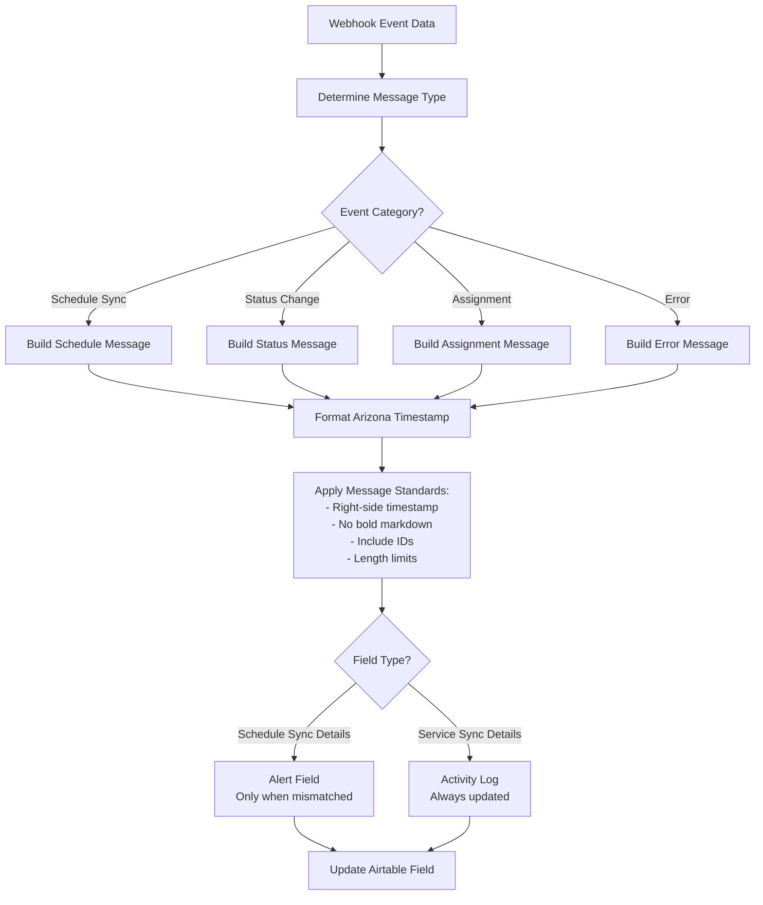
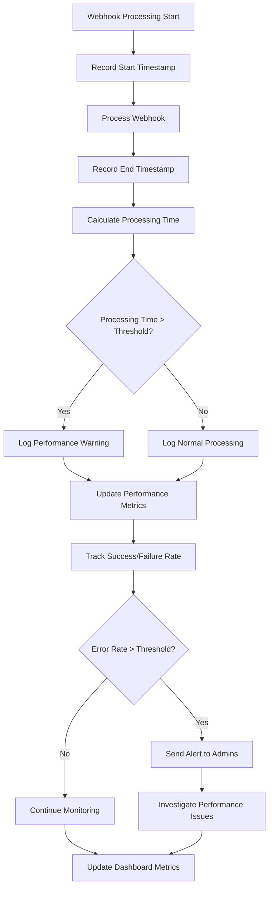
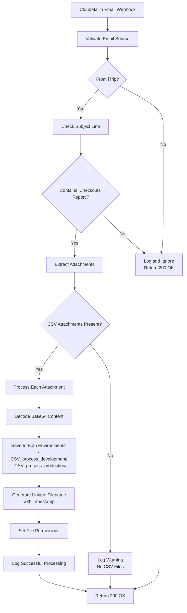

# Webhook Processing - Visual Flow Diagrams

**Version:** 2.2.8  
**Last Updated:** July 12, 2025  
**Purpose:** Visual representations of webhook processing workflows

---

## 📊 **WEBHOOK PROCESSING FLOW DIAGRAMS**

### 1. **Main Webhook Processing Flow**



### 2. **Authentication Flow**



### 3. **Environment Routing Flow**



### 4. **Appointment Event Processing Flow**

```mermaid
flowchart TD
    A[Appointment Event] --> B{Event Type?}
    
    B -->|scheduled| C[Extract Appointment Data]
    B -->|rescheduled| D[Extract Updated Data]
    B -->|discarded| E[Clear Appointment Data]
    B -->|pros_assigned| F[Extract Employee Data]
    B -->|pros_unassigned| G[Remove Employee Data]
    
    C --> H[Update Fields:<br/>- Service Appointment ID<br/>- Assignee<br/>- Scheduled Service Time<br/>- Job Status: Scheduled]
    
    D --> I[Update Fields:<br/>- Service Appointment ID<br/>- Assignee<br/>- Scheduled Service Time<br/>- Sync Message: Rescheduled]
    
    E --> J[Clear Fields:<br/>- Service Appointment ID<br/>- Assignee<br/>- Scheduled Service Time<br/>- Job Status: Unscheduled]
    
    F --> K[Update Fields:<br/>- Assignee<br/>- Sync Message: Pros Assigned]
    
    G --> L[Update Fields:<br/>- Assignee (Remaining)<br/>- Sync Message: Pros Unassigned]
    
    H --> M[Format Sync Message]
    I --> M
    J --> M
    K --> M
    L --> M
    
    M --> N[Update Airtable Record]
```

### 5. **Job Status Processing Flow**



### 6. **Record Matching and Reconciliation Flow**



### 7. **Error Handling Flow**



### 8. **Sync Message Formatting Flow**



### 9. **Performance Monitoring Flow**



### 10. **CloudMailin Email Processing Flow**



---

*These diagrams provide visual representations of all major webhook processing flows, from initial request receipt through final data updates, including error handling and performance monitoring.*