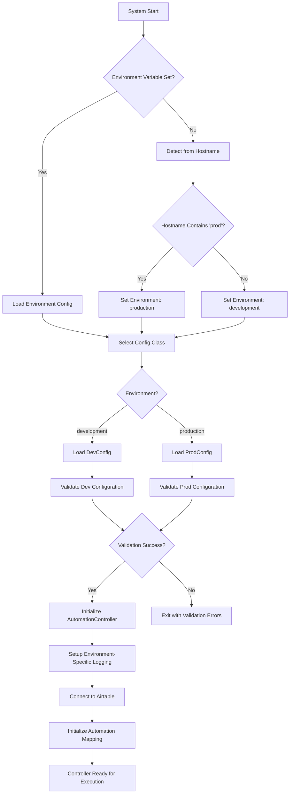
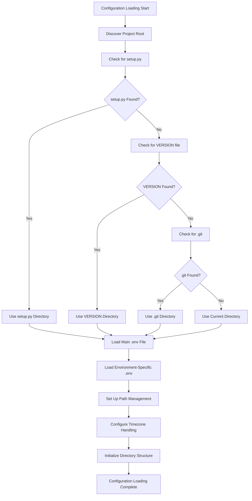
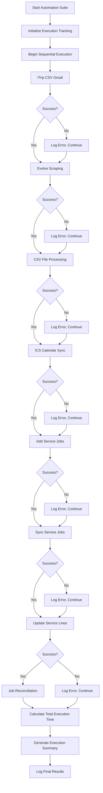
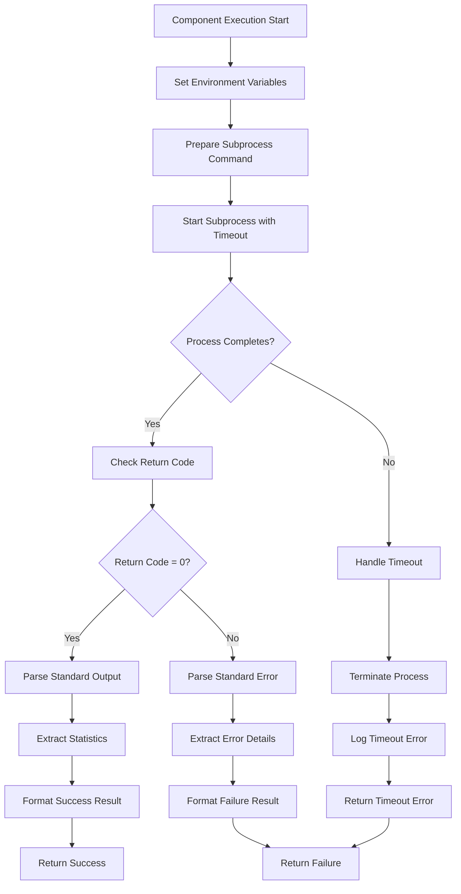
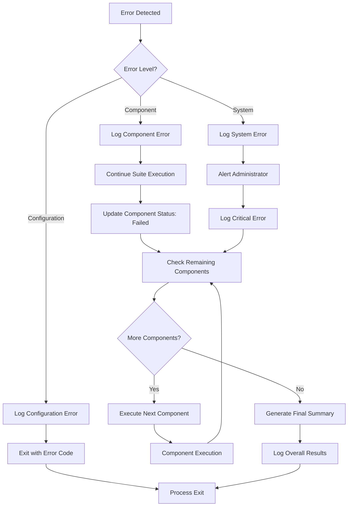
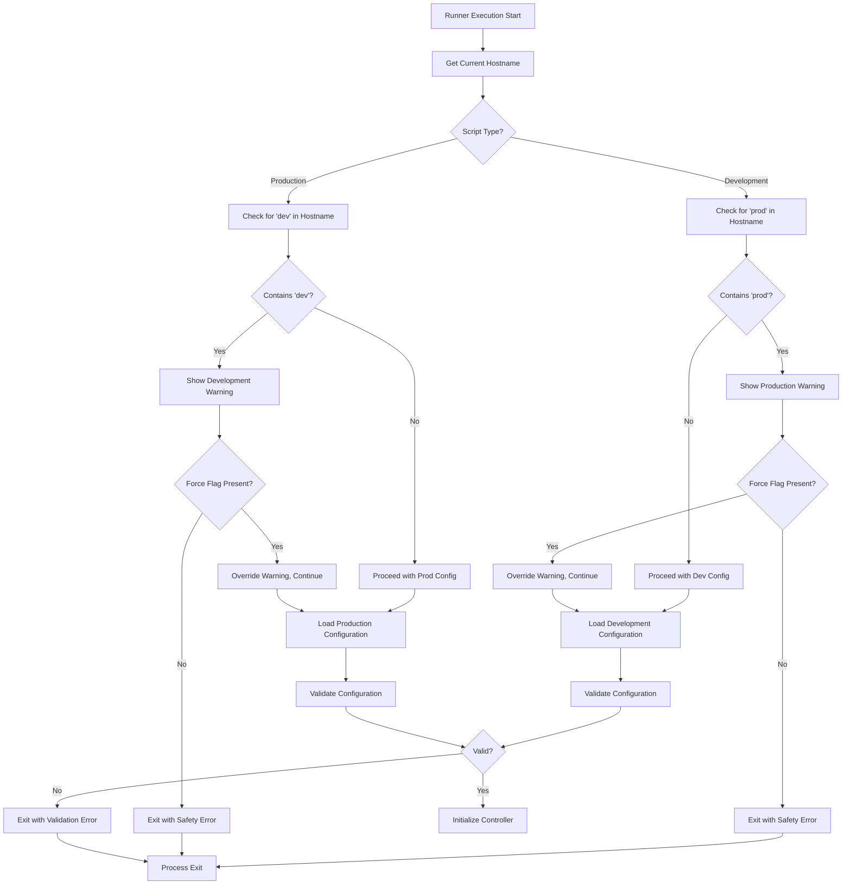
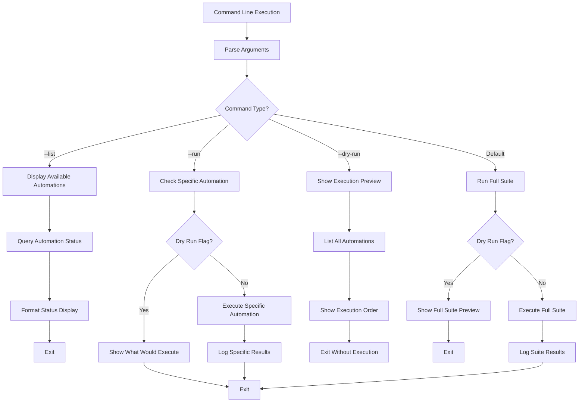
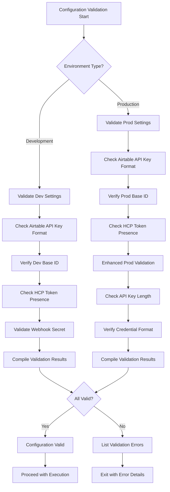
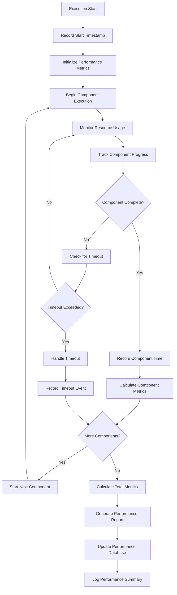

# Automation Controller - Visual Flow Diagrams

**Version:** 2.2.8  
**Last Updated:** July 12, 2025  
**Purpose:** Visual representations of automation controller orchestration workflows

---

## 📊 **AUTOMATION CONTROLLER FLOW DIAGRAMS**

### 1. **Main Controller Initialization Flow**



### 2. **Environment Configuration Loading Flow**



### 3. **Automation Status Management Flow**

```mermaid
flowchart TD
    A[Automation Execution Request] --> B[Query Airtable Status]
    B --> C{Status Record Exists?}
    
    C -->|Yes| D[Check Active Flag]
    C -->|No| E[Default to Active<br/>(Backward Compatibility)]
    
    D --> F{Is Active?}
    F -->|Yes| G[Update Status to 'Running']
    F -->|No| H[Log Skipped<br/>Return Success]
    
    E --> G
    G --> I[Record Start Timestamp]
    I --> J[Execute Automation Function]
    
    J --> K{Execution Success?}
    K -->|Yes| L[Calculate Execution Time]
    K -->|No| M[Capture Error Details]
    
    L --> N[Extract Statistics from Output]
    M --> O[Format Error Message]
    
    N --> P[Update Status: 'Completed']
    O --> Q[Update Status: 'Failed']
    
    P --> R[Log Success with Statistics]
    Q --> S[Log Failure with Error Details]
    
    H --> T[Return Result]
    R --> T
    S --> T
```

### 4. **Complete Automation Suite Execution Flow**



### 5. **Component Execution Flow**



### 6. **Error Handling and Recovery Flow**



### 7. **Environment Safety Validation Flow**



### 8. **Command Line Interface Flow**



### 9. **Configuration Validation Flow**



### 10. **Performance Monitoring Flow**



---

*These diagrams provide visual representations of all major automation controller flows, from initialization through execution monitoring, including comprehensive error handling and environment management.*