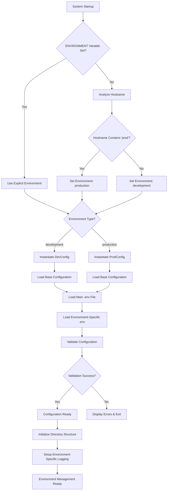
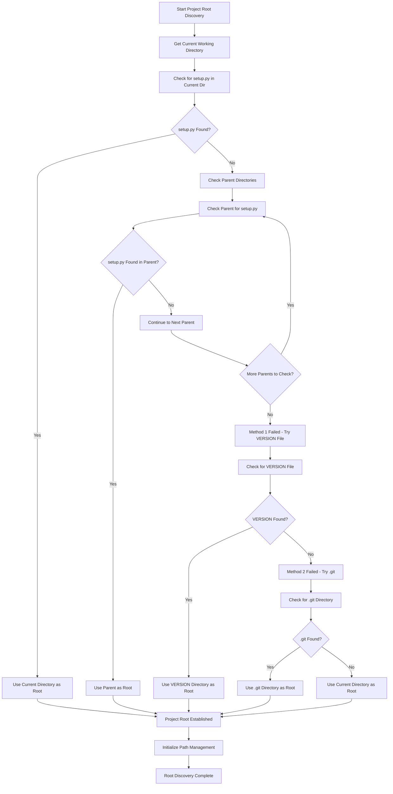
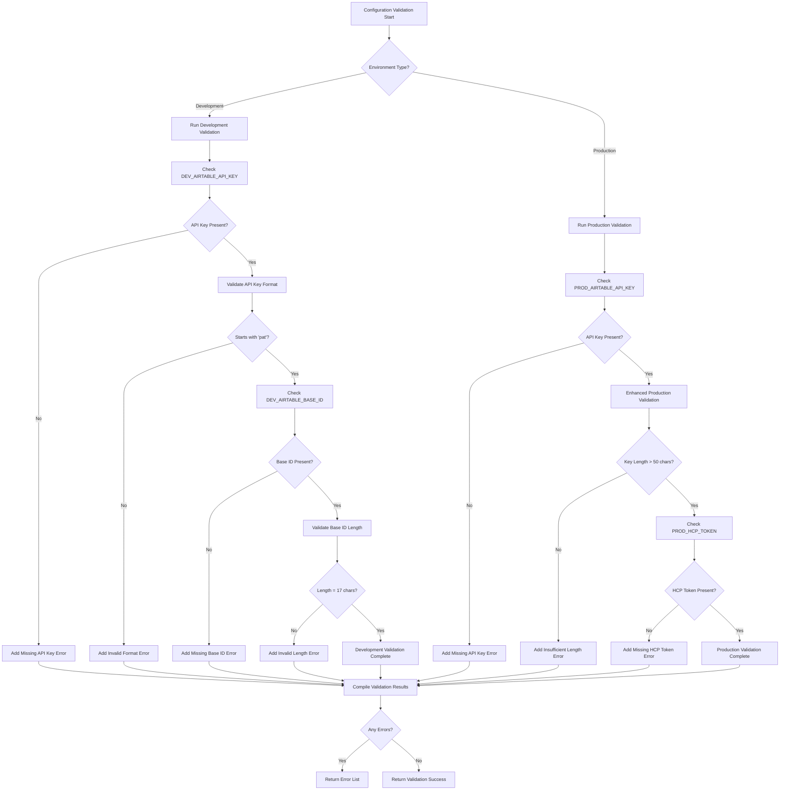
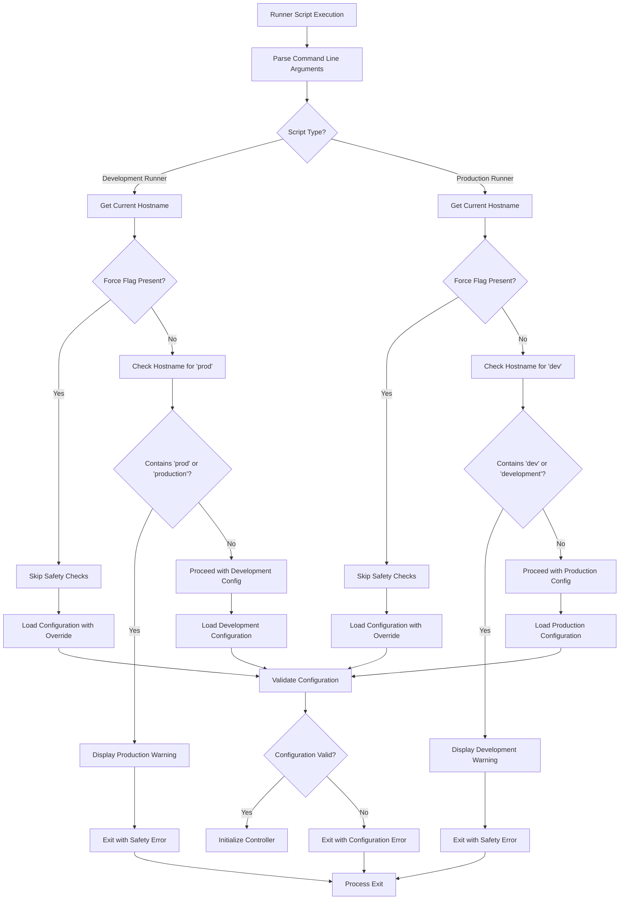
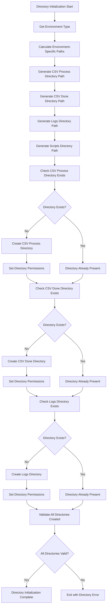
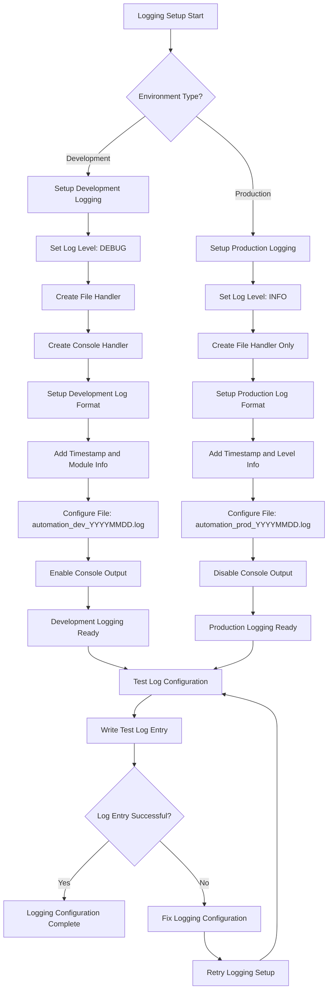
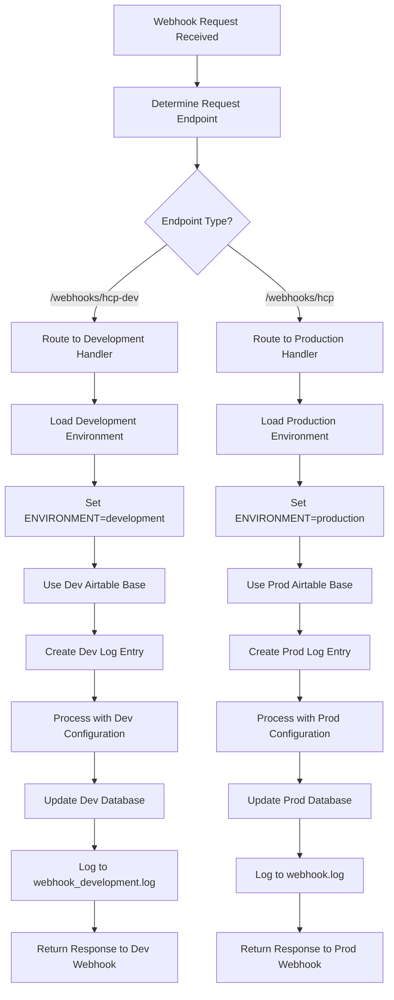
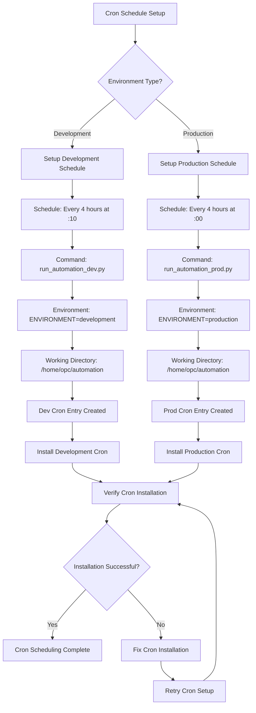
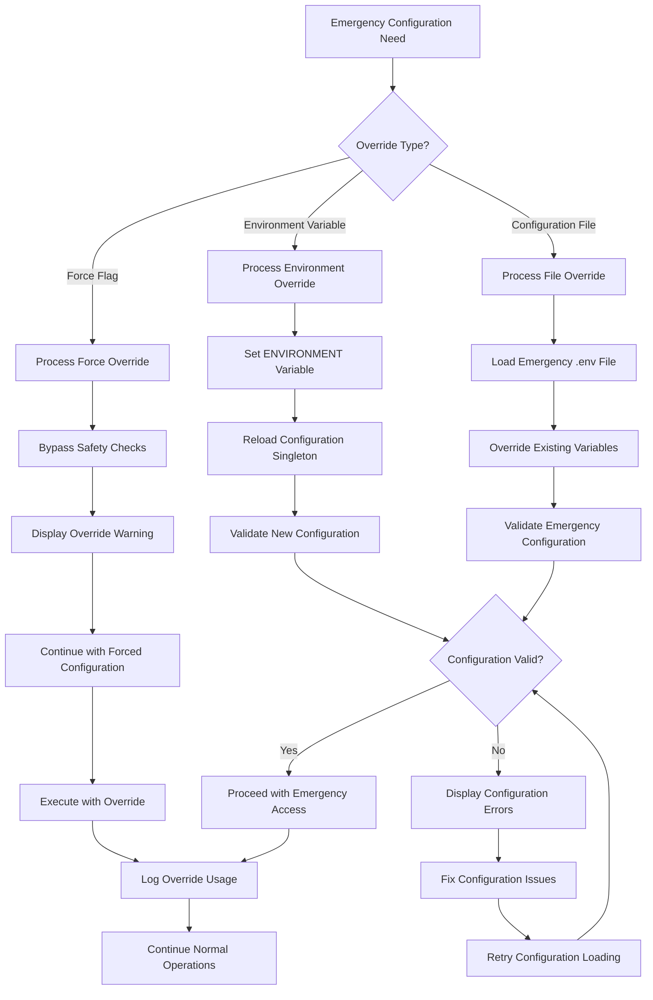
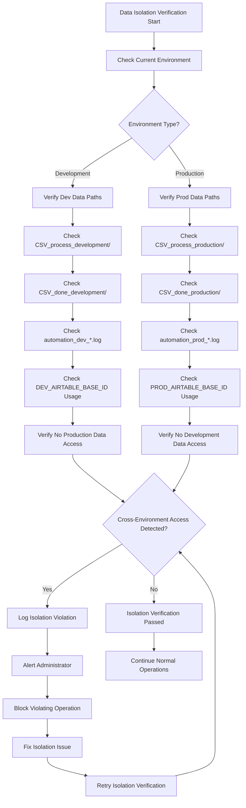

# Environment Management - Visual Flow Diagrams

**Version:** 2.2.8  
**Last Updated:** July 12, 2025  
**Purpose:** Visual representations of environment management workflows and system interactions

---

## 📊 **ENVIRONMENT MANAGEMENT FLOW DIAGRAMS**

### 1. **Environment Detection and Configuration Loading Flow**

### 2. **Project Root Discovery Flow**

### 3. **Configuration Validation Flow**

### 4. **Safety Check and Runner Validation Flow**

### 5. **Directory Structure Initialization Flow**

### 6. **Environment-Specific Logging Setup Flow**

### 7. **Webhook Environment Routing Flow**

### 8. **Cron Schedule Environment Separation Flow**

### 9. **Configuration Override and Emergency Access Flow**

### 10. **Cross-Environment Data Isolation Verification Flow**

---

*These diagrams provide comprehensive visual representations of all environment management flows, from basic configuration loading through complex cross-environment isolation verification, ensuring complete understanding of the system's environment separation architecture.*