# Error Handling & Recovery - Mermaid Flow Diagrams

**Version:** 2.2.8  
**Last Updated:** July 12, 2025  
**Purpose:** Visual representation of error handling flows and recovery mechanisms

---

## 🎯 **ERROR DETECTION AND CLASSIFICATION FLOW**

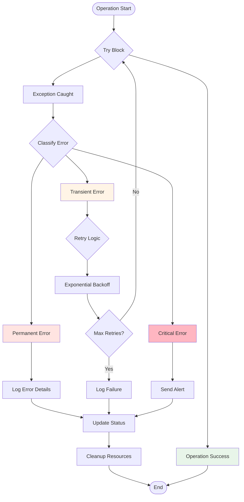

---

## 🔄 **API RETRY WITH RATE LIMITING FLOW**

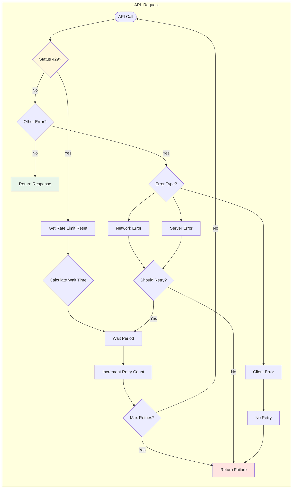

---

## 🛡️ **CONFIGURATION VALIDATION FLOW**

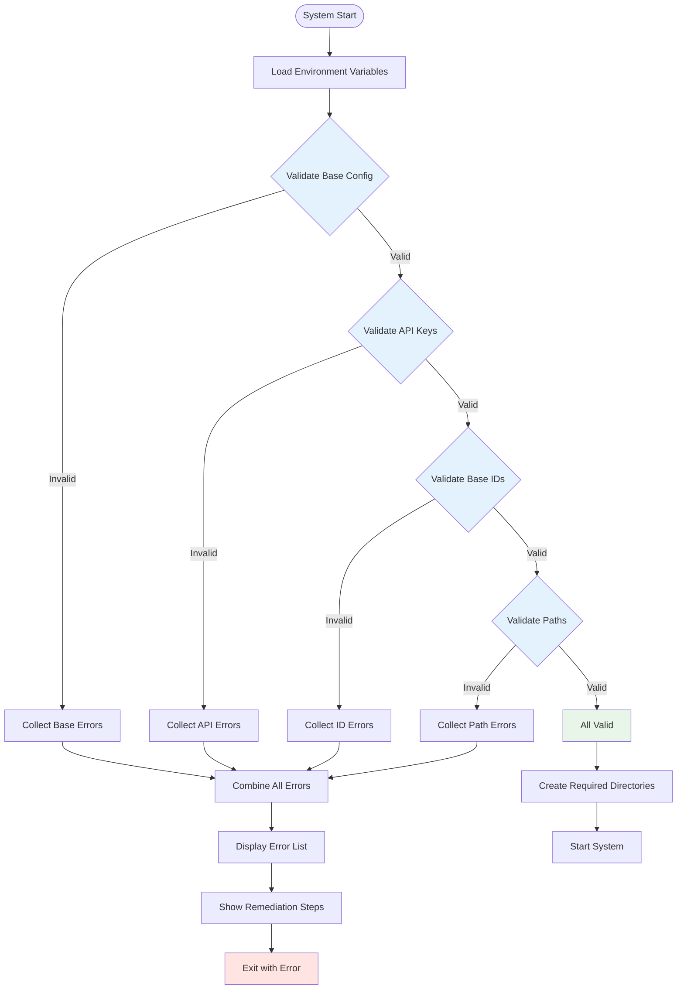

---

## 🔁 **BATCH OPERATION ERROR RECOVERY**

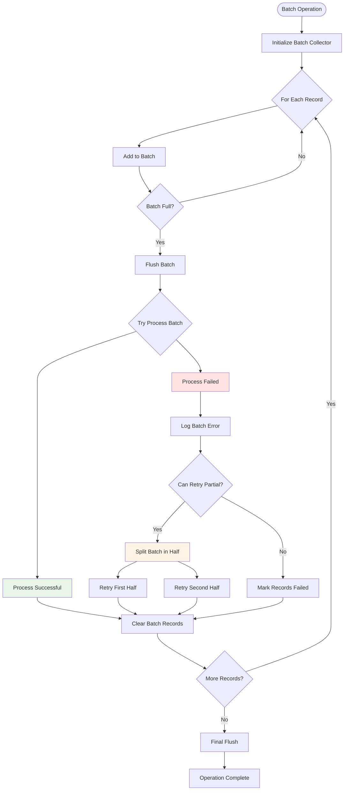

---

## 🌐 **WEBHOOK ERROR HANDLING FLOW**

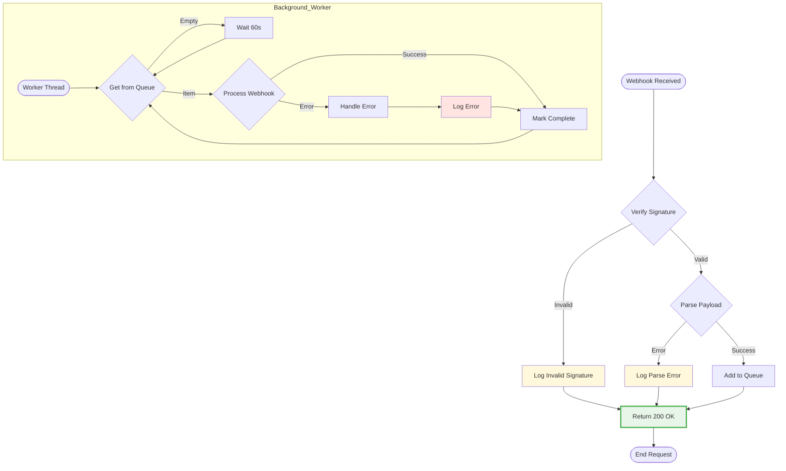

---

## 🔐 **SECURITY ERROR HANDLING FLOW**

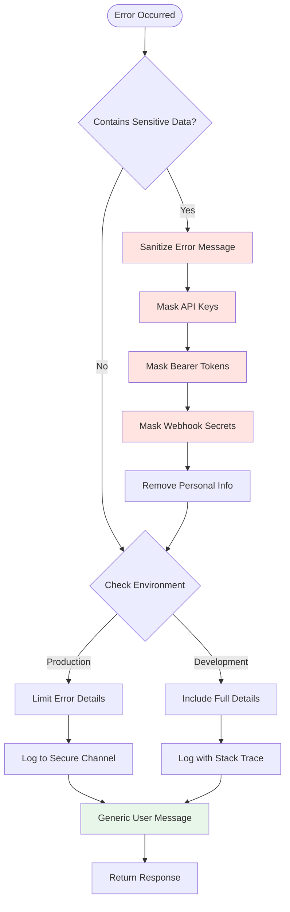

---

## 📊 **GRACEFUL DEGRADATION FLOW**

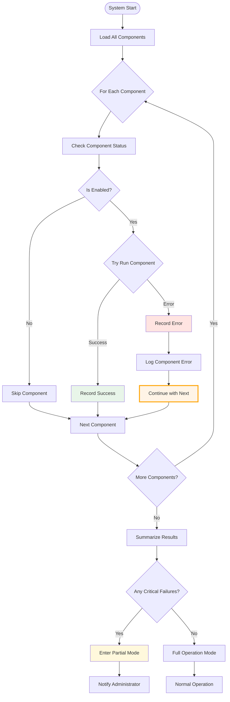

---

## 🔄 **TRANSACTION ROLLBACK FLOW**

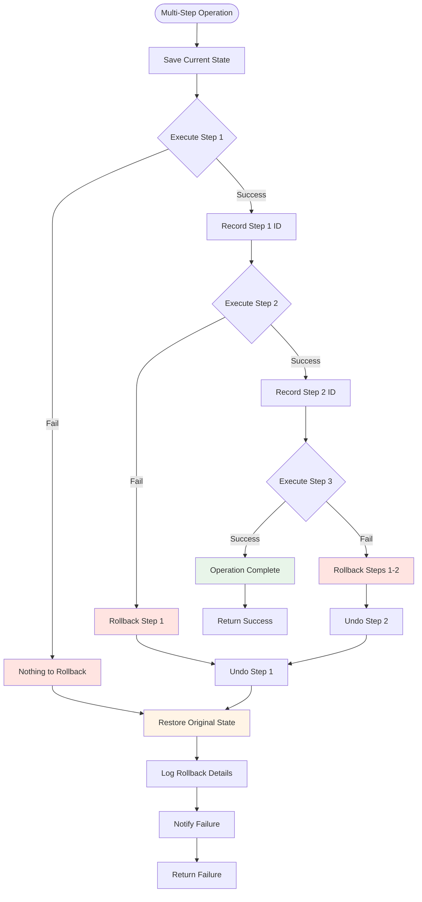

---

## 🏗️ **CIRCUIT BREAKER PATTERN**

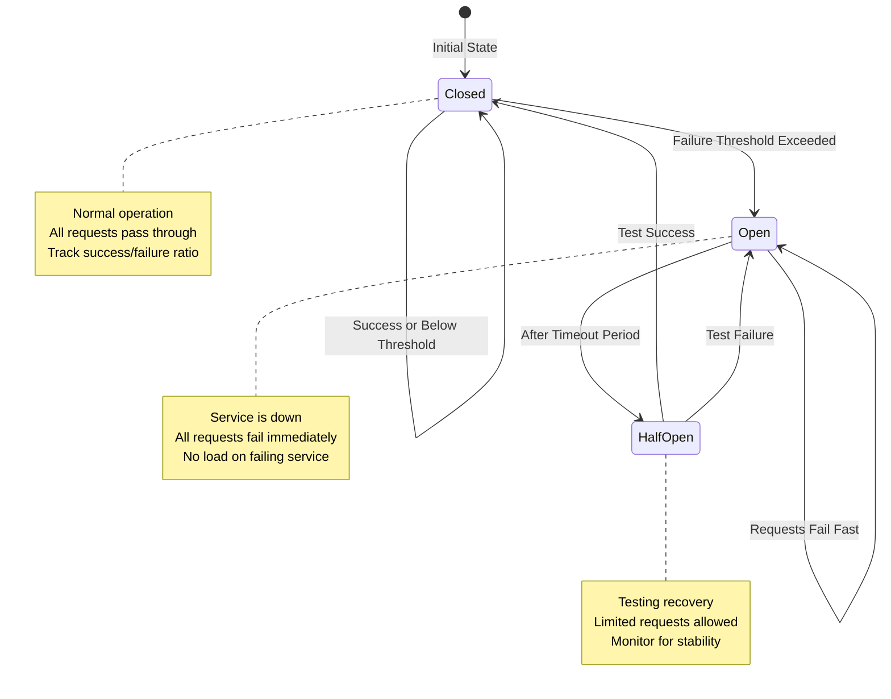

---

## 📈 **ERROR METRICS COLLECTION FLOW**

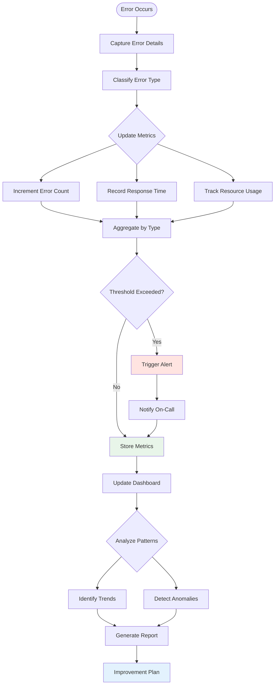

---

## 🔍 **COMPREHENSIVE ERROR LOGGING FLOW**

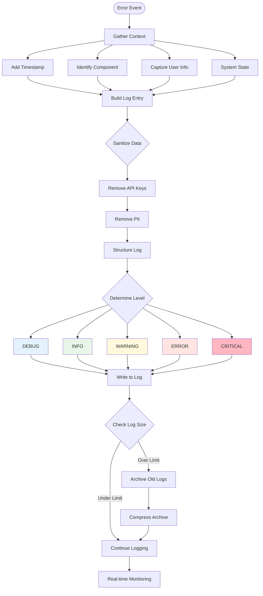

---

*These visual diagrams provide comprehensive coverage of error handling flows, recovery mechanisms, and operational patterns throughout the property management automation system.*