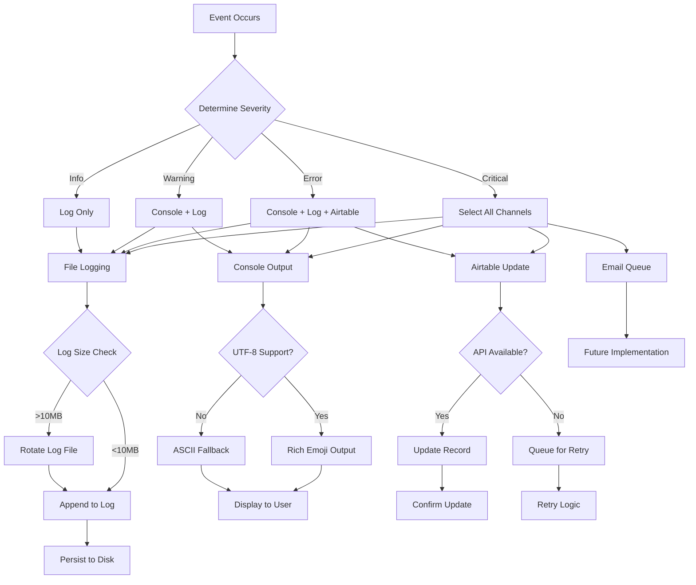
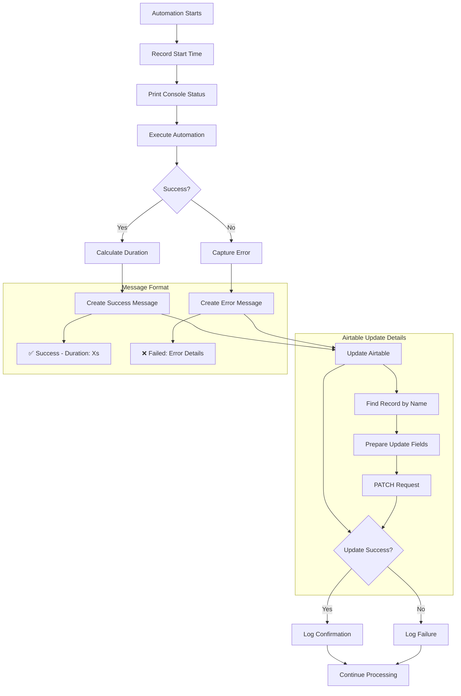
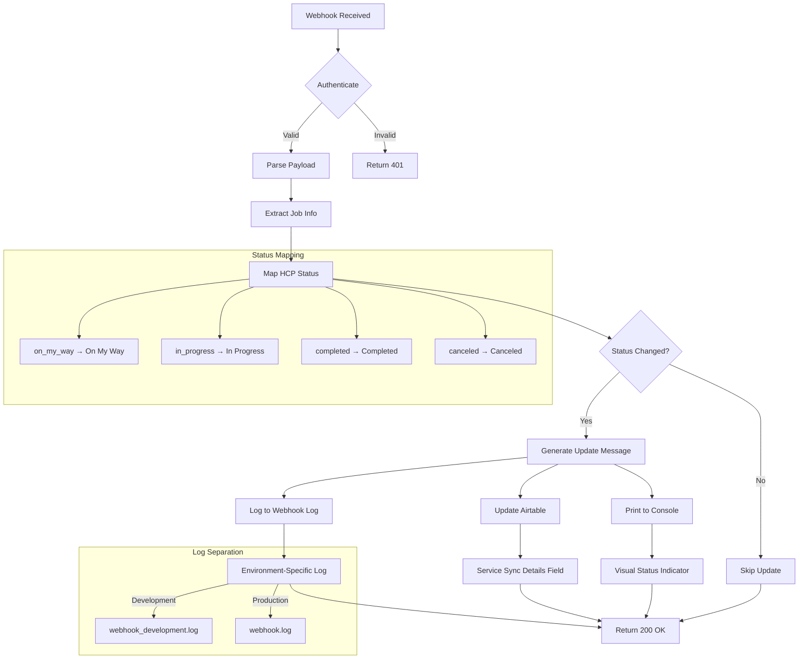
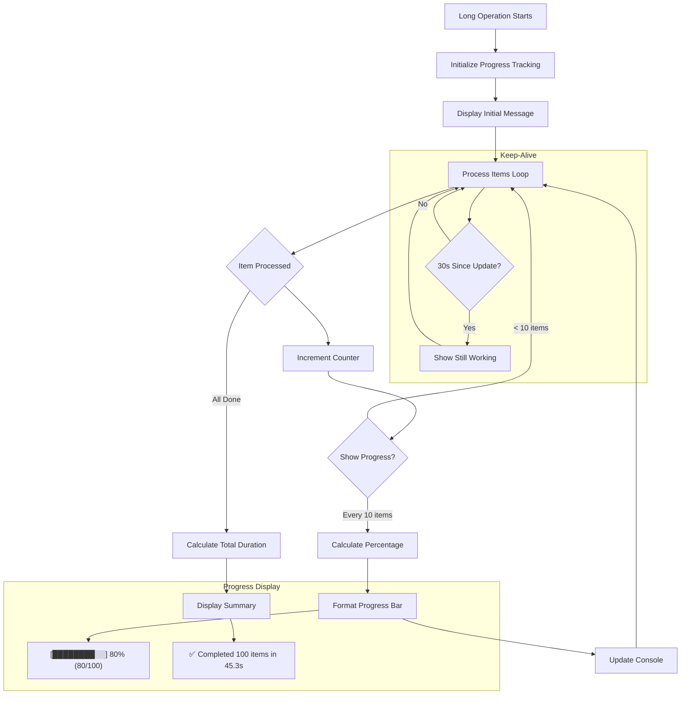
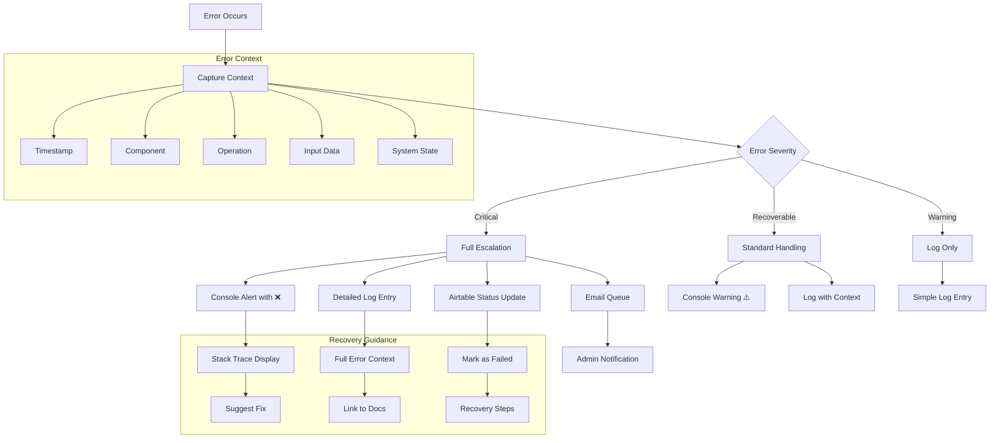
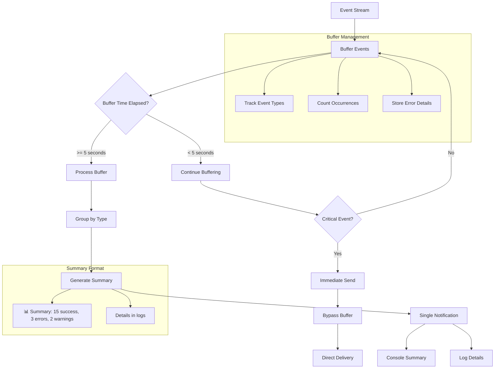
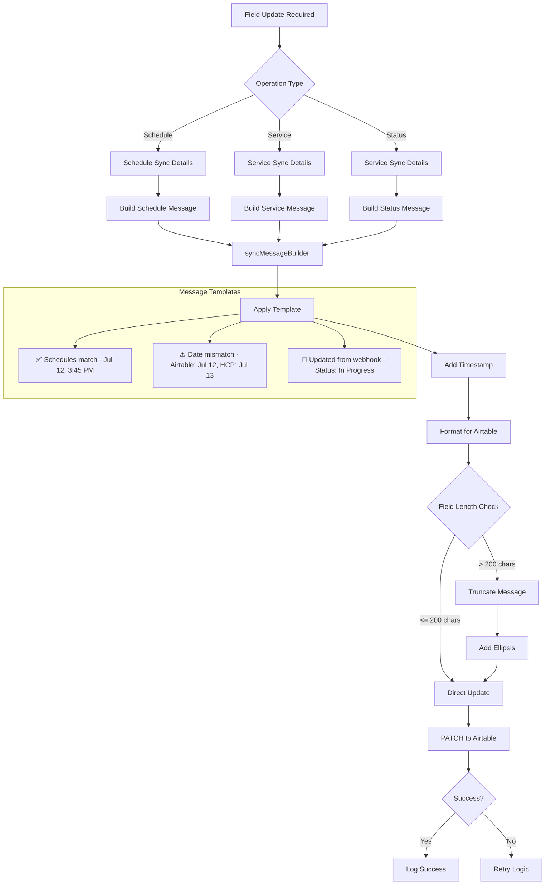
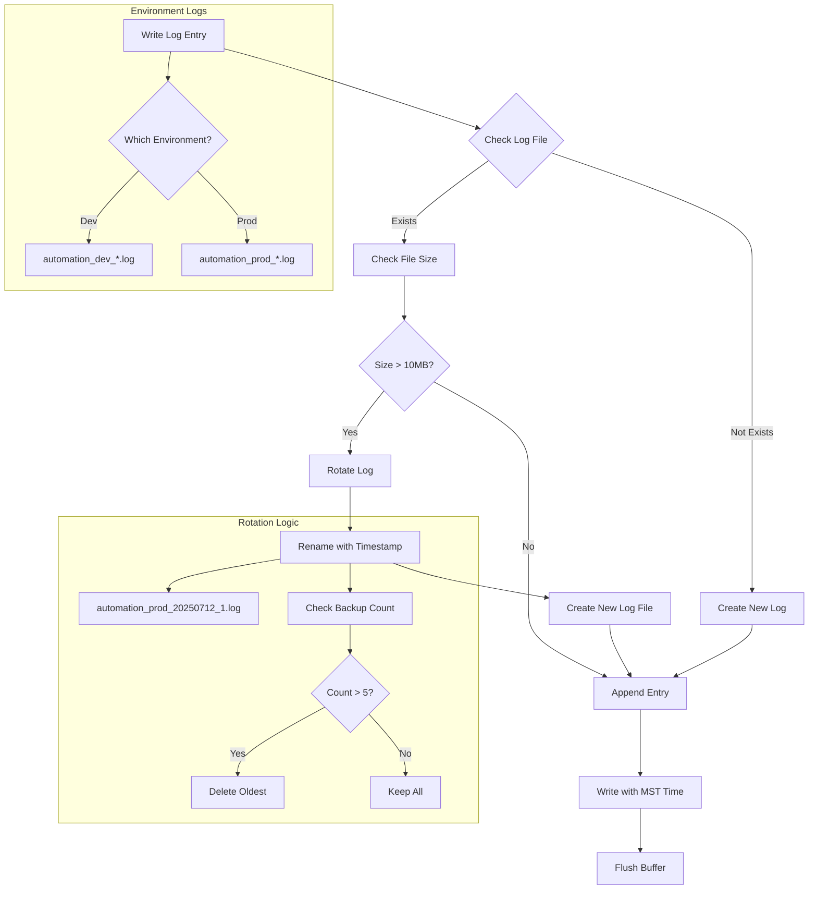
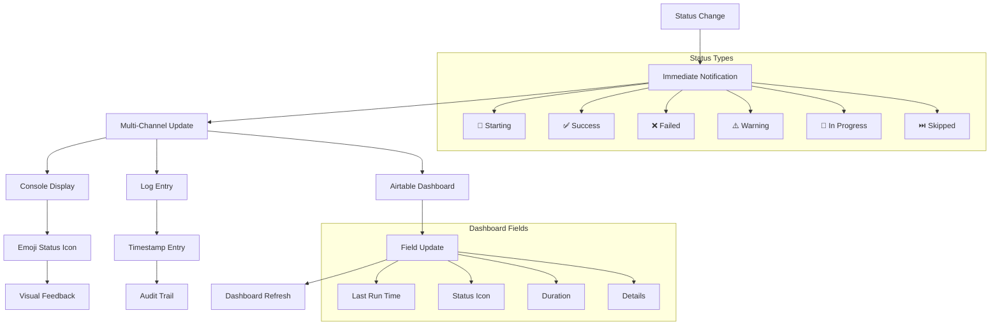
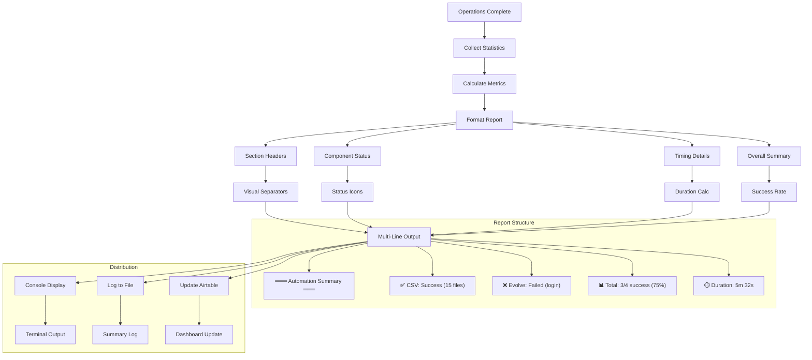

# Notification System - Mermaid Flow Diagrams

**Version:** 2.2.8  
**Last Updated:** July 12, 2025  
**Purpose:** Visual flow diagrams for notification system operations

---

## 📊 **VISUAL NOTIFICATION FLOWS**

### **1. Multi-Channel Notification Delivery Flow**



---

### **2. Automation Status Update Flow**



---

### **3. Webhook Notification Processing Flow**



---

### **4. Console Progress Notification Flow**



---

### **5. Error Notification Escalation Flow**



---

### **6. Batch Notification Aggregation Flow**



---

### **7. Field Update Notification Flow**



---

### **8. Log Rotation Management Flow**



---

### **9. Real-Time Status Dashboard Flow**



---

### **10. Summary Report Generation Flow**



---

## 🔧 **NOTIFICATION PATTERNS REFERENCE**

### **Visual Indicators**
- ✅ Success/Complete
- ❌ Error/Failed
- ⚠️ Warning/Caution
- 🔄 In Progress/Sync
- 📝 Update/Modification
- 🔍 Search/Check
- ⏭️ Skip/Bypass
- 🚀 Start/Launch
- 📊 Summary/Stats

### **Channel Matrix**
```
Critical → Console + Log + Airtable + Email
Error    → Console + Log + Airtable
Warning  → Console + Log
Info     → Log
Debug    → Log (verbose only)
```

### **Timing Strategies**
```
Immediate  → Status changes, errors
Buffered   → Similar events (5s window)
Scheduled  → Summary reports
Throttled  → Progress updates (10 items)
```

---

*These visual diagrams provide comprehensive coverage of notification flows throughout the property management automation system.*