# Reporting & Analytics - Mermaid Flow Diagrams

**Version:** 2.2.8  
**Last Updated:** July 12, 2025  
**Purpose:** Visual flow diagrams for reporting and analytics operations

---

## 📊 **VISUAL REPORTING FLOWS**

### **1. HCP Bulletproof Analysis Flow**


---

### **2. Service Item Analysis Flow**


---

### **3. CSV Processing Report Flow**

```mermaid
graph TD
    A[CSV Processing Complete] --> B[Collect Results]
    B --> C[Group by Property]
    
    C --> D[Initialize Counters]
    D --> E[Process Each Property]
    
    E --> F[Get Property Name]
    F --> G{Name Found?}
    G -->|Yes| H[Use Property Name]
    G -->|No| I[Use "Unknown Property"]
    
    H --> J[Count Outcomes]
    I --> J
    
    J --> K[New Records]
    J --> L[Modified Records]
    J --> M[Unchanged Records]
    
    K --> N[Property Report Section]
    L --> N
    M --> N
    
    N --> O{More Properties?}
    O -->|Yes| E
    O -->|No| P[Calculate Totals]
    
    P --> Q[Sum All New]
    P --> R[Sum All Modified]
    P --> S[Sum All Unchanged]
    
    Q --> T[Generate Summary]
    R --> T
    S --> T
    
    T --> U[Format Report]
    U --> V[Add Headers]
    U --> W[Add Property Details]
    U --> X[Add Summary Section]
    U --> Y[Add Footers]
    
    subgraph "Report Structure"
        V --> Z["------------ Run digest ------------"]
        W --> AA["CSV -> Source for Property Name"]
        X --> AB["------------ Summary ------------"]
        Y --> AC["------------ End Summary ------------"]
    end
```

---

### **4. Monthly Trend Analysis Flow**

```mermaid
graph TD
    A[Job Data Stream] --> B[Extract Date]
    
    B --> C{Valid Date?}
    C -->|No| D[Month = "unknown"]
    C -->|Yes| E[Parse Date Object]
    
    E --> F[Extract Year]
    E --> G[Extract Month]
    
    F --> H[Format YYYY-MM]
    G --> H
    
    H --> I{Month Exists?}
    I -->|No| J[Initialize Month]
    I -->|Yes| K[Get Month Data]
    
    J --> L[Set Job Count = 0]
    J --> M[Set Revenue = 0]
    
    K --> N[Increment Job Count]
    K --> O[Add to Revenue]
    L --> N
    M --> O
    
    N --> P{More Jobs?}
    O --> P
    P -->|Yes| A
    P -->|No| Q[Convert to Array]
    
    Q --> R[Map Entries]
    R --> S[Sort by Month]
    S --> T[Calculate Trends]
    
    T --> U[Month-over-Month]
    T --> V[Seasonal Patterns]
    T --> W[Growth Rate]
    
    subgraph "Trend Metrics"
        U --> X[% Change]
        V --> Y[Peak Months]
        W --> Z[Annual Growth]
    end
```

---

### **5. Customer Revenue Ranking Flow**

```mermaid
graph TD
    A[Start Analysis] --> B[Initialize Customer Map]
    B --> C[Process Jobs]
    
    C --> D[Extract Customer ID]
    D --> E{Customer Exists?}
    
    E -->|No| F[Skip Job]
    E -->|Yes| G[Get Customer Name]
    
    G --> H{In Map?}
    H -->|No| I[Create Entry]
    H -->|Yes| J[Get Entry]
    
    I --> K[Initialize Stats]
    K --> L[Job Count = 0]
    K --> M[Revenue = 0]
    K --> N[Status Map = {}]
    
    J --> O[Update Stats]
    L --> O
    M --> O
    N --> O
    
    O --> P[Increment Jobs]
    O --> Q[Add Revenue]
    O --> R[Track Status]
    
    P --> S{More Jobs?}
    Q --> S
    R --> S
    
    S -->|Yes| C
    S -->|No| T[Convert to Array]
    
    T --> U[Calculate Averages]
    U --> V[Sort by Revenue]
    V --> W[Take Top 10]
    
    W --> X[Format Results]
    
    subgraph "Customer Metrics"
        X --> Y[Total Jobs]
        X --> Z[Total Revenue]
        X --> AA[Average Value]
        X --> AB[Status Breakdown]
    end
```

---

### **6. Data Quality Assurance Flow**


---

### **7. Revenue Extraction Strategy Flow**


---

### **8. Automation Performance Summary Flow**

```mermaid
graph TD
    A[Suite Complete] --> B[Collect Results]
    B --> C[Count Successes]
    B --> D[Count Failures]
    B --> E[Calculate Duration]
    
    C --> F[Success Rate %]
    D --> F
    
    E --> G[Total Time]
    E --> H[Per-Component Time]
    
    F --> I[Generate Summary]
    G --> I
    H --> I
    
    I --> J[Format Header]
    I --> K[List Components]
    I --> L[Show Metrics]
    I --> M[Add Footer]
    
    K --> N[Component Loop]
    N --> O{Success?}
    
    O -->|Yes| P[✅ Component Name]
    O -->|No| Q[❌ Component Name]
    
    P --> R[Show Duration]
    Q --> R
    
    R --> S{More Components?}
    S -->|Yes| N
    S -->|No| T[Display Totals]
    
    subgraph "Summary Format"
        J --> U["═══ Automation Summary ═══"]
        T --> V["📊 Results: X/Y successful"]
        T --> W["⏱️ Duration: XXs"]
        M --> X["═══ Complete ═══"]
    end
```



---

### **9. Report Distribution Flow**


---

### **10. Real-Time Dashboard Update Flow**


---

## 🔧 **ANALYTICS PATTERNS REFERENCE**

### **Data Sources**
- HCP cached job files
- CSV processing results
- ICS sync statistics
- Automation run logs

### **Analysis Types**
```
Revenue    → Customer ranking, monthly trends
Inventory  → Service item usage, costs
Operations → Success rates, timing
Quality    → Error rates, completeness
```

### **Output Destinations**
```
Console    → Human-readable summaries
Logs       → Structured reports
Airtable   → Dashboard updates
Exports    → CSV/JSON files
```

---

*These visual diagrams provide comprehensive coverage of reporting and analytics flows throughout the property management automation system.*