# Mermaid Flow Diagrams - Monitoring & Health Checks

**Feature:** 18-monitoring-health-checks  
**Version:** 2.2.8  
**Last Updated:** July 13, 2025

---

## **DIAGRAM 1: HTTP Health Check Endpoint Flow**


---

## **DIAGRAM 2: System Monitoring Script Execution**

```mermaid
graph TD
    A[Monitor Script Started] --> B[Initialize Environment]
    B --> C[Load Configuration]
    C --> D[Set PST Timezone]
    
    D --> E[Check Cron Schedule]
    E --> F{Automation Scheduled?}
    F -->|Yes| G[✅ Schedule Active]
    F -->|No| H[❌ No Schedule Found]
    
    G --> I[Check Recent Activity]
    H --> I
    I --> J[Scan Process List]
    J --> K[Analyze Log Files]
    
    K --> L{Recent Activity?}
    L -->|Yes| M[✅ Activity Detected]
    L -->|No| N[⚠️ No Recent Activity]
    
    M --> O[Check System Resources]
    N --> O
    O --> P[Monitor Disk Usage]
    
    P --> Q{Disk Usage OK?}
    Q -->|< 80%| R[✅ Disk Space Good]
    Q -->|80-89%| S[⚠️ Disk Space Warning]
    Q -->|≥ 90%| T[❌ Disk Space Critical]
    
    R --> U[Calculate Next Run]
    S --> U
    T --> U
    
    U --> V[Parse Cron Expression]
    V --> W[Calculate Time Until Next]
    W --> X[Format 12-hour Time]
    X --> Y[Generate Report]
    
    Y --> Z{Issues Found?}
    Z -->|Yes| AA[Send Alerts]
    Z -->|No| BB[✅ All Systems Healthy]
    
    AA --> CC[Exit with Warning]
    BB --> DD[Exit Successfully]
```



---

## **DIAGRAM 3: Airtable Status Integration Workflow**


---

## **DIAGRAM 4: Comprehensive E2E Testing Framework**

```mermaid
graph LR
    A[Test Suite Start] --> B[Initialize Environment]
    B --> C[Generate Test Data]
    
    C --> D[Test 1: Data Generation]
    D --> E{Data Gen Success?}
    E -->|Yes| F[✅ Pass]
    E -->|No| G[❌ Fail]
    
    F --> H[Test 2: CSV Processing]
    G --> H
    H --> I{CSV Success?}
    I -->|Yes| J[✅ Pass]
    I -->|No| K[❌ Fail]
    
    J --> L[Test 3: ICS Processing]
    K --> L
    L --> M{ICS Success?}
    M -->|Yes| N[✅ Pass]
    M -->|No| O[❌ Fail]
    
    N --> P[Test 4: Job Creation]
    O --> P
    P --> Q{Job Creation Success?}
    Q -->|Yes| R[✅ Pass]
    Q -->|No| S[❌ Fail]
    
    R --> T[Test 5: HCP Sync]
    S --> T
    T --> U{HCP Sync Success?}
    U -->|Yes| V[✅ Pass]
    U -->|No| W[❌ Fail]
    
    V --> X[Test 6: Schedule Mgmt]
    W --> X
    X --> Y{Schedule Success?}
    Y -->|Yes| Z[✅ Pass]
    Y -->|No| AA[❌ Fail]
    
    Z --> BB[Test 7: Business Logic]
    AA --> BB
    BB --> CC{Logic Success?}
    CC -->|Yes| DD[✅ Pass]
    CC -->|No| EE[❌ Fail]
    
    DD --> FF[Test 8: Error Handling]
    EE --> FF
    FF --> GG{Error Test Success?}
    GG -->|Yes| HH[✅ Pass]
    GG -->|No| II[❌ Fail]
    
    HH --> JJ[Cleanup Test Data]
    II --> JJ
    JJ --> KK[Generate Report]
    
    KK --> LL{Pass Rate ≥ 80%?}
    LL -->|Yes| MM[🎉 Suite Passed]
    LL -->|No| NN[⚠️ Suite Needs Attention]
```



---

## **DIAGRAM 5: Webhook Health Monitoring Integration**


---

## **DIAGRAM 6: Cron Schedule Analysis and Prediction**


---

## **DIAGRAM 7: Error Detection and Smart Filtering**

```mermaid
graph TD
    A[Scan Log Directory] --> B[Identify Recent Logs]
    B --> C[Read Log Entries]
    
    C --> D{Filter Success Messages}
    D -->|Contains ✅| E[Skip - Success]
    D -->|Contains SUCCESS| E
    D -->|Contains "completed successfully"| E
    D -->|Contains "All systems healthy"| E
    
    D -->|Other| F[Check for Error Patterns]
    
    F --> G{Error Pattern?}
    G -->|ERROR| H[Classify as Error]
    G -->|FAILED| H
    G -->|EXCEPTION| H
    G -->|CRITICAL| I[Classify as Critical]
    G -->|FATAL| I
    
    E --> J[Continue to Next Entry]
    H --> K[Extract Error Context]
    I --> L[Extract Critical Context]
    
    K --> M[Add to Error Count]
    L --> N[Add to Critical Count]
    
    M --> O[Group Related Errors]
    N --> O
    
    O --> P{More Logs?}
    P -->|Yes| J
    P -->|No| Q[Calculate Error Rates]
    
    Q --> R[Generate Error Summary]
    R --> S{Errors Found?}
    S -->|Yes| T[⚠️ Issues Detected]
    S -->|No| U[✅ No Errors Found]
    
    T --> V[Provide Investigation Commands]
    U --> W[Continue Monitoring]
```

---

## **DIAGRAM 8: Performance Metrics Collection**

```mermaid
graph LR
    A[Request Start] --> B[Record Start Time]
    B --> C[Begin Processing]
    
    C --> D[Track Component A]
    D --> E[Track Component B]
    E --> F[Track Component C]
    
    D --> G[Measure DB Query Time]
    E --> H[Measure API Call Time]
    F --> I[Measure File Processing Time]
    
    G --> J[Record Metrics]
    H --> J
    I --> J
    
    J --> K[Calculate Totals]
    K --> L[Update Moving Averages]
    L --> M[Check Thresholds]
    
    M --> N{Performance OK?}
    N -->|Yes| O[✅ Normal Performance]
    N -->|No| P[⚠️ Performance Degraded]
    
    O --> Q[Store Metrics]
    P --> R[Generate Alert]
    
    Q --> S[Update Dashboard]
    R --> S
    
    S --> T[Performance Report]
```



---

## **DIAGRAM 9: Uptime and Availability Tracking**

```mermaid
stateDiagram-v2
    [*] --> ServiceStartup
    
    ServiceStartup --> Running: Service Initialized
    Running --> HealthCheck: Periodic Check
    
    HealthCheck --> Running: ✅ Check Passed
    HealthCheck --> Degraded: ⚠️ Partial Failure
    HealthCheck --> Failed: ❌ Check Failed
    
    Degraded --> Running: Recovery
    Degraded --> Failed: Further Degradation
    
    Failed --> Recovery: Attempting Restart
    Recovery --> Running: ✅ Service Restored
    Recovery --> Failed: ❌ Recovery Failed
    
    Running --> Maintenance: Planned Downtime
    Maintenance --> Running: Maintenance Complete
    
    Failed --> [*]: Service Terminated
    
    note right of Running
        Uptime: 99.9%
        Last Check: ✅
    end note
    
    note right of Failed
        Downtime Recorded
        Alert Sent
    end note
```



---

## **DIAGRAM 10: Comprehensive Health Status Aggregation**

```mermaid
graph TD
    A[Collect Component Health] --> B[HTTP Endpoints]
    A --> C[Database Connectivity]
    A --> D[Automation Status]
    A --> E[System Resources]
    A --> F[Error Rates]
    
    B --> G{Endpoint OK?}
    C --> H{DB Connected?}
    D --> I{Automation Running?}
    E --> J{Resources OK?}
    F --> K{Error Rate OK?}
    
    G -->|Yes| L[Weight: 20 points]
    G -->|No| M[Weight: 0 points]
    
    H -->|Yes| N[Weight: 25 points]
    H -->|No| O[Weight: 0 points]
    
    I -->|Yes| P[Weight: 30 points]
    I -->|No| Q[Weight: 0 points]
    
    J -->|Yes| R[Weight: 15 points]
    J -->|No| S[Weight: 0 points]
    
    K -->|Yes| T[Weight: 10 points]
    K -->|No| U[Weight: 0 points]
    
    L --> V[Sum Total Score]
    M --> V
    N --> V
    O --> V
    P --> V
    Q --> V
    R --> V
    S --> V
    T --> V
    U --> V
    
    V --> W{Total Score?}
    W -->|90-100| X[🟢 Healthy]
    W -->|70-89| Y[🟡 Warning]
    W -->|50-69| Z[🟠 Degraded]
    W -->|< 50| AA[🔴 Critical]
    
    X --> BB[Generate Health Report]
    Y --> BB
    Z --> BB
    AA --> BB
    
    BB --> CC[Update Dashboard]
    CC --> DD[Notify Stakeholders]
```



---

## **DIAGRAM 11: Zero-Downtime Health Monitoring**


---

## **DIAGRAM 12: Multi-Environment Health Monitoring**

```mermaid
graph TD
    A[Health Monitor Request] --> B{Environment?}
    
    B -->|Development| C[Dev Health Endpoint]
    B -->|Production| D[Prod Health Endpoint]
    
    C --> E[Dev Airtable Base]
    C --> F[Dev Webhook Server]
    C --> G[Dev HCP Account]
    
    D --> H[Prod Airtable Base]
    D --> I[Prod Webhook Server]
    D --> J[Prod HCP Account]
    
    E --> K{Dev DB OK?}
    F --> L{Dev Webhook OK?}
    G --> M{Dev HCP OK?}
    
    H --> N{Prod DB OK?}
    I --> O{Prod Webhook OK?}
    J --> P{Prod HCP OK?}
    
    K --> Q[Dev Health Score]
    L --> Q
    M --> Q
    
    N --> R[Prod Health Score]
    O --> R
    P --> R
    
    Q --> S[Dev Status Report]
    R --> T[Prod Status Report]
    
    S --> U[Combined Dashboard]
    T --> U
    
    U --> V{Cross-Environment Issues?}
    V -->|Yes| W[Alert: Multi-Env Problem]
    V -->|No| X[✅ All Environments Healthy]
```



---

*These Mermaid diagrams provide comprehensive visual representations of all monitoring and health check workflows, from basic HTTP endpoints to complex multi-environment status aggregation and zero-downtime monitoring capabilities.*